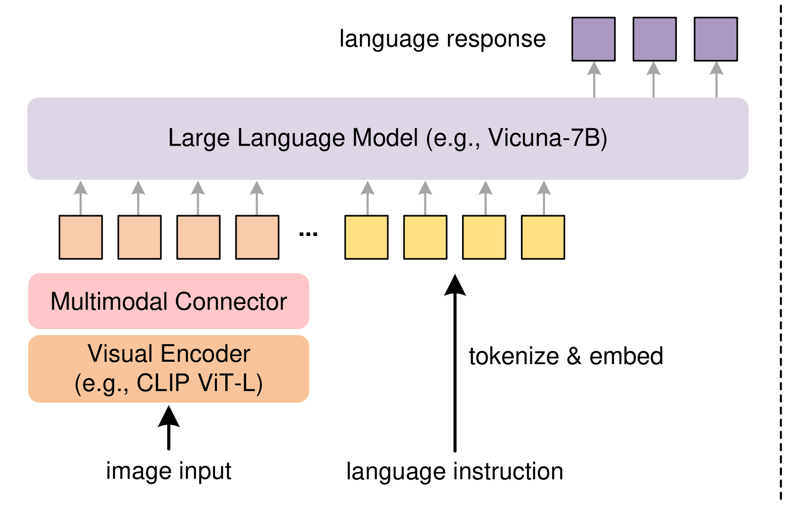
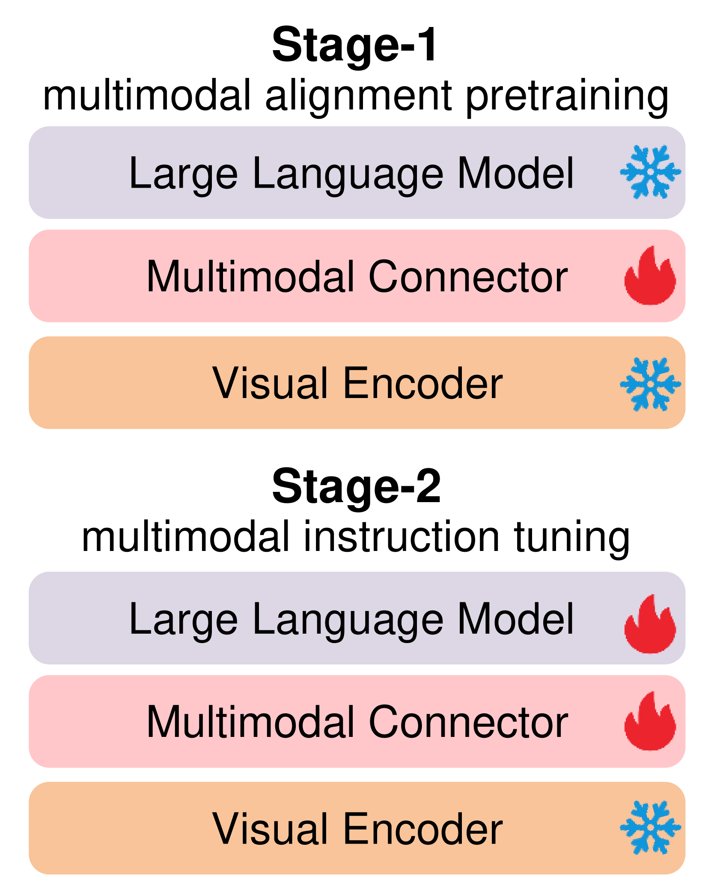
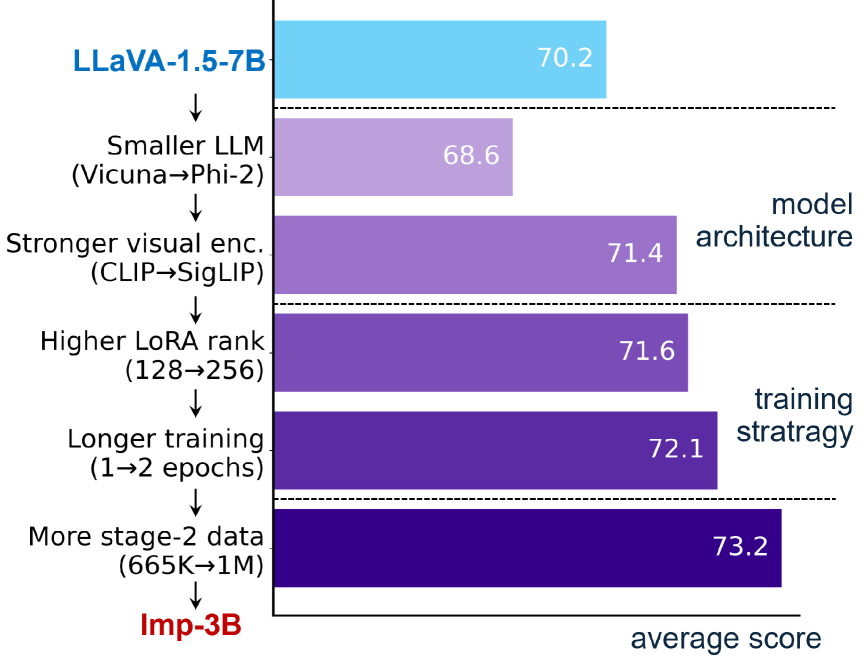
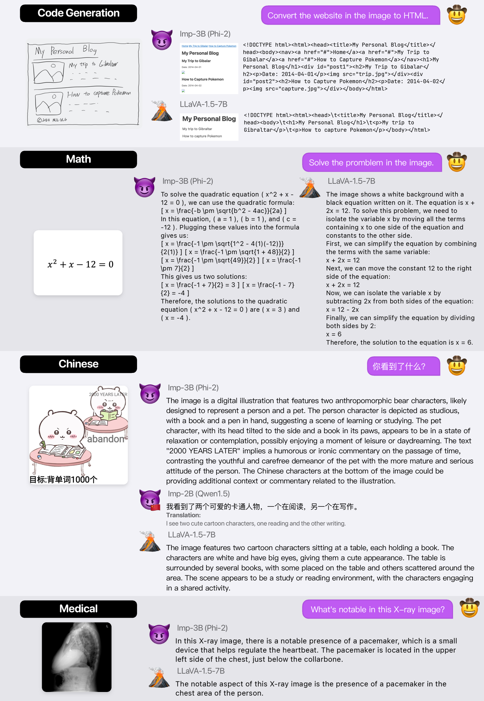

# Imp：移动设备上的高效大型多模态模型

发布时间：2024年05月20日

`LLM应用

这篇论文主要探讨了轻量级大型多模态模型（LMMs）的设计和优化，特别是在资源受限的环境中的应用。论文详细研究了模型架构、训练策略和数据选择，并开发了Imp系列模型，这些模型在规模受限的情况下表现出色。此外，论文还讨论了如何通过技术如低比特量化和分辨率降低来实现在移动芯片上的高效部署。这些内容直接关联到大型语言模型（LLMs）的应用层面，特别是在模型优化和实际部署方面的应用，因此归类为LLM应用。` `移动计算` `多模态理解`

> Imp: Highly Capable Large Multimodal Models for Mobile Devices

# 摘要

> 借助大型语言模型（LLMs）的力量，最新的大型多模态模型（LMMs）在开放世界的多模态理解上展现了卓越的多功能性。但这些模型通常庞大且计算密集，限制了它们在资源有限环境中的应用。为此，研究者们相继提出了几种轻量级LMMs，旨在在规模受限（如3B）的情况下发挥最大潜力。尽管这些方法取得了积极成果，但多数仅关注设计的一两个方面，影响模型性能的关键设计决策尚未深入探讨。本文系统地研究了轻量级LMMs的模型架构、训练策略和数据选择。基于研究成果，我们开发了Imp系列——2B至4B规模的高性能LMMs。特别地，Imp-3B模型不仅稳定超越同规模的现有轻量级LMMs，甚至超越了13B规模的顶尖模型。通过低比特量化和分辨率降低技术，Imp模型能在高通Snapdragon 8Gen3移动芯片上高效部署，推理速度可达每秒约13个令牌。

> By harnessing the capabilities of large language models (LLMs), recent large multimodal models (LMMs) have shown remarkable versatility in open-world multimodal understanding. Nevertheless, they are usually parameter-heavy and computation-intensive, thus hindering their applicability in resource-constrained scenarios. To this end, several lightweight LMMs have been proposed successively to maximize the capabilities under constrained scale (e.g., 3B). Despite the encouraging results achieved by these methods, most of them only focus on one or two aspects of the design space, and the key design choices that influence model capability have not yet been thoroughly investigated. In this paper, we conduct a systematic study for lightweight LMMs from the aspects of model architecture, training strategy, and training data. Based on our findings, we obtain Imp -- a family of highly capable LMMs at the 2B-4B scales. Notably, our Imp-3B model steadily outperforms all the existing lightweight LMMs of similar size, and even surpasses the state-of-the-art LMMs at the 13B scale. With low-bit quantization and resolution reduction techniques, our Imp model can be deployed on a Qualcomm Snapdragon 8Gen3 mobile chip with a high inference speed of about 13 tokens/s.

[Arxiv](https://arxiv.org/abs/2405.12107)