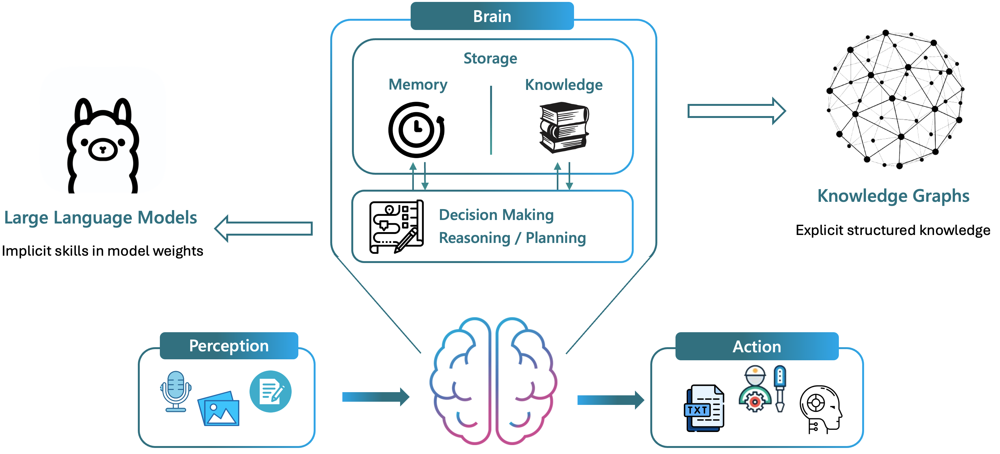
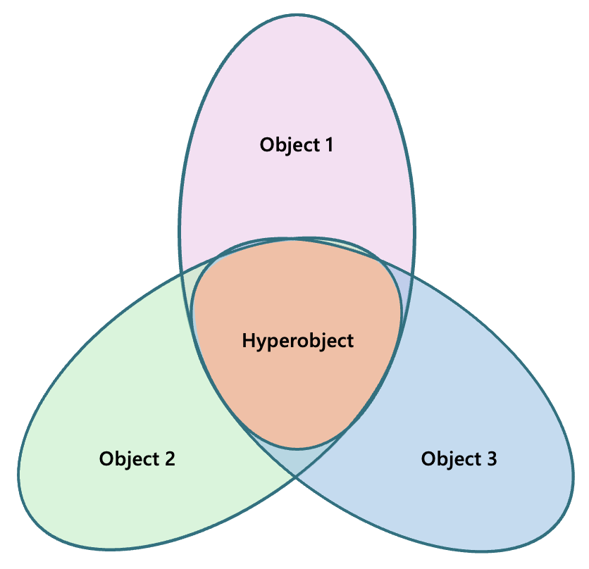
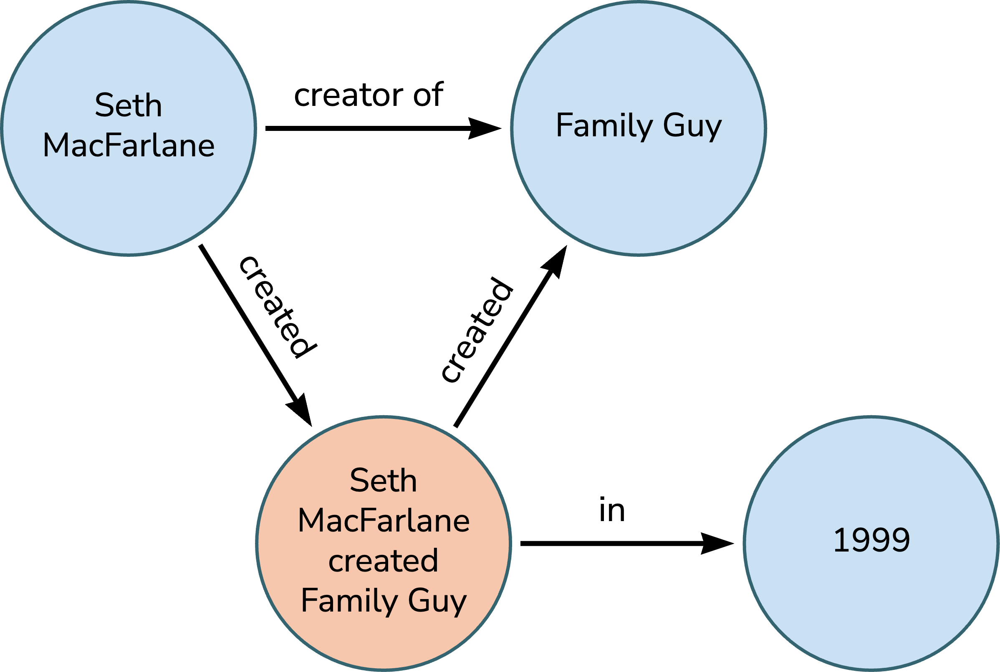
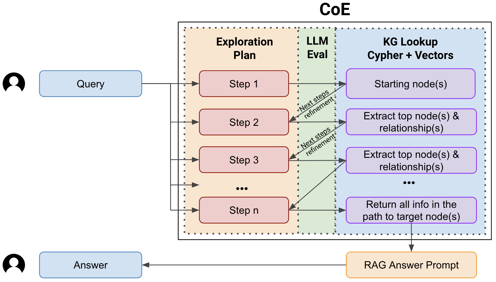
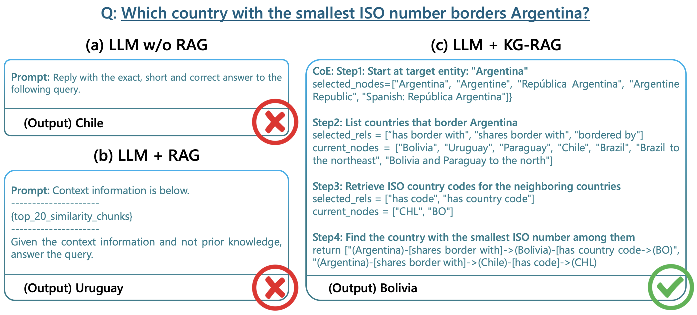

# KG-RAG：连接知识与创意的桥梁

发布时间：2024年05月20日

`Agent

这篇论文主要讨论了智能代理系统中大型语言模型代理（LMAs）在处理知识密集型任务时遇到的问题，并提出了一种结合知识图谱和LLMs的框架（KG-RAG）来解决这些问题。该框架通过构建知识图谱和使用特定的检索算法来增强LMAs的知识处理能力，从而减少信息幻觉和提高事实准确性。因此，这篇论文更偏向于讨论智能代理系统中的技术和方法，属于Agent分类。` `智能代理系统` `知识图谱`

> KG-RAG: Bridging the Gap Between Knowledge and Creativity

# 摘要

> 在智能代理系统的发展中，如何在保持大型语言模型代理（LMAs）创造性的同时确保事实准确性，是一个重大挑战。LMAs在处理知识密集型任务时，常遭遇信息幻觉、灾难性遗忘及长上下文处理的限制。本文提出的KG-RAG（知识图谱-检索增强生成）框架，通过结合结构化知识图谱与LLMs功能，大幅降低了对LLMs潜在知识的依赖，从而强化了LMAs的知识处理能力。该框架首先从非结构化文本构建知识图谱，随后在新图上进行信息检索，以执行知识图谱问答（KGQA）。检索过程中采用的“探索链（CoE）”算法，利用LLMs的推理能力，在知识图谱中逐步探索节点与关系。初步实验结果显示，在减少幻觉内容方面取得了显著成效，为开发擅长处理知识密集任务的智能系统开辟了新路径。

> Ensuring factual accuracy while maintaining the creative capabilities of Large Language Model Agents (LMAs) poses significant challenges in the development of intelligent agent systems. LMAs face prevalent issues such as information hallucinations, catastrophic forgetting, and limitations in processing long contexts when dealing with knowledge-intensive tasks. This paper introduces a KG-RAG (Knowledge Graph-Retrieval Augmented Generation) pipeline, a novel framework designed to enhance the knowledge capabilities of LMAs by integrating structured Knowledge Graphs (KGs) with the functionalities of LLMs, thereby significantly reducing the reliance on the latent knowledge of LLMs. The KG-RAG pipeline constructs a KG from unstructured text and then performs information retrieval over the newly created graph to perform KGQA (Knowledge Graph Question Answering). The retrieval methodology leverages a novel algorithm called Chain of Explorations (CoE) which benefits from LLMs reasoning to explore nodes and relationships within the KG sequentially. Preliminary experiments on the ComplexWebQuestions dataset demonstrate notable improvements in the reduction of hallucinated content and suggest a promising path toward developing intelligent systems adept at handling knowledge-intensive tasks.

[Arxiv](https://arxiv.org/abs/2405.12035)