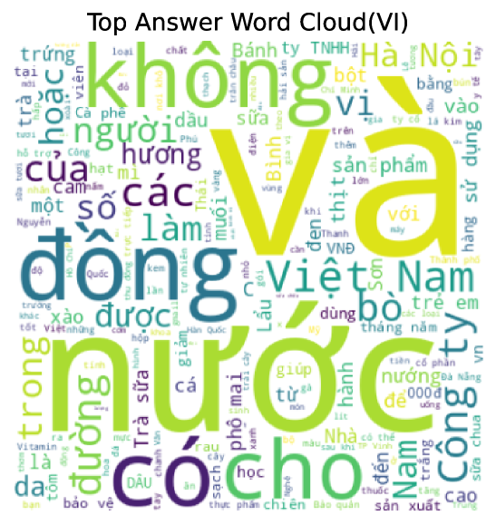

# MTVQA：多语言文本驱动的视觉问答基准

发布时间：2024年05月20日

`LLM应用

这篇论文介绍了MTVQA，一个多语言的文本中心视觉问答（TEC-VQA）基准，并评估了大型语言模型如GPT-4V在此基准上的表现。这表明论文关注的是大型语言模型在特定应用场景（即文本中心视觉问答）中的实际应用和性能评估，因此属于LLM应用分类。` `人机交互` `人工智能`

> MTVQA: Benchmarking Multilingual Text-Centric Visual Question Answering

# 摘要

> 文本中心视觉问答（TEC-VQA）的正确格式不仅促进了文本主导的视觉环境中的人机交互，还成为了评估文本场景理解AI模型的实际标准。尽管多数TEC-VQA基准集中于英语和中文，但通过翻译引擎扩展多语言问答对的尝试在TEC-VQA中遭遇了“视觉-文本错位”问题，忽视了图像中的视觉文本，并未能充分应对微妙意义、上下文扭曲、语言偏见及问题多样性等挑战。为此，我们推出了MTVQA，一个包含9种语言高质量专家标注的多语言TEC-VQA基准，这是首个针对文本场景的此类基准。通过评估GPT-4V等顶尖模态大型语言模型，我们发现仍有提升空间，凸显了MTVQA的价值。我们期待MTVQA能为研究者带来新视角和灵感，该数据集将在https://huggingface.co/datasets/ByteDance/MTVQA上公开。

> Text-Centric Visual Question Answering (TEC-VQA) in its proper format not only facilitates human-machine interaction in text-centric visual environments but also serves as a de facto gold proxy to evaluate AI models in the domain of text-centric scene understanding. However, most TEC-VQA benchmarks have focused on high-resource languages like English and Chinese. Despite pioneering works to expand multilingual QA pairs in non-text-centric VQA datasets using translation engines, the translation-based protocol encounters a substantial ``Visual-textual misalignment'' problem when applied to TEC-VQA. Specifically, it prioritizes the text in question-answer pairs while disregarding the visual text present in images. Furthermore, it does not adequately tackle challenges related to nuanced meaning, contextual distortion, language bias, and question-type diversity. In this work, we address the task of multilingual TEC-VQA and provide a benchmark with high-quality human expert annotations in 9 diverse languages, called MTVQA. To our knowledge, MTVQA is the first multilingual TEC-VQA benchmark to provide human expert annotations for text-centric scenarios. Further, by evaluating several state-of-the-art Multimodal Large Language Models (MLLMs), including GPT-4V, on our MTVQA dataset, it is evident that there is still room for performance improvement, underscoring the value of our dataset. We hope this dataset will provide researchers with fresh perspectives and inspiration within the community. The MTVQA dataset will be available at https://huggingface.co/datasets/ByteDance/MTVQA.

[Arxiv](https://arxiv.org/abs/2405.11985)