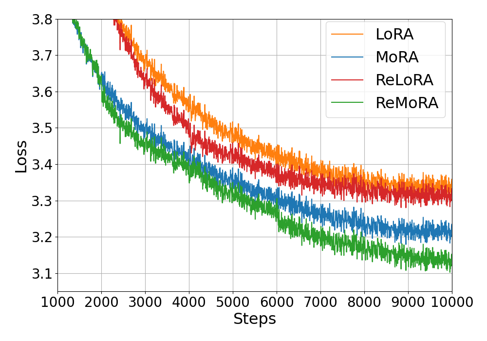
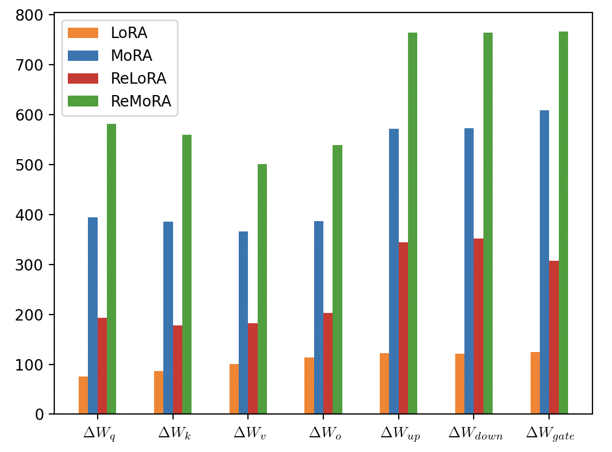

# MoRA：一种高秩更新策略，专为高效参数微调设计

发布时间：2024年05月20日

`LLM理论

理由：这篇论文探讨了大型语言模型（LLM）中的低秩适应技术（LoRA）及其局限性，并提出了新的方法（MoRA）来改进这一技术。论文内容涉及LLM的内部机制和改进方法，属于对LLM理论的深入研究。虽然MoRA方法可能在应用中有所体现，但其核心贡献在于理论层面的创新和改进，因此更适合归类为LLM理论。` `机器学习`

> MoRA: High-Rank Updating for Parameter-Efficient Fine-Tuning

# 摘要

> 低秩适应是大型语言模型中一种流行的参数高效微调技术。本文探讨了LoRA中实施的低秩更新对LLMs学习新知识能力的影响，发现其存在局限。基于此，我们提出了MoRA方法，通过使用方阵实现高秩更新，同时保持参数数量不变，并引入非参数操作符调整输入输出维度，确保权重可合并回模型，便于部署。在指令调整、数学推理、持续预训练、记忆和预训练等五个任务上的评估显示，MoRA在内存密集型任务中超越了LoRA，并在其他任务上表现相当。

> Low-rank adaptation is a popular parameter-efficient fine-tuning method for large language models. In this paper, we analyze the impact of low-rank updating, as implemented in LoRA. Our findings suggest that the low-rank updating mechanism may limit the ability of LLMs to effectively learn and memorize new knowledge. Inspired by this observation, we propose a new method called MoRA, which employs a square matrix to achieve high-rank updating while maintaining the same number of trainable parameters. To achieve it, we introduce the corresponding non-parameter operators to reduce the input dimension and increase the output dimension for the square matrix. Furthermore, these operators ensure that the weight can be merged back into LLMs, which makes our method can be deployed like LoRA. We perform a comprehensive evaluation of our method across five tasks: instruction tuning, mathematical reasoning, continual pretraining, memory and pretraining. Our method outperforms LoRA on memory-intensive tasks and achieves comparable performance on other tasks.

[Arxiv](https://arxiv.org/abs/2405.12130)