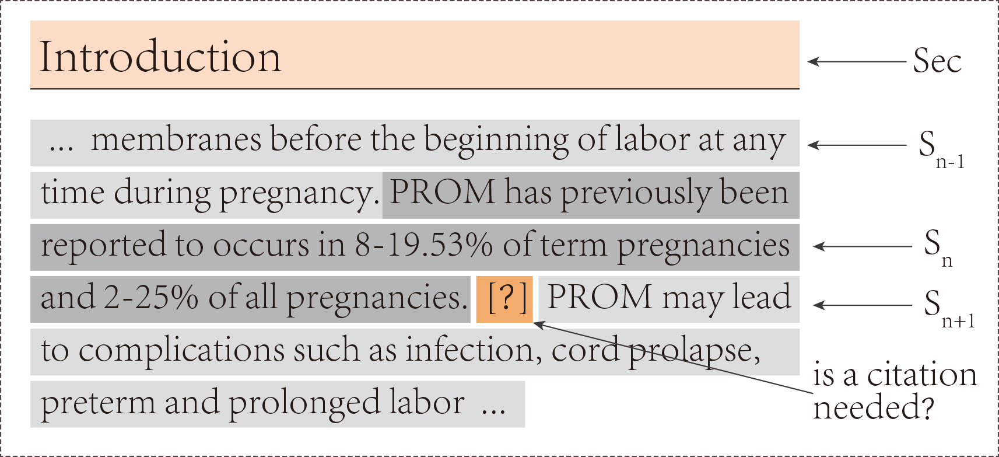
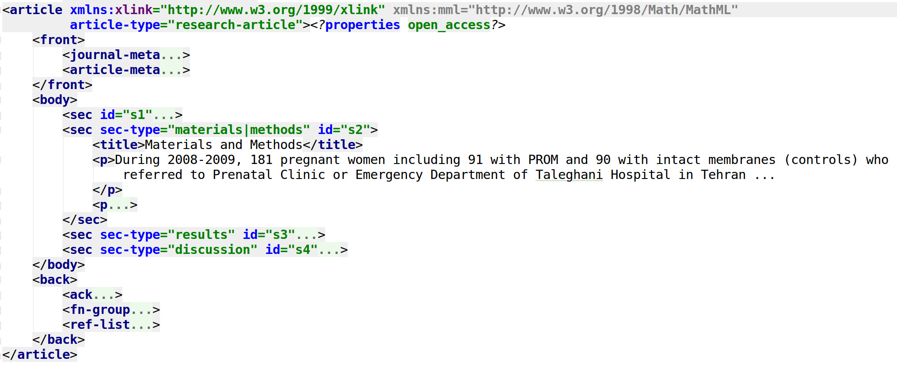
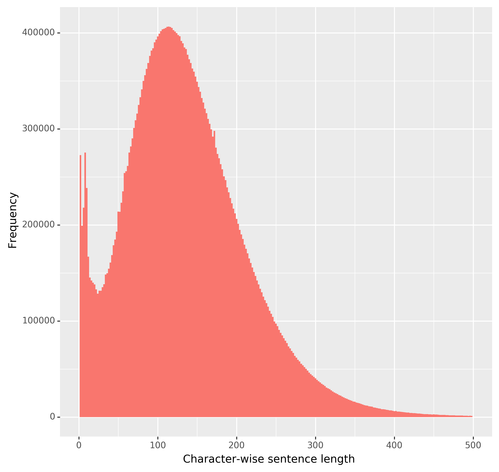
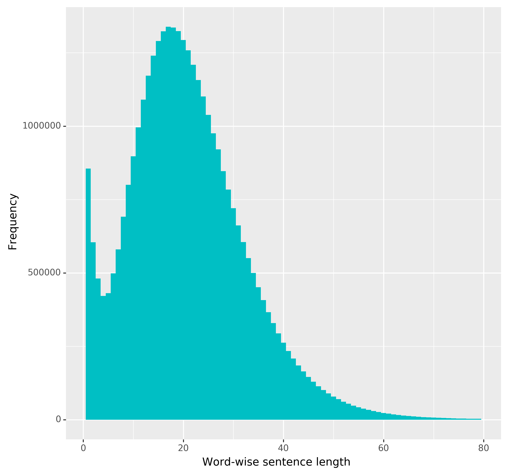
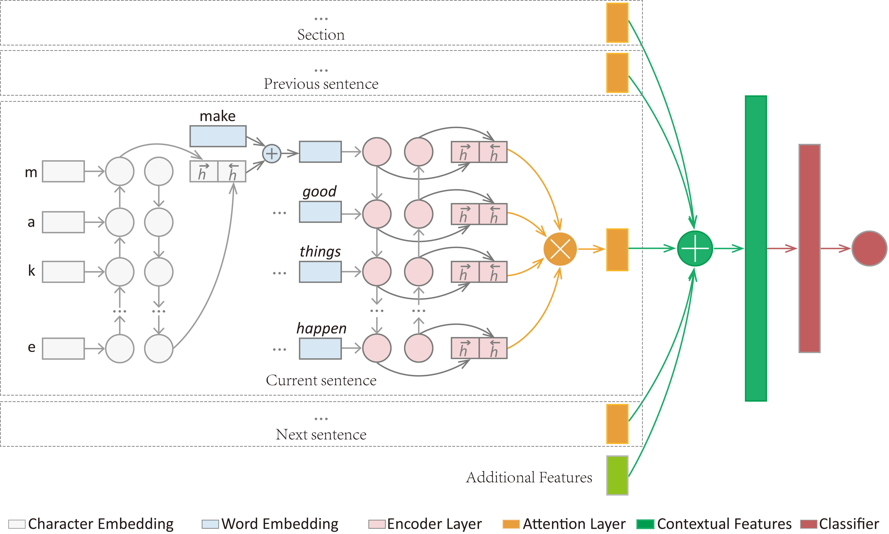
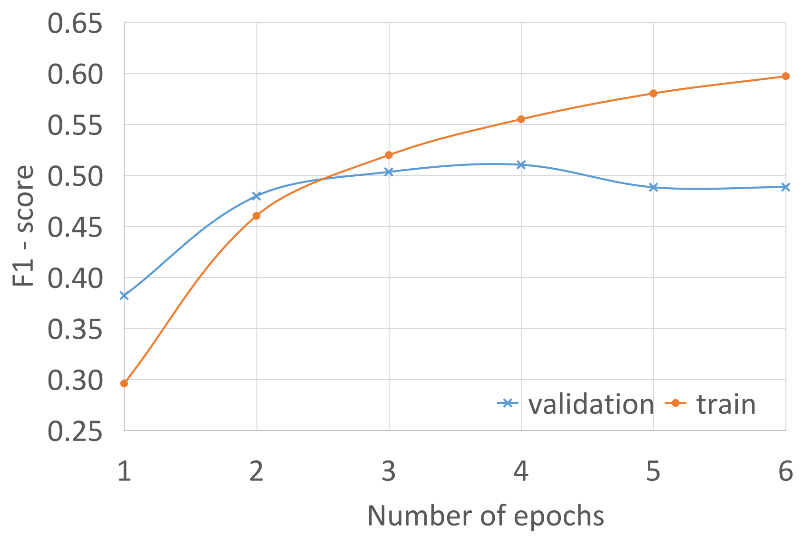
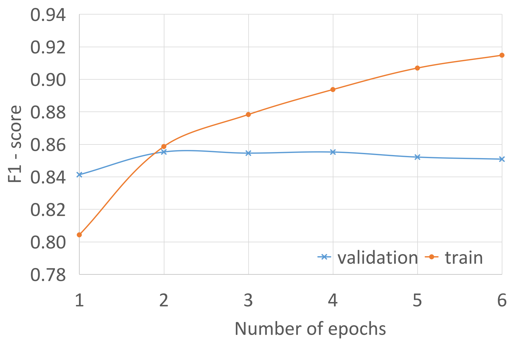
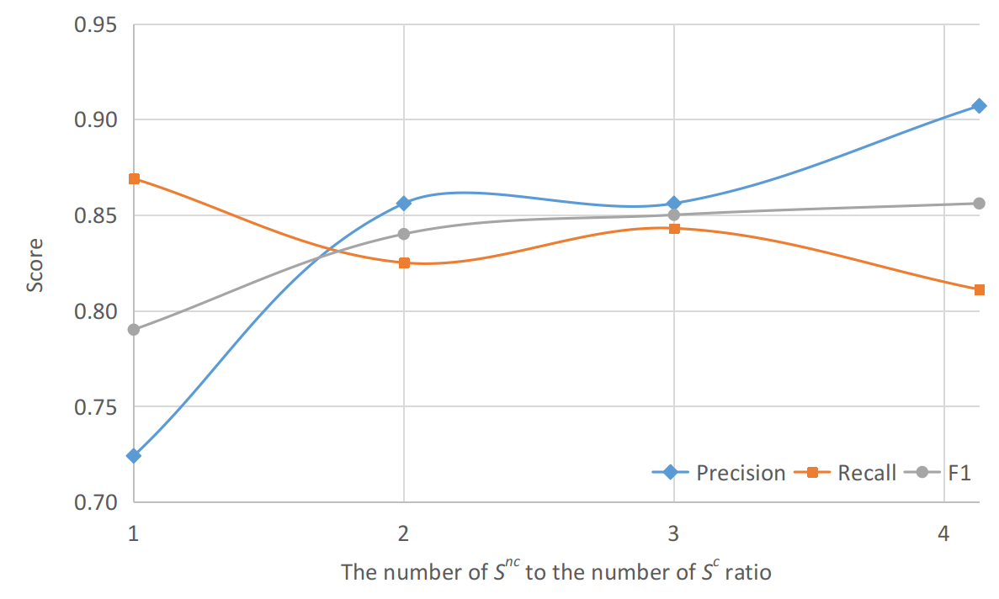
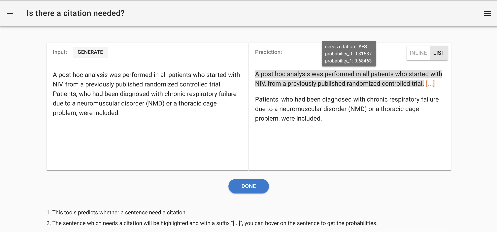

# 利用基于注意力的双向长短期记忆网络与可解释模型，构建引用价值的模型

发布时间：2024年05月20日

`Agent

理由：这篇论文主要关注的是开发一个自动化的系统，即一个“Agent”，用于识别科学文献中需要引用的句子。该系统结合了注意力机制和上下文信息的双向长短期记忆网络（BiLSTM），并使用了一个大规模的新数据集（PMOA-CITE）。这个Agent的目标是提高科学论证的严谨性，通过自动识别引用的重要性来辅助科学家。这与Agent分类下的研究内容相符，即开发和应用智能系统来解决特定问题。` `科学研究` `文献引用`

> Modeling citation worthiness by using attention-based bidirectional long short-term memory networks and interpretable models

# 摘要

> 科学家们早已掌握引用科学文献以支撑论点的技巧。但难题在于，他们有时难以决定引用的最佳位置，甚至可能完全遗漏引用。自动识别需引用的句子（即引用的重要性）能有效解决这些问题，助力构建更为严谨的科学论证。以往研究虽已尝试用机器学习解决此问题，但所用数据集较小，且未充分利用如深度学习中的注意力机制等最新算法。我们推测，通过从开放获取出版物中构建的大规模监督数据集，可以开发出极为精准的深度学习模型。本研究中，我们提出了一种结合注意力机制与上下文信息的双向长短期记忆网络（BiLSTM），用以识别需引用的句子。同时，我们创建了一个基于PubMed开放获取子集的大型新数据集（PMOA-CITE），其规模远超以往。实验结果显示，我们的模型在ACL-ARC标准数据集上达到了顶尖水平（$F_{1}=0.507$），并在PMOA-CITE上表现出色（$F_{1}=0.856$），且能实现跨数据集的迁移学习。我们还通过可解释模型揭示了特定语言如何促进或抑制引用。研究发现，章节及周围句子对提升预测准确性至关重要。进一步分析模型所谓的错误预测，我们发现了引用行为和源数据中的系统性人类错误，这为模型在预提交和预存档阶段检查文档提供了可能。我们已将新数据集、代码及一个网络工具公开，供社区使用。

> Scientist learn early on how to cite scientific sources to support their claims. Sometimes, however, scientists have challenges determining where a citation should be situated -- or, even worse, fail to cite a source altogether. Automatically detecting sentences that need a citation (i.e., citation worthiness) could solve both of these issues, leading to more robust and well-constructed scientific arguments. Previous researchers have applied machine learning to this task but have used small datasets and models that do not take advantage of recent algorithmic developments such as attention mechanisms in deep learning. We hypothesize that we can develop significantly accurate deep learning architectures that learn from large supervised datasets constructed from open access publications. In this work, we propose a Bidirectional Long Short-Term Memory (BiLSTM) network with attention mechanism and contextual information to detect sentences that need citations. We also produce a new, large dataset (PMOA-CITE) based on PubMed Open Access Subset, which is orders of magnitude larger than previous datasets. Our experiments show that our architecture achieves state of the art performance on the standard ACL-ARC dataset ($F_{1}=0.507$) and exhibits high performance ($F_{1}=0.856$) on the new PMOA-CITE. Moreover, we show that it can transfer learning across these datasets. We further use interpretable models to illuminate how specific language is used to promote and inhibit citations. We discover that sections and surrounding sentences are crucial for our improved predictions. We further examined purported mispredictions of the model, and uncovered systematic human mistakes in citation behavior and source data. This opens the door for our model to check documents during pre-submission and pre-archival procedures. We make this new dataset, the code, and a web-based tool available to the community.

[Arxiv](https://arxiv.org/abs/2405.12206)