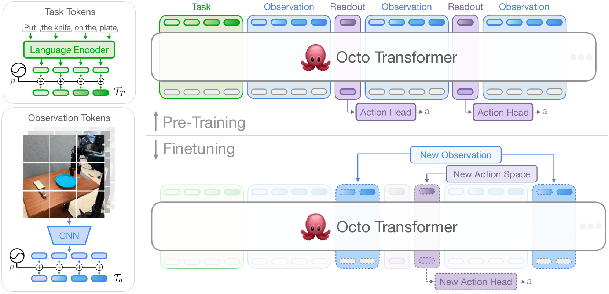
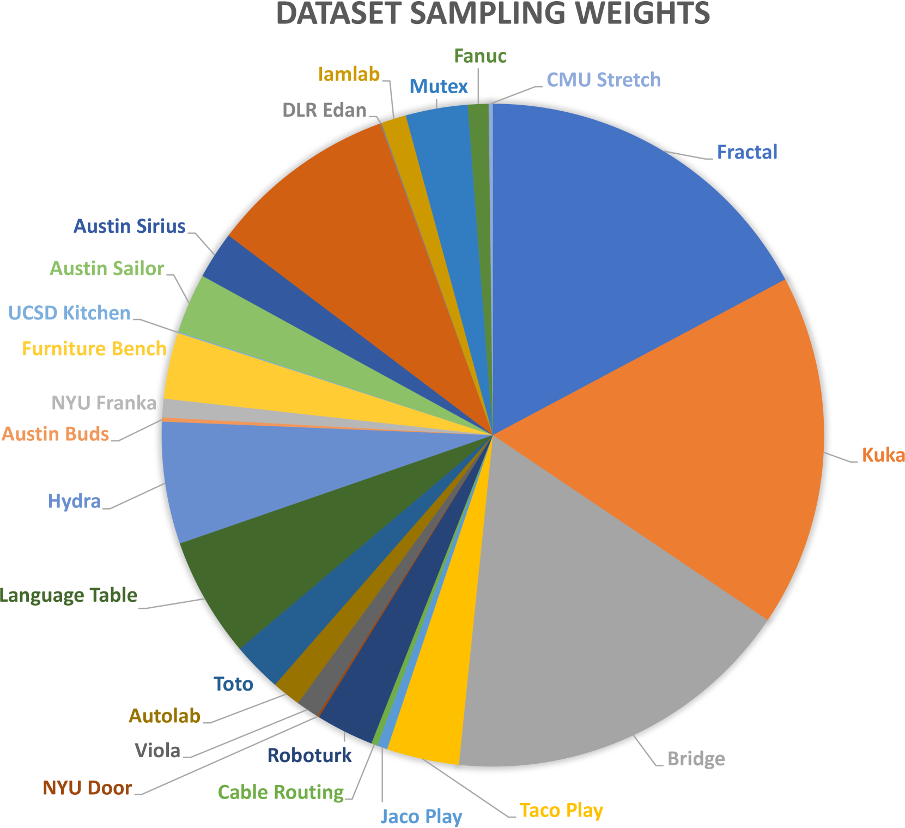
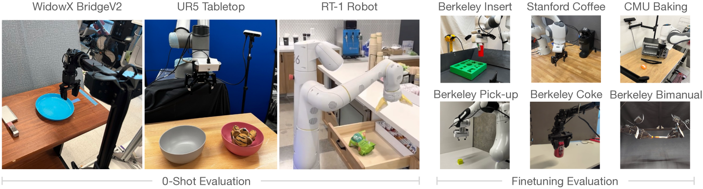
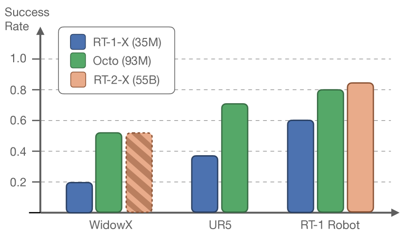
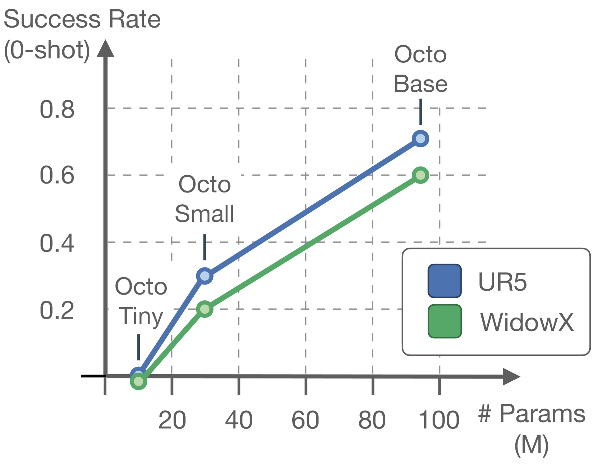
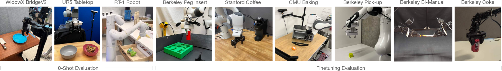

# Octo：一款开源的通用机器人策略，旨在为机器人领域提供灵活且广泛适用的解决方案。

发布时间：2024年05月20日

`Agent

这篇论文主要探讨了基于大型transformer的策略Octo在机器人学习领域的应用，特别是在多变的机器人学习场景、环境和任务中的适应性。Octo策略通过预训练和微调，能够处理各种传感器和动作空间，兼容多种机器人平台，并迅速适应新领域。这与Agent的定义相符，即一个能够感知环境并采取行动以达到目标的系统。因此，这篇论文应归类为Agent。` `机器人技术` `自动化`

> Octo: An Open-Source Generalist Robot Policy

# 摘要

> 通过在多样化的机器人数据集上预训练的大型策略，我们有望革新机器人学习领域：无需从头开始，这些通用策略仅需少量领域数据微调，便能广泛适应。为了在多变的机器人学习场景、环境和任务中发挥作用，这些策略必须能处理各种传感器和动作空间，兼容多种机器人平台，并能迅速高效地适应新领域。本研究旨在为开发开源、广泛适用的通用机器人操作策略奠定基础。我们首先推出了Octo，一个基于大型transformer的策略，它接受了来自Open X-Embodiment数据集的80万轨迹训练，这是当前最大的机器人操作数据集。Octo能通过语言命令或目标图像进行操作，并在标准消费级GPU上几小时内适应新的感官输入和动作空间。在9个机器人平台上的实验表明，Octo是一种多功能的策略初始化，能有效适应新的观察和动作空间。我们还对Octo模型的设计进行了详细分析，从架构到训练数据，旨在为未来通用机器人模型的研究提供指导。

> Large policies pretrained on diverse robot datasets have the potential to transform robotic learning: instead of training new policies from scratch, such generalist robot policies may be finetuned with only a little in-domain data, yet generalize broadly. However, to be widely applicable across a range of robotic learning scenarios, environments, and tasks, such policies need to handle diverse sensors and action spaces, accommodate a variety of commonly used robotic platforms, and finetune readily and efficiently to new domains. In this work, we aim to lay the groundwork for developing open-source, widely applicable, generalist policies for robotic manipulation. As a first step, we introduce Octo, a large transformer-based policy trained on 800k trajectories from the Open X-Embodiment dataset, the largest robot manipulation dataset to date. It can be instructed via language commands or goal images and can be effectively finetuned to robot setups with new sensory inputs and action spaces within a few hours on standard consumer GPUs. In experiments across 9 robotic platforms, we demonstrate that Octo serves as a versatile policy initialization that can be effectively finetuned to new observation and action spaces. We also perform detailed ablations of design decisions for the Octo model, from architecture to training data, to guide future research on building generalist robot models.

[Arxiv](https://arxiv.org/abs/2405.12213)