# PARALLELGPUOS：基于验证推测的并发操作系统级GPU检查点与恢复系统

发布时间：2024年05月20日

`LLM应用

理由：这篇论文主要讨论了在GPU任务中实现检查点与恢复（C/R）的机制，特别是在操作系统级别上对GPU进程进行透明处理的方法。虽然论文中提到了大型语言模型（LLM）训练的应用，但其核心贡献在于开发了一种新的GPU C/R解决方案，即POS系统，该系统能够并发执行C/R操作，提高性能，并适用于多种应用程序，包括LLM训练。因此，这篇论文更偏向于LLM的应用层面，即如何优化和增强LLM训练过程中的技术支持，而不是深入探讨LLM的理论或Agent的设计与实现。` `云计算` `GPU计算`

> PARALLELGPUOS: A Concurrent OS-level GPU Checkpoint and Restore System using Validated Speculation

# 摘要

> 检查点与恢复（C/R）是GPU任务的核心机制。POS系统作为首个操作系统级别的GPU C/R解决方案，能够在不干扰应用程序的情况下，透明地执行GPU进程的检查点与恢复，满足云服务等现代系统的需求。POS的独特之处在于，它能在应用程序运行的同时，并发执行C/R操作，这在仅涉及CPU的场景中简单易行，但面对GPU时则颇具挑战。关键问题在于，如何在保持透明性的同时，确保并发操作的一致性。CPU通过操作系统和硬件分页轻松解决此问题，而GPU为了性能则绕过了这些机制。POS通过运行时推测性地提取GPU内核的缓冲区访问信息，巧妙填补了这一语义鸿沟。由于GPU内核结构清晰，我们的方法在多个领域的应用程序中实现了100%的准确性，从视觉处理到大型语言模型训练，再到强化学习。基于这些提取的语义，POS系统性地将C/R与应用程序执行重叠，显著提升了性能，超越了现有的操作系统级别GPU C/R系统，实现了训练容错、实时GPU进程迁移和基于GPU的无服务器计算的快速启动。

> Checkpointing (C) and restoring (R) are key components for GPU tasks. POS is an OS-level GPU C/R system: It can transparently checkpoint or restore processes that use the GPU, without requiring any cooperation from the application, a key feature required by modern systems like the cloud. Moreover, POS is the first OS-level C/R system that can concurrently execute C/R with the application execution: a critical feature that can be trivially achieved when the processes only running on the CPU, but becomes challenging when the processes use GPU. The problem is how to ensure consistency during concurrent execution with the lack of application semantics due to transparency. CPU processes can leverage OS and hardware paging to fix inconsistency without application semantics. Unfortunately, GPU bypasses OS and paging for high performance. POS fills the semantic gap by speculatively extracting buffer access information of GPU kernels during runtime. Thanks to the simple and well-structured nature of GPU kernels, our speculative extraction (with runtime validation) achieves 100% accuracy on applications from training to inference whose domains span from vision, large language models, and reinforcement learning. Based on the extracted semantics, we systematically overlap C/R with application execution, and achieves orders of magnitude higher performance under various tasks compared with the state-of-the-art OS-level GPU C/R, including training fault tolerance, live GPU process migration, and cold starts acceleration in GPU-based serverless computing.

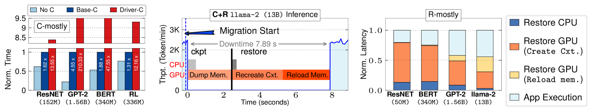

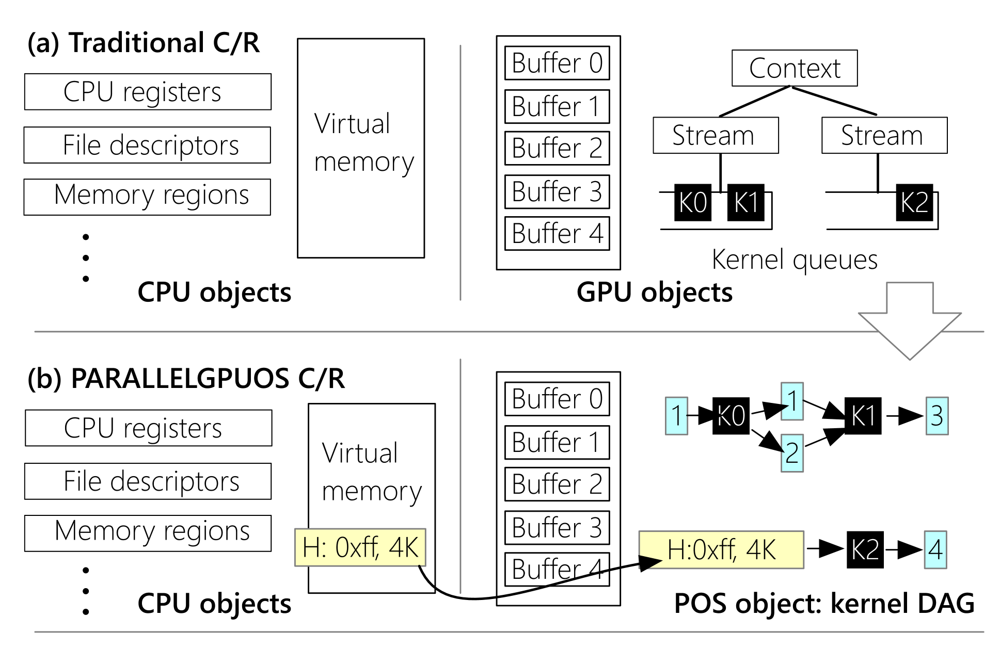

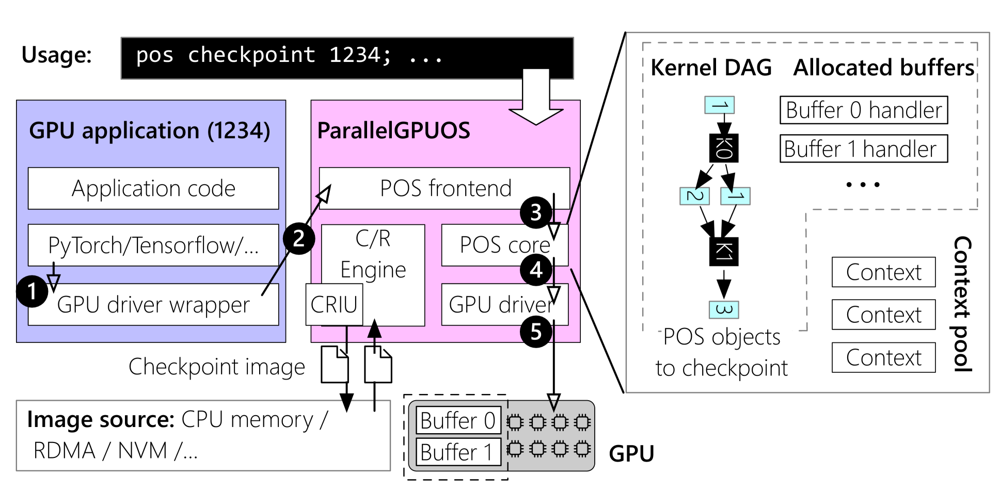

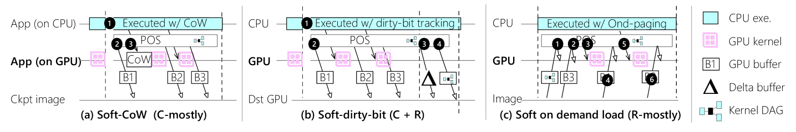

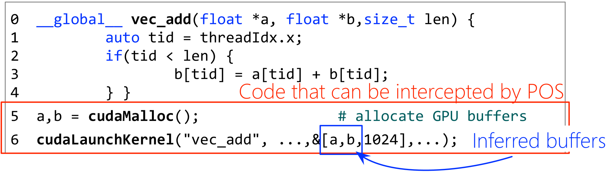

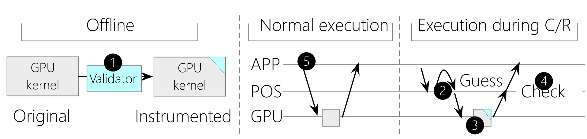

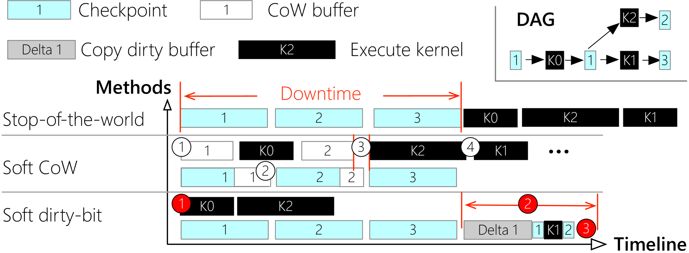

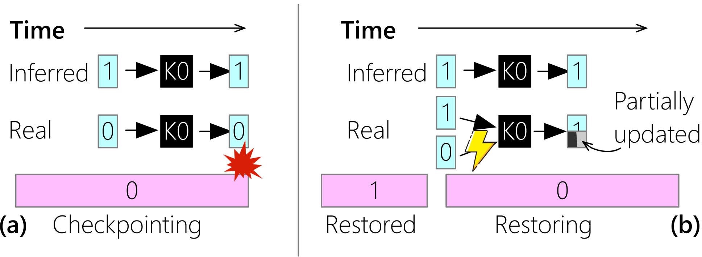

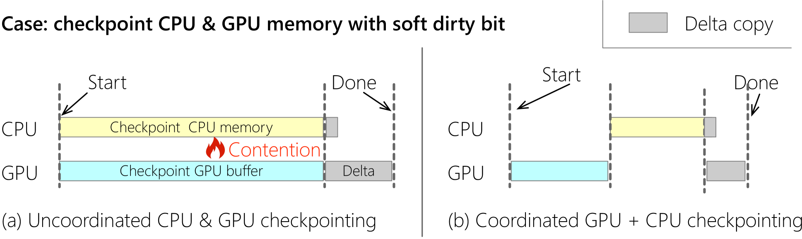

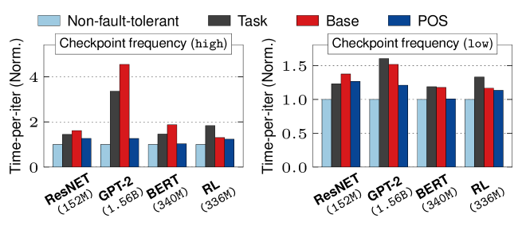

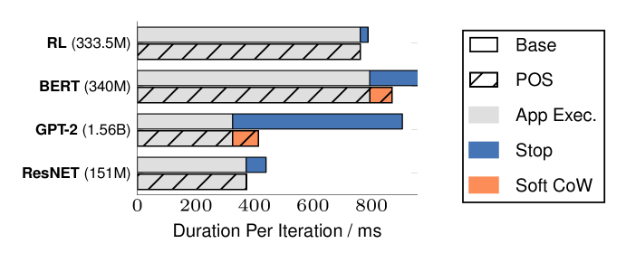

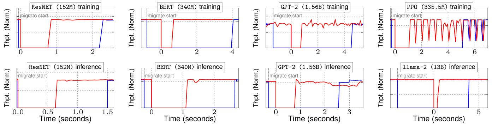

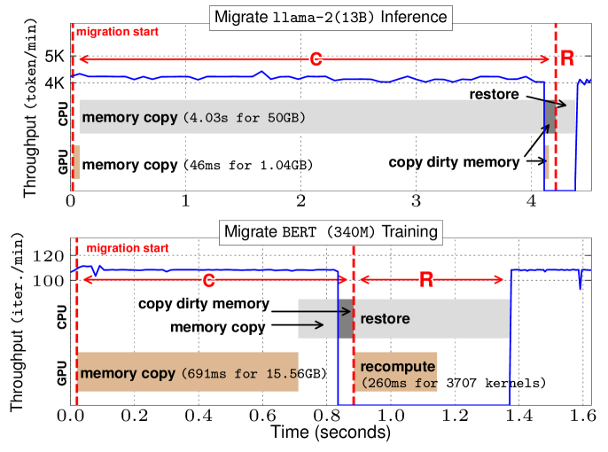

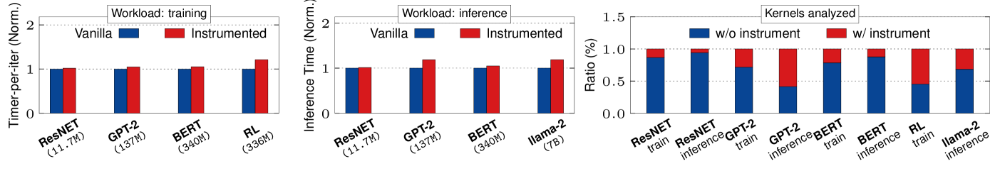

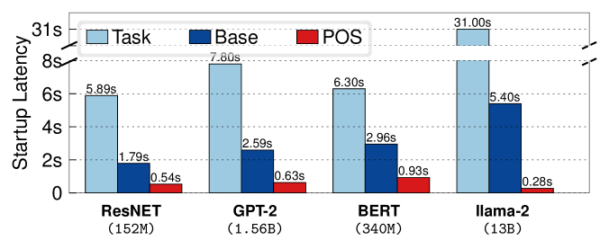

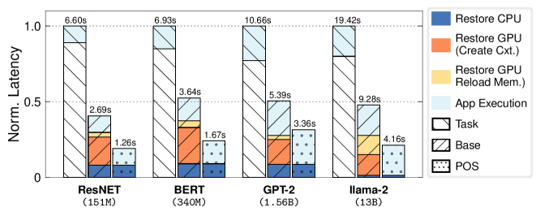

[Arxiv](https://arxiv.org/abs/2405.12079)