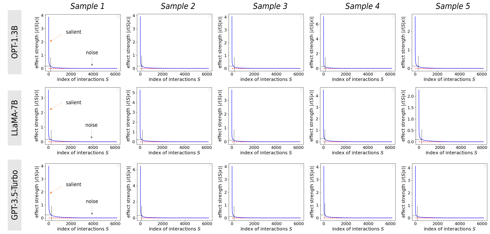

# 探究大型语言模型中上下文推理与记忆效应的量化分析

发布时间：2024年05月20日

`LLM理论

这篇论文的摘要描述了一个公理系统，用于量化大型语言模型（LLM）在语言生成中的记忆与上下文推理效应。这些效应涉及LLM编码的词汇间的非线性互动，并且研究者区分了不同类型的记忆和推理效应。这种研究专注于LLM的理论分析和内部机制，因此属于LLM理论分类。` `机器学习`

> Quantifying In-Context Reasoning Effects and Memorization Effects in LLMs

# 摘要

> 本研究提出了一套公理系统，旨在精确量化大型语言模型（LLM）在语言生成中的记忆与上下文推理效应。这些效应表现为LLM编码的词汇间的非线性互动。通过该系统，我们区分了记忆效应为基础与混沌两类，并将上下文推理效应细分为增强、消除及反转推理模式。此外，分解出的效应满足稀疏与普遍匹配特性，确保了LLM置信度得分能准确分解为记忆与推理效应。实验结果显示，这种分解有助于直接分析LLM中的推理细节。

> In this study, we propose an axiomatic system to define and quantify the precise memorization and in-context reasoning effects used by the large language model (LLM) for language generation. These effects are formulated as non-linear interactions between tokens/words encoded by the LLM. Specifically, the axiomatic system enables us to categorize the memorization effects into foundational memorization effects and chaotic memorization effects, and further classify in-context reasoning effects into enhanced inference patterns, eliminated inference patterns, and reversed inference patterns. Besides, the decomposed effects satisfy the sparsity property and the universal matching property, which mathematically guarantee that the LLM's confidence score can be faithfully decomposed into the memorization effects and in-context reasoning effects. Experiments show that the clear disentanglement of memorization effects and in-context reasoning effects enables a straightforward examination of detailed inference patterns encoded by LLMs.

[Arxiv](https://arxiv.org/abs/2405.11880)