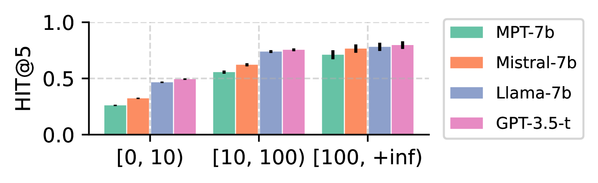
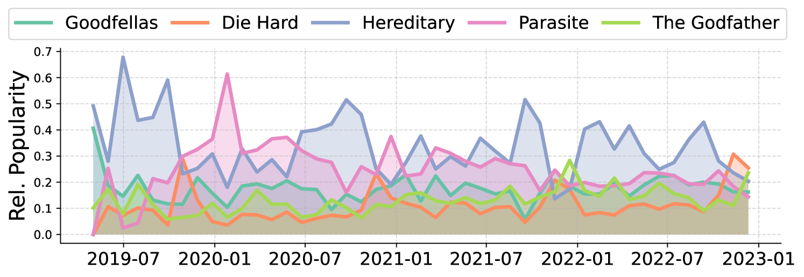
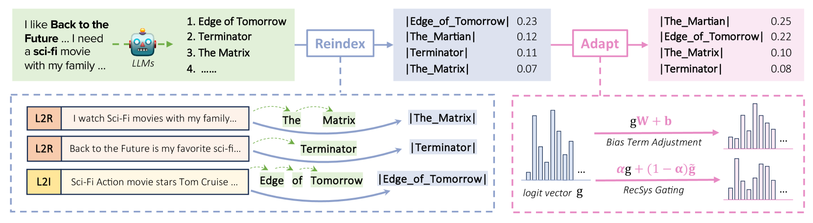
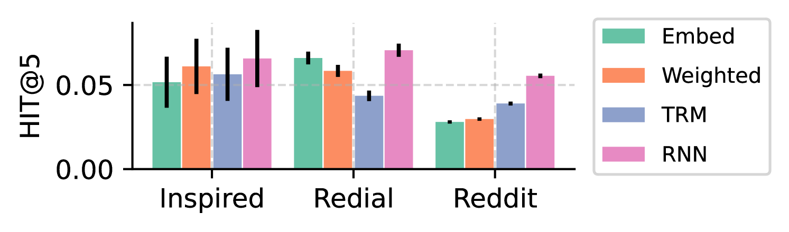
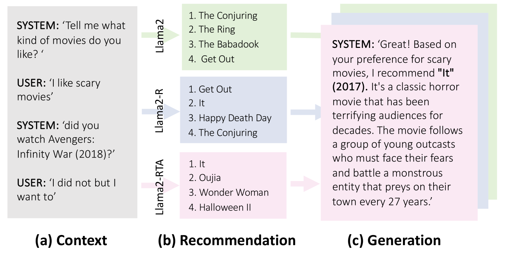

# 重索引再适应：优化大型语言模型于对话推荐之应用

发布时间：2024年05月20日

`LLM应用

这篇论文探讨了大型语言模型（LLMs）在对话推荐系统中的应用，特别是在控制推荐物品分布方面的挑战。论文提出了一种名为“重新索引-然后适应”（RTA）的新框架，旨在简化LLMs中的多令牌物品标题并调整其概率分布，以提高推荐系统的性能。这种方法结合了LLMs的查询理解能力和传统推荐系统在控制物品分布方面的优势。因此，这篇论文属于LLM应用类别，因为它专注于LLMs在特定应用场景（对话推荐系统）中的实际应用和改进。` `对话推荐系统` `推荐系统`

> Reindex-Then-Adapt: Improving Large Language Models for Conversational Recommendation

# 摘要

> 大型语言模型（LLMs）正通过其对物品内容的精准索引、对复杂对话上下文的深刻理解以及相关物品标题的生成能力，彻底改变对话推荐系统。但控制推荐物品的分布仍是一大难题，这往往导致性能不佳，尤其是在捕捉如物品流行度这类快速变化的数据分布时。在对话推荐中，LLMs通过自回归生成多令牌标题来推荐物品，这使得全面获取和控制推荐变得复杂。为此，我们提出了“重新索引-然后适应”（RTA）框架，该框架将LLMs中的多令牌物品标题简化为单令牌，并相应调整其概率分布。RTA框架巧妙结合了LLMs的复杂查询理解能力和传统推荐系统（RecSys）在对话推荐中高效控制物品分布的优势。实验证明，我们的框架在三个对话推荐数据集和两种适应场景下均显著提升了准确性。

> Large language models (LLMs) are revolutionizing conversational recommender systems by adeptly indexing item content, understanding complex conversational contexts, and generating relevant item titles. However, controlling the distribution of recommended items remains a challenge. This leads to suboptimal performance due to the failure to capture rapidly changing data distributions, such as item popularity, on targeted conversational recommendation platforms. In conversational recommendation, LLMs recommend items by generating the titles (as multiple tokens) autoregressively, making it difficult to obtain and control the recommendations over all items. Thus, we propose a Reindex-Then-Adapt (RTA) framework, which converts multi-token item titles into single tokens within LLMs, and then adjusts the probability distributions over these single-token item titles accordingly. The RTA framework marries the benefits of both LLMs and traditional recommender systems (RecSys): understanding complex queries as LLMs do; while efficiently controlling the recommended item distributions in conversational recommendations as traditional RecSys do. Our framework demonstrates improved accuracy metrics across three different conversational recommendation datasets and two adaptation settings

[Arxiv](https://arxiv.org/abs/2405.12119)