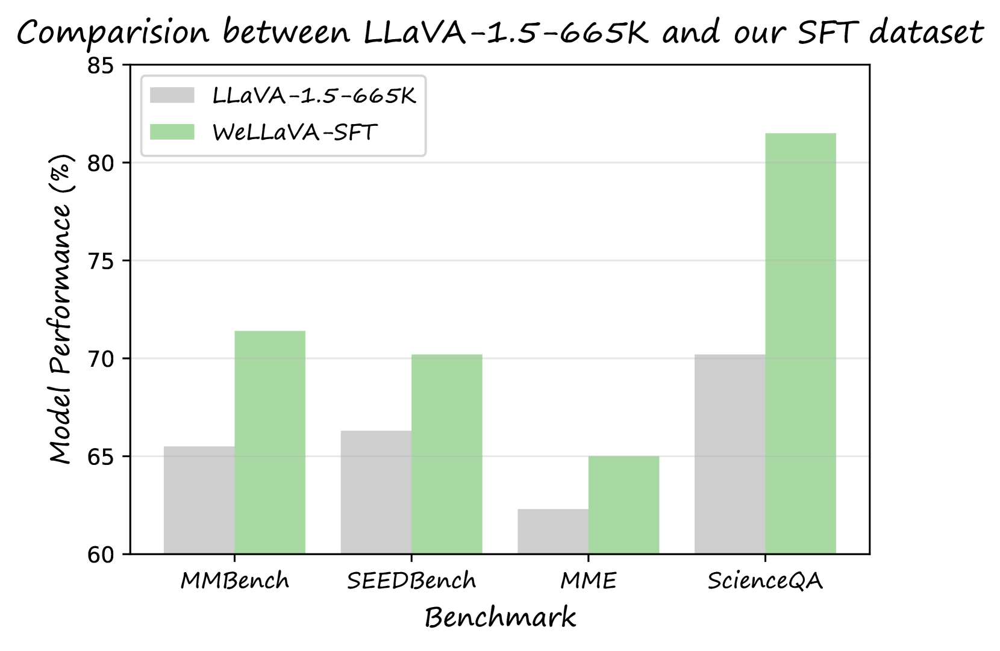
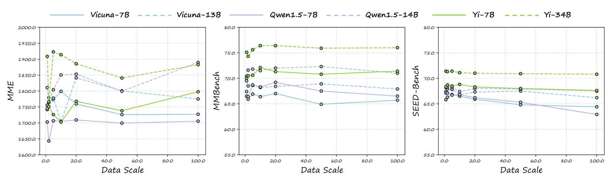
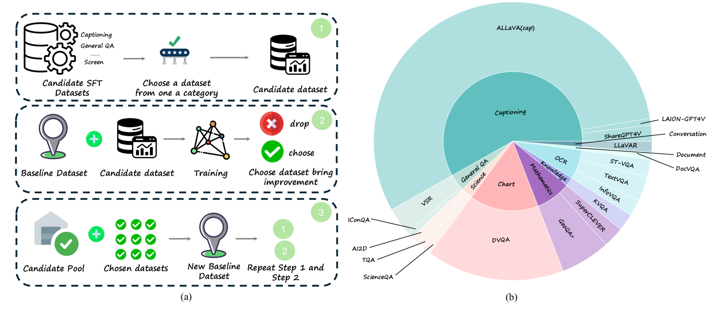
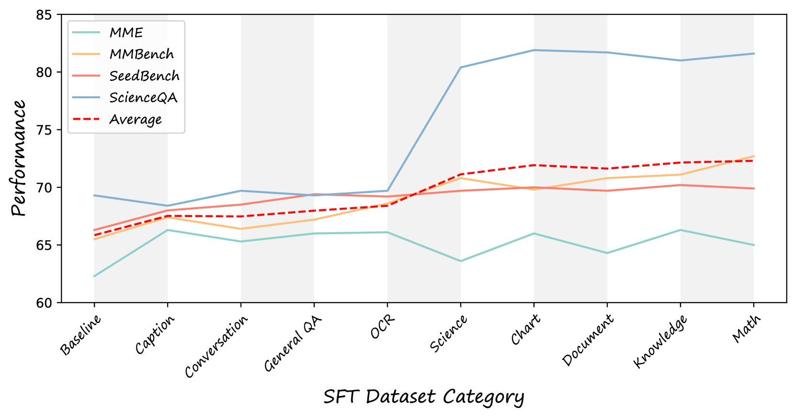

# 审视视觉-语言模型中常被忽略的维度

发布时间：2024年05月20日

`LLM应用

这篇论文关注的是大型视觉-语言模型（如LLaVA）在预训练和指令调整过程中的数据效率问题。它探讨了如何优化数据使用以提升模型性能，而不是简单地增加数据量。这与LLM应用领域紧密相关，因为它涉及如何有效地应用和优化现有的LLM技术，以提高其在特定任务上的表现。因此，这篇论文应归类于LLM应用。` `人工智能` `数据优化`

> Rethinking Overlooked Aspects in Vision-Language Models

# 摘要

> 近期，GPT4-V和LLaVA等大型视觉-语言模型取得了重大进展，尤其是LLaVA的模块化设计，既简洁又高效。研究者们主要通过增加预训练和指令调整数据来提升模型性能。然而，本文关注的是预训练中的数据效率和指令调整数据集的选择，指出单纯增加数据量未必能提升性能，甚至可能适得其反。我们开发了一套方法，以识别最有效的SFT数据集，揭示并非所有SFT数据都必需。本文旨在为未来研究提供指导，优化数据使用，提升视觉-语言模型的性能，而非仅仅推出一个新模型。

> Recent advancements in large vision-language models (LVLMs), such as GPT4-V and LLaVA, have been substantial. LLaVA's modular architecture, in particular, offers a blend of simplicity and efficiency. Recent works mainly focus on introducing more pre-training and instruction tuning data to improve model's performance. This paper delves into the often-neglected aspects of data efficiency during pre-training and the selection process for instruction tuning datasets. Our research indicates that merely increasing the size of pre-training data does not guarantee improved performance and may, in fact, lead to its degradation. Furthermore, we have established a pipeline to pinpoint the most efficient instruction tuning (SFT) dataset, implying that not all SFT data utilized in existing studies are necessary. The primary objective of this paper is not to introduce a state-of-the-art model, but rather to serve as a roadmap for future research, aiming to optimize data usage during pre-training and fine-tuning processes to enhance the performance of vision-language models.

[Arxiv](https://arxiv.org/abs/2405.11850)