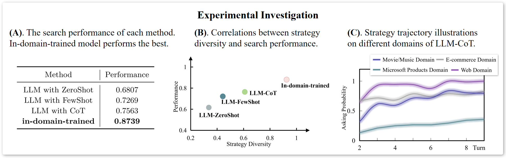

# STYLE：优化大型语言模型对话代理中提问澄清问题的跨领域应用能力

发布时间：2024年05月20日

`Agent

这篇论文主要探讨了基于大型语言模型（LLMs）的澄清策略在不同领域中的适应性和迁移性问题。论文提出了一种名为“Style”的新方法，旨在提高这些策略在未知领域间的可迁移性，并通过实验证明了该方法在提升搜索性能方面的有效性。由于论文关注的是如何使LLMs更好地适应和迁移到不同领域，以提高对话式搜索引擎的效率，这更偏向于Agent的范畴，即如何设计和优化智能代理以适应特定任务或环境。因此，我将这篇论文分类为Agent。` `搜索引擎` `对话系统`

> STYLE: Improving Domain Transferability of Asking Clarification Questions in Large Language Model Powered Conversational Agents

# 摘要

> 随着对话式搜索引擎在各领域的重要性日益增加，何时提出澄清问题的策略变得至关重要。大型语言模型（LLMs）凭借其强大的上下文理解和特定领域知识，使得基于LLM的澄清策略能够迅速适应不同领域。然而，面对未知领域，这些策略仍显力不从心，难以实现领域间的有效迁移。为此，我们首次深入探讨这一挑战，并发现现有方法往往采用一种适用于所有领域的通用策略，这限制了其在多样化领域中的搜索效率。鉴于此，我们创新性地提出了一种名为“Style”的方法，旨在提升领域间的可迁移性。实验数据令人鼓舞，显示“Style”在四个未知领域中平均提升了约10%的搜索性能，彰显了其卓越的领域适应能力。

> Equipping a conversational search engine with strategies regarding when to ask clarification questions is becoming increasingly important across various domains. Attributing to the context understanding capability of LLMs and their access to domain-specific sources of knowledge, LLM-based clarification strategies feature rapid transfer to various domains in a post-hoc manner. However, they still struggle to deliver promising performance on unseen domains, struggling to achieve effective domain transferability. We take the first step to investigate this issue and existing methods tend to produce one-size-fits-all strategies across diverse domains, limiting their search effectiveness. In response, we introduce a novel method, called Style, to achieve effective domain transferability. Our experimental results indicate that Style bears strong domain transferability, resulting in an average search performance improvement of ~10% on four unseen domains.

[Arxiv](https://arxiv.org/abs/2405.12059)