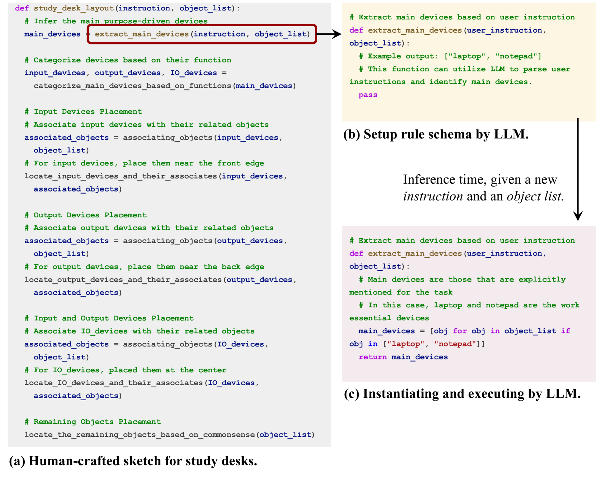
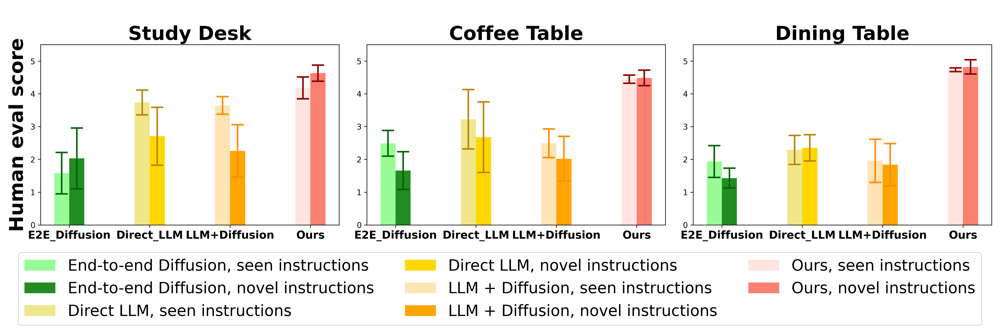

# "布置起来！"：利用组合生成模型进行功能性物体布局

发布时间：2024年05月20日

`Agent

理由：这篇论文主要探讨了如何让机器人（即Agent）理解并执行模糊指令，并开发了一个框架（SetItUp）来实现这一目标。该框架利用大型语言模型（LLMs）来识别物体间的空间关系，并构建模型来确定物体位置，从而完成特定的任务（如布置餐桌）。这属于Agent技术的应用，因为它涉及创建能够理解和执行复杂任务的智能系统。` `机器人技术` `家居自动化`

> "Set It Up!": Functional Object Arrangement with Compositional Generative Models

# 摘要

> 本文探讨了如何让机器人理解并执行模糊指令，如“为两人布置餐桌”，这一挑战。传统方法多依赖于明确的指令，如“将物体A置于桌上”。为此，我们开发了SetItUp框架，它通过结合少量训练样本与人工编写的程序草图，揭示特定场景的排列规则。SetItUp采用物体间抽象空间关系的图式表示，将问题分解为两部分：一是从有限数据中提炼排列模式，二是将抽象关系转化为具体的物体摆放。它借助大型语言模型（LLMs）识别新场景中物体间的空间关系作为约束条件，并构建扩散模型库以确定满足这些约束的物体位置。实验在包含多种桌子的数据集上进行，结果表明，SetItUp在创造既实用又美观的物体布局上，超越了现有模型。

> This paper studies the challenge of developing robots capable of understanding under-specified instructions for creating functional object arrangements, such as "set up a dining table for two"; previous arrangement approaches have focused on much more explicit instructions, such as "put object A on the table." We introduce a framework, SetItUp, for learning to interpret under-specified instructions. SetItUp takes a small number of training examples and a human-crafted program sketch to uncover arrangement rules for specific scene types. By leveraging an intermediate graph-like representation of abstract spatial relationships among objects, SetItUp decomposes the arrangement problem into two subproblems: i) learning the arrangement patterns from limited data and ii) grounding these abstract relationships into object poses. SetItUp leverages large language models (LLMs) to propose the abstract spatial relationships among objects in novel scenes as the constraints to be satisfied; then, it composes a library of diffusion models associated with these abstract relationships to find object poses that satisfy the constraints. We validate our framework on a dataset comprising study desks, dining tables, and coffee tables, with the results showing superior performance in generating physically plausible, functional, and aesthetically pleasing object arrangements compared to existing models.

[Arxiv](https://arxiv.org/abs/2405.11928)