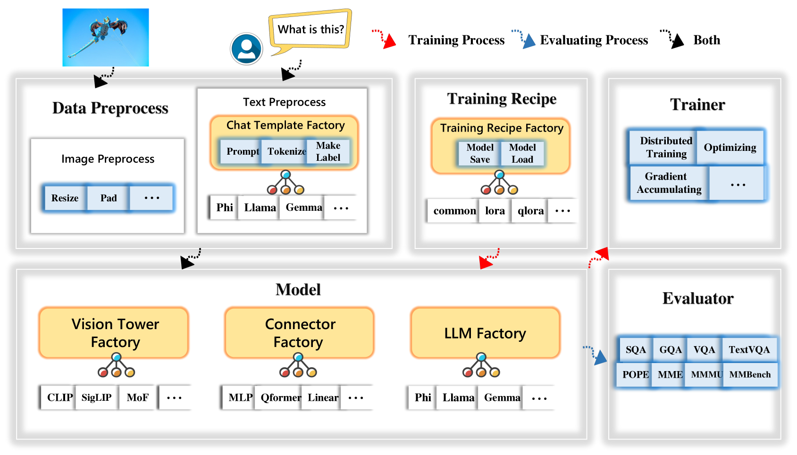

# TinyLLaVA工厂：专为小型大规模多模态模型设计的模块化代码库

发布时间：2024年05月20日

`LLM应用

理由：这篇论文介绍了一个名为TinyLLaVA Factory的开源代码库，专门为小型多模态模型（LMMs）设计。它强调了代码的简洁性、功能的可扩展性以及结果的可重复性，这些都是实际应用中的重要特性。此外，该代码库支持用户定制LMMs，并提供了流行的训练方案，以简化预训练和微调过程。这些特点表明，该论文主要关注于LLM的实际应用和开发工具，因此归类为LLM应用。` `软件工程` `人工智能`

> TinyLLaVA Factory: A Modularized Codebase for Small-scale Large Multimodal Models

# 摘要

> 我们推出了TinyLLaVA Factory，一个开源的模块化代码库，专为小型多模态模型（LMMs）设计，强调代码简洁、功能可扩展和结果可重复。基于软件工程的工厂模式，该代码库将系统分解为可互换的模块，每个模块集成了前沿技术和方法，并预留了扩展空间。用户不仅能定制LMMs，还能利用提供的流行训练方案，简化预训练和微调过程。实验证明，TinyLLaVA Factory有效助力研究者和实践者在有限的计算资源下，探索和开发小型LMMs。

> We present TinyLLaVA Factory, an open-source modular codebase for small-scale large multimodal models (LMMs) with a focus on simplicity of code implementations, extensibility of new features, and reproducibility of training results. Following the design philosophy of the factory pattern in software engineering, TinyLLaVA Factory modularizes the entire system into interchangeable components, with each component integrating a suite of cutting-edge models and methods, meanwhile leaving room for extensions to more features. In addition to allowing users to customize their own LMMs, TinyLLaVA Factory provides popular training recipes to let users pretrain and finetune their models with less coding effort. Empirical experiments validate the effectiveness of our codebase. The goal of TinyLLaVA Factory is to assist researchers and practitioners in exploring the wide landscape of designing and training small-scale LMMs with affordable computational resources.

[Arxiv](https://arxiv.org/abs/2405.11788)