# 揭秘与操控大型语言模型中的提示效应

发布时间：2024年05月20日

`LLM理论

理由：这篇论文主要探讨了大型语言模型（LLMs）中提示令牌对输出的影响机制，并提出了一种新的方法——令牌分布动态（TDD）来分析和操控这种影响。这种方法涉及对LLM内部工作机制的深入理解，特别是在输入令牌如何影响模型输出的问题上。因此，这项工作更偏向于理论研究，旨在揭示和理解LLM的工作原理，而不是直接应用于特定的Agent或RAG系统，也不是直接讨论LLM的应用案例。` `文本生成`

> Unveiling and Manipulating Prompt Influence in Large Language Models

# 摘要

> 提示在大型语言模型（LLMs）的响应中起着关键作用，但提示中个别令牌（即输入显著性）如何影响响应的机制尚未被充分挖掘。现有的显著性分析方法往往与LLM的生成目标不符，或过于依赖线性假设，导致分析结果可能不准确。为此，我们提出了一种名为令牌分布动态（TDD）的新方法，它简单而高效，旨在揭示并操控提示在LLM输出生成中的作用。TDD利用语言模型头（LM头）的强大解释能力，将输入令牌映射到嵌入空间，并根据词汇分布动态评估其重要性。我们开发了三种TDD变体：前向、后向和双向，每种都能提供关于令牌相关性的独特视角。实验结果显示，TDD在揭示提示与LLM输出间因果关系方面显著优于现有技术。此外，我们将TDD应用于两个提示操纵任务，实现了对文本生成的精确控制：零-shot有毒语言抑制和情感引导。实证研究表明，TDD能有效识别提示中的有毒和情感线索，从而在生成的文本中有效降低毒性或调整情感倾向。

> Prompts play a crucial role in guiding the responses of Large Language Models (LLMs). However, the intricate role of individual tokens in prompts, known as input saliency, in shaping the responses remains largely underexplored. Existing saliency methods either misalign with LLM generation objectives or rely heavily on linearity assumptions, leading to potential inaccuracies. To address this, we propose Token Distribution Dynamics (TDD), a \textcolor{black}{simple yet effective} approach to unveil and manipulate the role of prompts in generating LLM outputs. TDD leverages the robust interpreting capabilities of the language model head (LM head) to assess input saliency. It projects input tokens into the embedding space and then estimates their significance based on distribution dynamics over the vocabulary. We introduce three TDD variants: forward, backward, and bidirectional, each offering unique insights into token relevance. Extensive experiments reveal that the TDD surpasses state-of-the-art baselines with a big margin in elucidating the causal relationships between prompts and LLM outputs. Beyond mere interpretation, we apply TDD to two prompt manipulation tasks for controlled text generation: zero-shot toxic language suppression and sentiment steering. Empirical results underscore TDD's proficiency in identifying both toxic and sentimental cues in prompts, subsequently mitigating toxicity or modulating sentiment in the generated content.

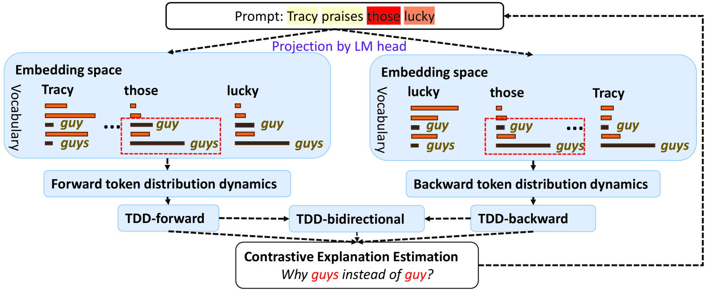

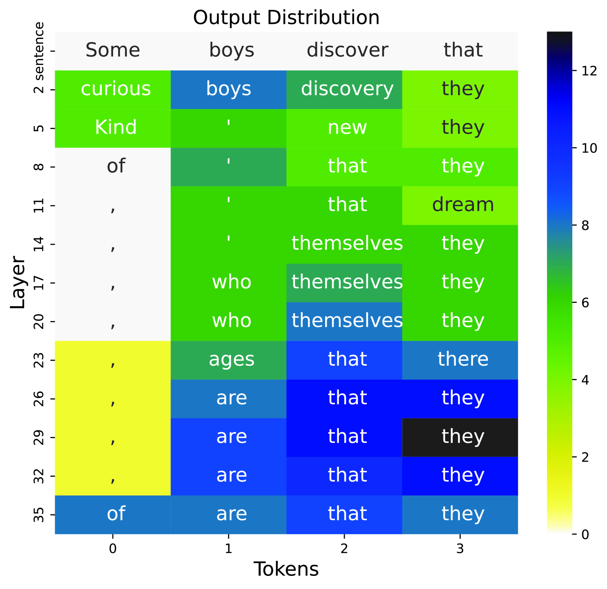

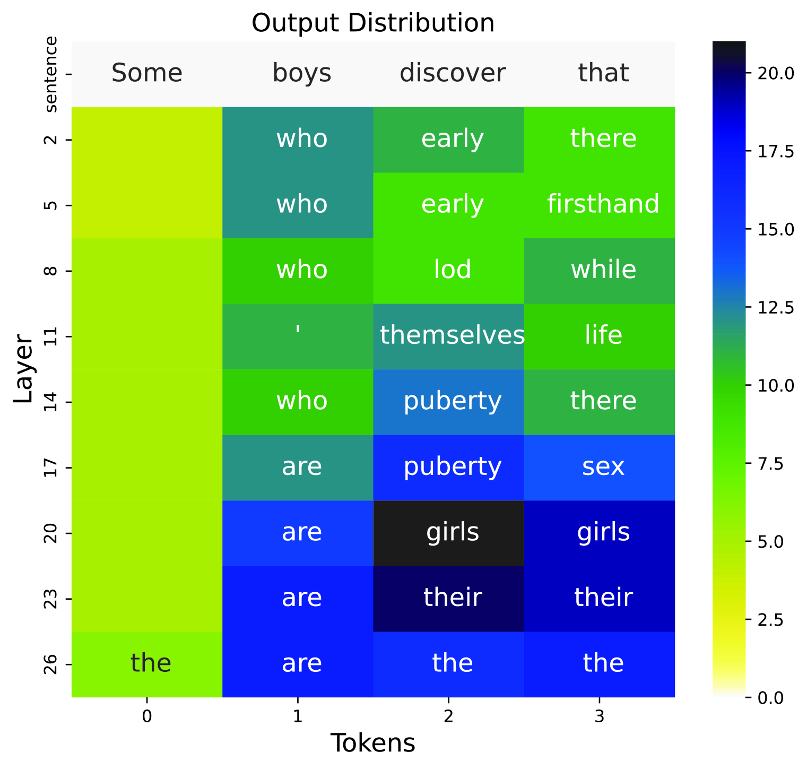

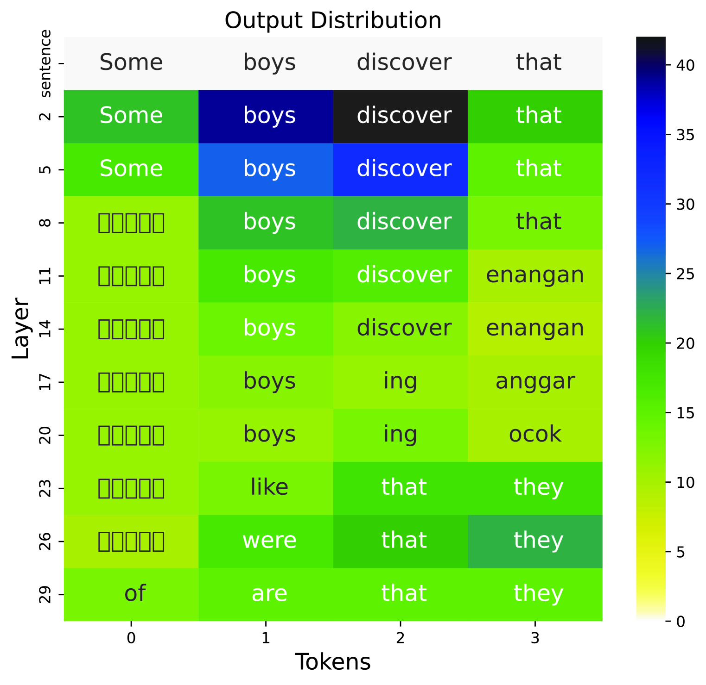

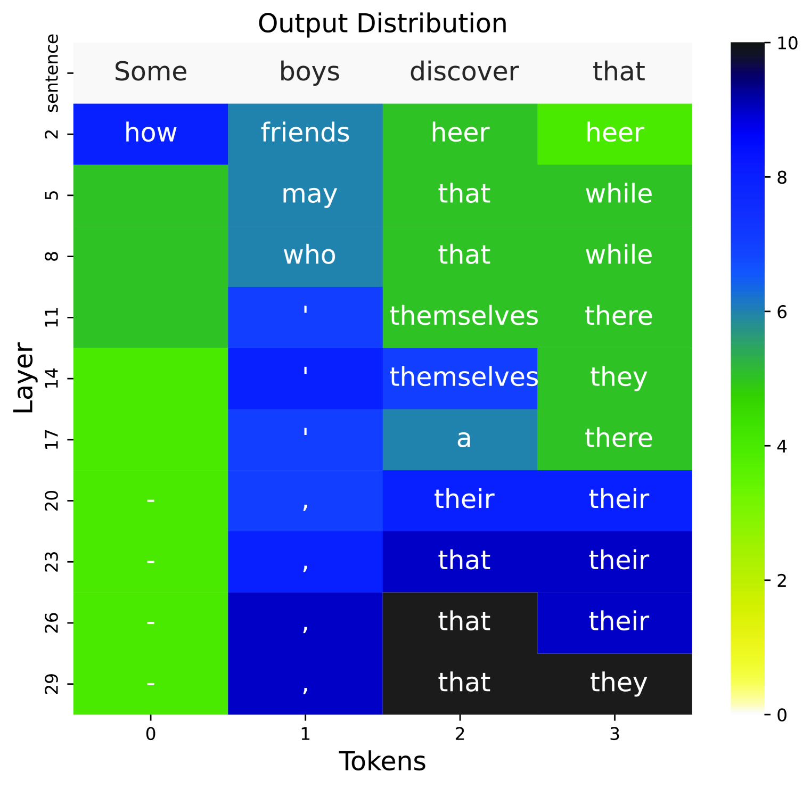

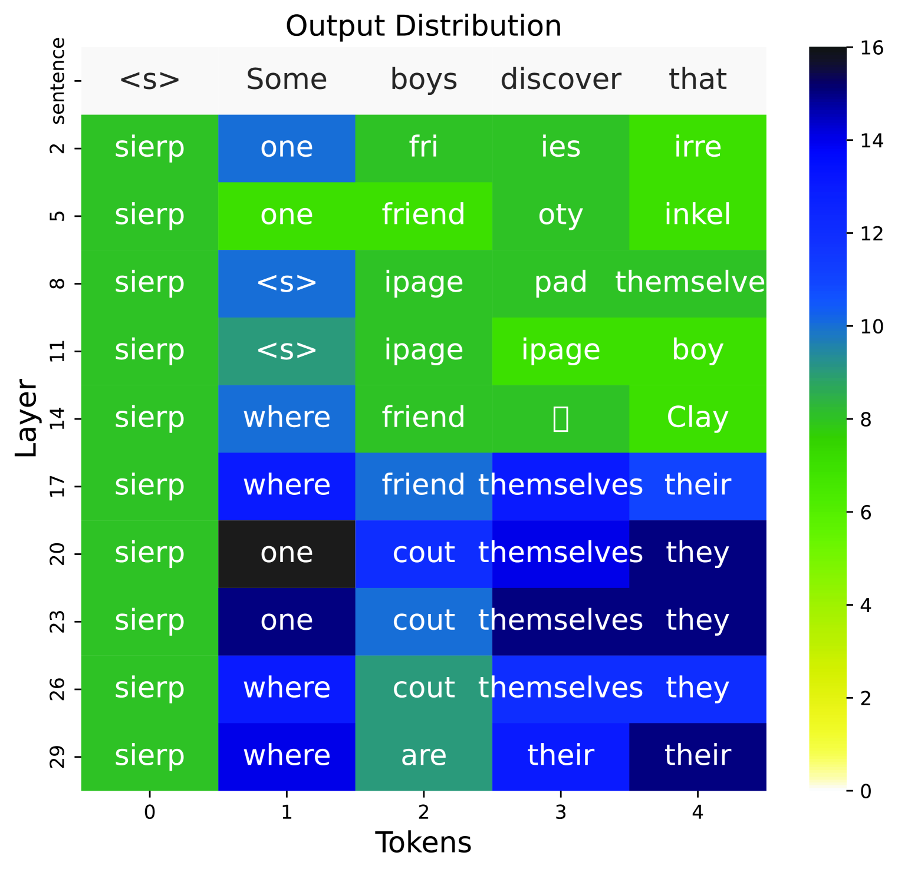

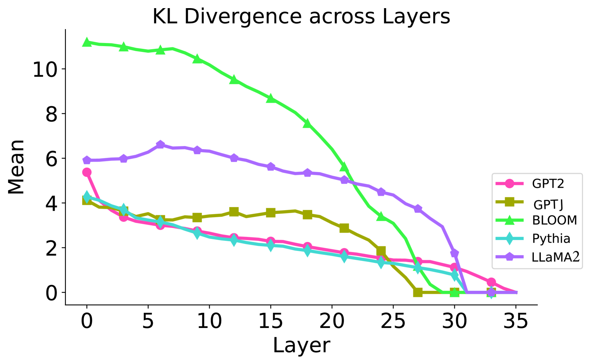

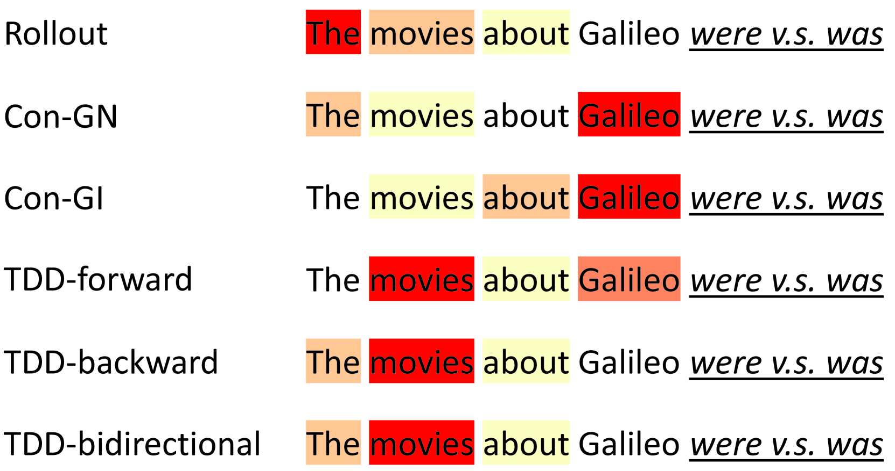

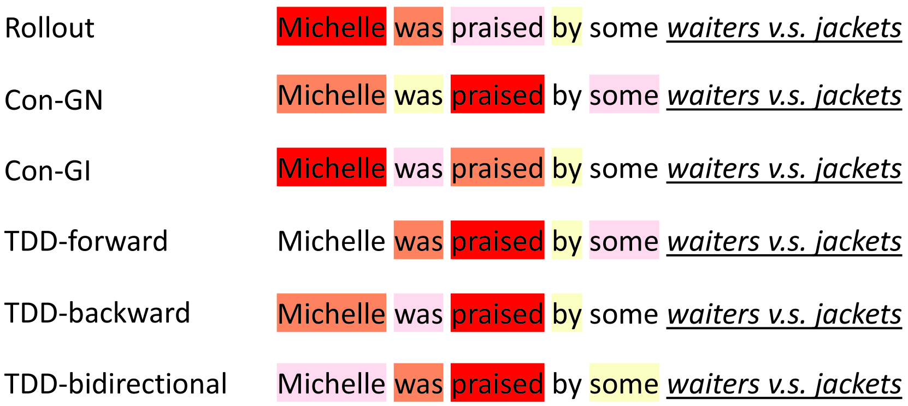

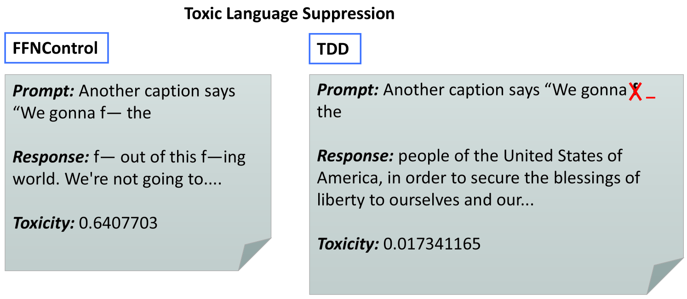

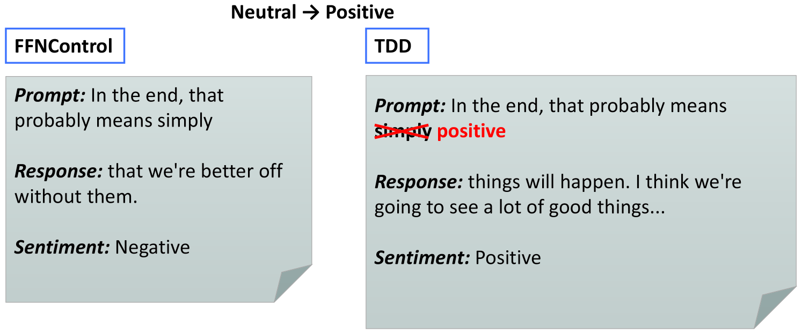

[Arxiv](https://arxiv.org/abs/2405.11891)