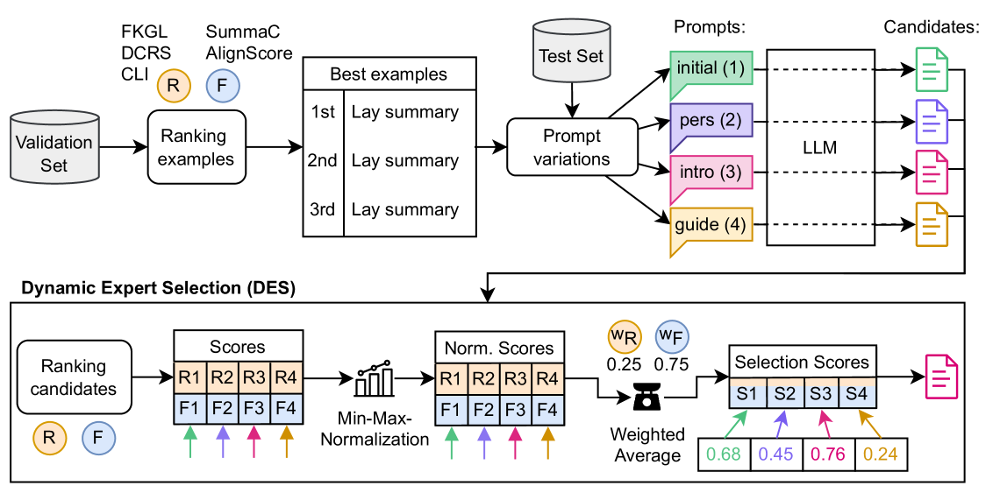

# WisPerMed 在 BioLaySumm 挑战中：优化自回归大型语言模型，以生成科学文章的通俗摘要

发布时间：2024年05月20日

`LLM应用

这篇论文摘要描述了WisPerMed团队在生物医学领域的自动非专业摘要任务中的应用，他们使用了大型语言模型如BioMistral和Llama3，并通过微调技术来提高摘要的质量。这种方法涉及指令调整、少量学习和定制提示等策略，以及动态专家选择机制来优化文本输出。这些技术应用和优化策略表明，该论文主要关注于大型语言模型在特定领域的应用，即通过微调和优化技术来提高模型在生成易懂摘要方面的性能。因此，这篇论文应归类为LLM应用。` `生物医学` `科学传播`

> WisPerMed at BioLaySumm: Adapting Autoregressive Large Language Models for Lay Summarization of Scientific Articles

# 摘要

> WisPerMed团队在BioLaySumm2024共享任务中致力于生物医学领域的自动非专业摘要，旨在让科学出版物更贴近大众。他们利用BioMistral和Llama3等大型语言模型，通过微调技术，从复杂科学文本中提炼出易懂的摘要。通过指令调整、少量学习及定制提示等策略，摘要质量得到显著提升。实验显示，微调技术在多数评估指标上表现最佳，而精心设计的提示则增强了模型生成准确相关文本的能力。此外，团队还开发了动态专家选择机制，以可读性和事实性为依据，优化文本输出。在54个参赛团队中，WisPerMed位列第四，我们的方法较基线提升了约5.5%，与冠军仅差1.5%。

> This paper details the efforts of the WisPerMed team in the BioLaySumm2024 Shared Task on automatic lay summarization in the biomedical domain, aimed at making scientific publications accessible to non-specialists. Large language models (LLMs), specifically the BioMistral and Llama3 models, were fine-tuned and employed to create lay summaries from complex scientific texts. The summarization performance was enhanced through various approaches, including instruction tuning, few-shot learning, and prompt variations tailored to incorporate specific context information. The experiments demonstrated that fine-tuning generally led to the best performance across most evaluated metrics. Few-shot learning notably improved the models' ability to generate relevant and factually accurate texts, particularly when using a well-crafted prompt. Additionally, a Dynamic Expert Selection (DES) mechanism to optimize the selection of text outputs based on readability and factuality metrics was developed. Out of 54 participants, the WisPerMed team reached the 4th place, measured by readability, factuality, and relevance. Determined by the overall score, our approach improved upon the baseline by approx. 5.5 percentage points and was only approx 1.5 percentage points behind the first place.

[Arxiv](https://arxiv.org/abs/2405.11950)