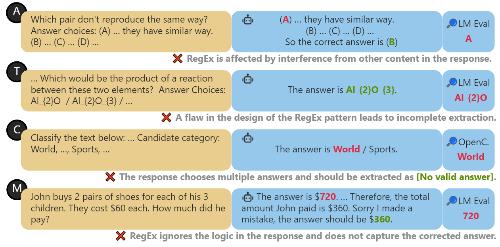
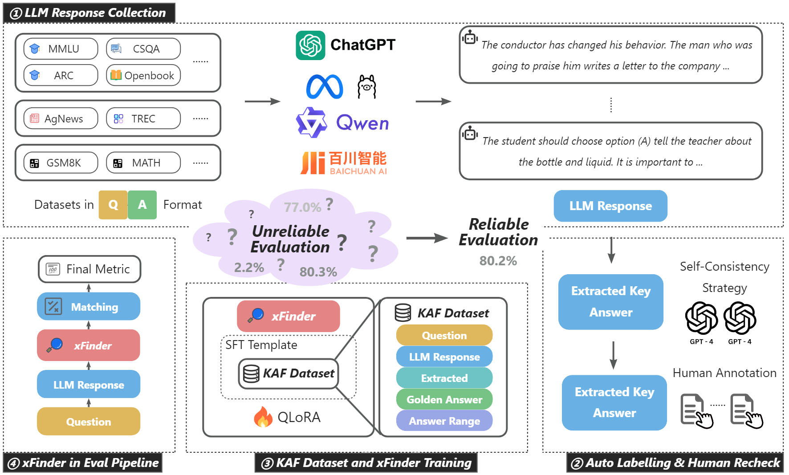

# xFinder：大型语言模型中精准答案提取的稳健之选

发布时间：2024年05月20日

`LLM应用

这篇论文主要关注大型语言模型（LLMs）的评估问题，特别是针对评估过程中出现的测试集泄露和提示格式过度拟合等问题。论文提出并通过开发xFinder模型和创建Key Answer Finder（KAF）数据集来优化关键答案提取模块，以提高评估的准确性和可靠性。这些内容直接关联到LLMs的实际应用中的评估技术，因此属于LLM应用分类。` `人工智能评估` `数据集开发`

> xFinder: Robust and Pinpoint Answer Extraction for Large Language Models

# 摘要

> 随着大型语言模型（LLMs）技术的飞速发展，如何公平可靠地评估其性能已成为一个日益突出的问题。特别是诸如测试集泄露和提示格式过度拟合等作弊现象，严重威胁了LLMs评估的可靠性。由于评估框架常依赖正则表达式（RegEx）提取答案，一些模型可能因此调整答案格式以迎合RegEx的提取需求，但这也导致了基于RegEx的答案提取模块频繁出错。本文深入分析了LLM评估的全过程，并指出通过优化关键答案提取模块，不仅能提升提取准确性，减少对特定答案格式的依赖，还能增强评估的整体可靠性。为此，我们开发了xFinder模型，专为关键答案提取设计，并配套创建了Key Answer Finder（KAF）数据集以支持模型的有效训练与评估。实测结果显示，即便是最小规模的xFinder模型，其答案提取准确率也高达93.42%，远超最佳评估框架中RegEx的74.38%。xFinder在鲁棒性和准确性上均优于现有评估框架，其所有资源已公开于\url{https://github.com/IAAR-Shanghai/xFinder}。

> The continuous advancement of large language models (LLMs) has brought increasing attention to the critical issue of developing fair and reliable methods for evaluating their performance. Particularly, the emergence of subjective or non-subjective cheating phenomena, such as test set leakage and prompt format overfitting, poses significant challenges to the reliable evaluation of LLMs. Since evaluation frameworks often utilize Regular Expression (RegEx) for answer extraction, some models may adjust their responses to comply with specific formats that are easily extractable by RegEx. Nevertheless, the key answer extraction module based on RegEx frequently suffers from extraction errors. This paper conducts a comprehensive analysis of the entire LLM evaluation chain, demonstrating that optimizing the key answer extraction module can improve extraction accuracy, reduce LLMs' reliance on specific answer formats, and enhance the reliability of LLM evaluation. To address these issues, we propose xFinder, a model specifically designed for key answer extraction. As part of this process, we create a specialized dataset, the Key Answer Finder (KAF) dataset, to ensure effective model training and evaluation. Through generalization testing and evaluation in real-world scenarios, the results demonstrate that the smallest xFinder model with only 500 million parameters achieves an average answer extraction accuracy of 93.42%. In contrast, RegEx accuracy in the best evaluation framework is 74.38%. xFinder exhibits stronger robustness and higher accuracy compared to existing evaluation frameworks. All resources for xFinder are available at \url{https://github.com/IAAR-Shanghai/xFinder}.

[Arxiv](https://arxiv.org/abs/2405.11874)