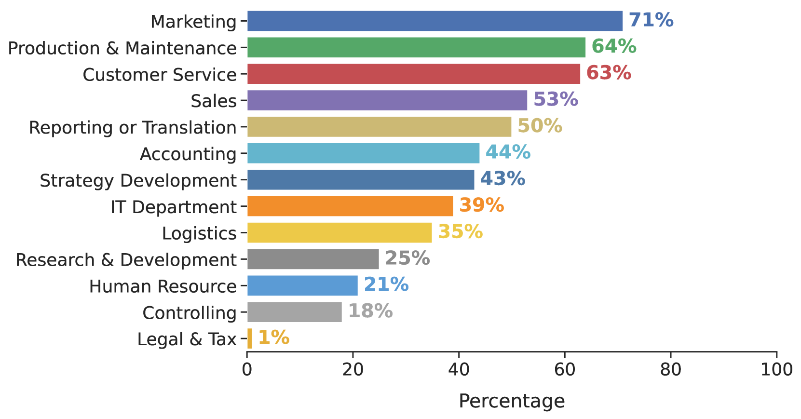
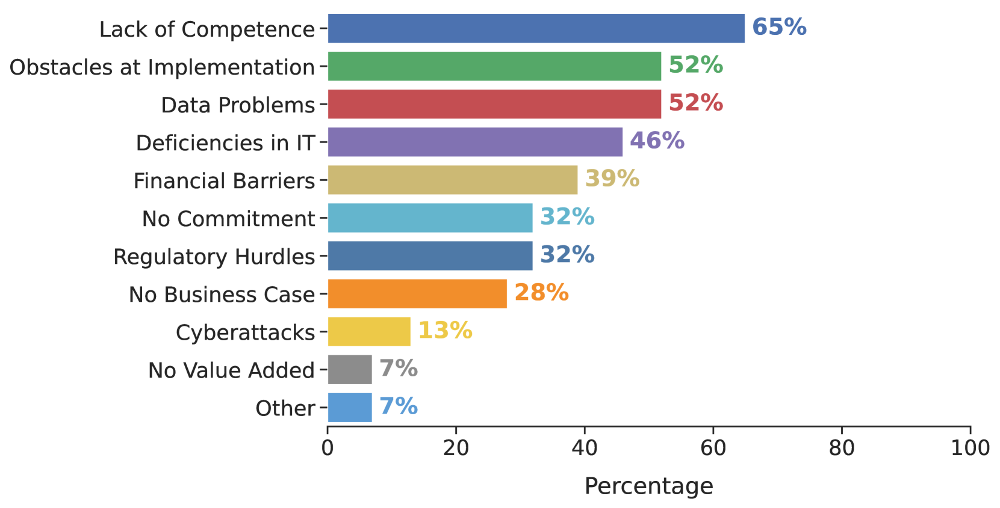
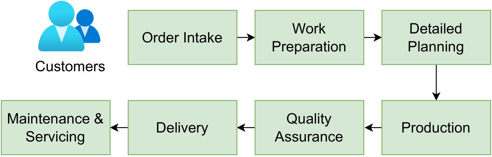

# 制造业中的AI：市场分析与机遇

发布时间：2024年05月21日

`LLM应用` `制造业` `人工智能`

> AI in Manufacturing: Market Analysis and Opportunities

# 摘要

> 本文深入探讨了AI在制造业的革新力量，特别聚焦于人机界面和智能铣床，揭示了AI如何助力操作更直观、生产更精准。通过详尽的市场分析，我们揭示了德国制造商AI采用率的飙升，并与全球趋势对比，深入剖析AI在生产、维护、客户服务等多领域的应用。同时，我们探索了生成式AI及大型语言模型在制造业的潜力。数据显示，德国企业AI采用率从2020年的6%激增至2023年的13.3%，预示着2030年将迎来巨大的经济效益。此外，本文还客观分析了AI实施中的挑战与机遇，如数据质量与集成难题，为行业提供了全面的视角。

> In this paper, we explore the transformative impact of Artificial Intelligence (AI) in the manufacturing sector, highlighting its potential to revolutionize industry practices and enhance operational efficiency. We delve into various applications of AI in manufacturing, with a particular emphasis on human-machine interfaces (HMI) and AI-powered milling machines, showcasing how these technologies contribute to more intuitive operations and precision in production processes. Through rigorous market analysis, the paper presents insightful data on AI adoption rates among German manufacturers, comparing these figures with global trends and exploring the specific uses of AI in production, maintenance, customer service, and more. In addition, the paper examines the emerging field of Generative AI and the potential applications of large language models in manufacturing processes. The findings indicate a significant increase in AI adoption from 6% in 2020 to 13.3% in 2023 among German companies, with a projection of substantial economic impact by 2030. The study also addresses the challenges faced by companies, such as data quality and integration hurdles, providing a balanced view of the opportunities and obstacles in AI implementation.

[Arxiv](https://arxiv.org/abs/2407.05426)