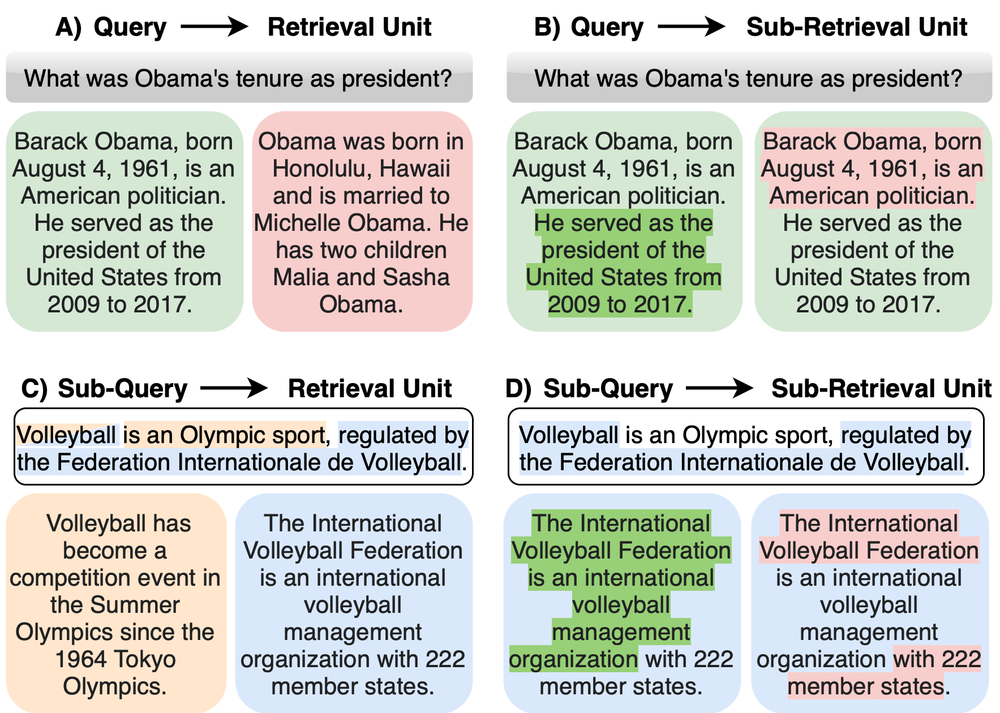
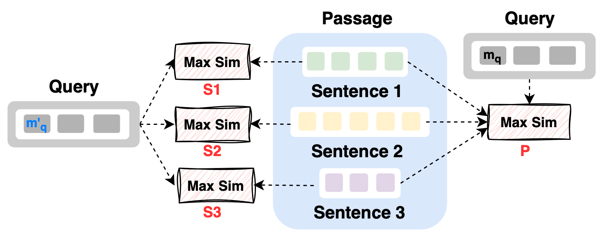
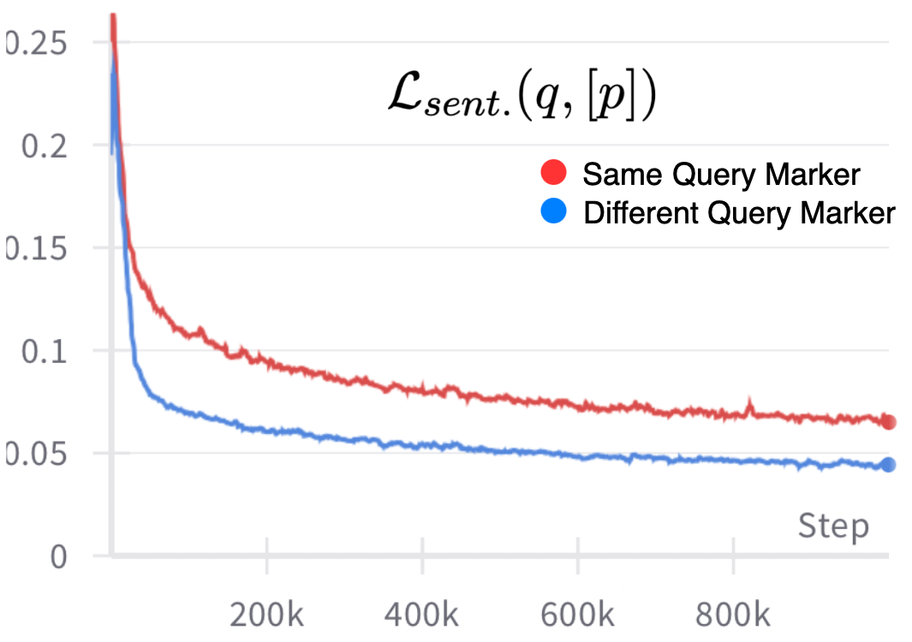
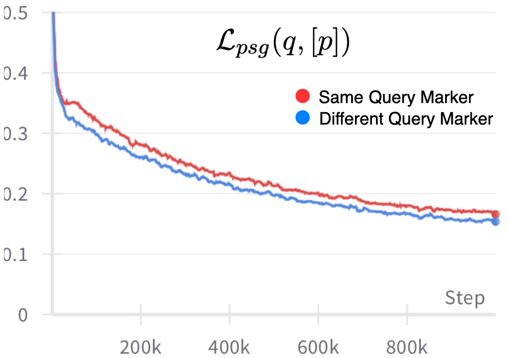
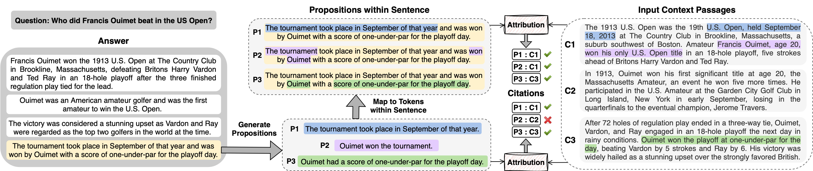

# AGRaME：多向量嵌入助力任意粒度排序

发布时间：2024年05月23日

`RAG

这篇论文主要探讨了搜索领域中的排名问题，并提出了任意粒度排名的概念，通过多向量嵌入实现不同粒度级别的排名。这种方法特别适用于需要精细排名粒度的应用，如开放域问答的句子级排名或归属的命题级排名。论文中提到的“检索增强生成”（Retrieval-Augmented Generation, RAG）是该研究的应用场景之一，因此将这篇论文归类为RAG。` `问答系统`

> AGRaME: Any-Granularity Ranking with Multi-Vector Embeddings

# 摘要

> 在搜索领域，排名问题至关重要且广受欢迎。但现有算法往往将排名粒度固定在段落级别，或需为不同粒度定制索引，限制了灵活性。这种局限影响了需要更精细排名粒度的应用，如开放域问答的句子级排名或归属的命题级排名。本研究提出了任意粒度排名的概念，通过多向量嵌入实现不同粒度级别的排名，同时保持单一粗粒度编码。我们设计了多粒度对比损失来训练多向量方法，并通过句子和命题验证了其有效性。最终，我们将命题级排名应用于检索增强生成中的后验引用添加，其性能超越了传统的提示驱动引用生成方法。

> Ranking is a fundamental and popular problem in search. However, existing ranking algorithms usually restrict the granularity of ranking to full passages or require a specific dense index for each desired level of granularity. Such lack of flexibility in granularity negatively affects many applications that can benefit from more granular ranking, such as sentence-level ranking for open-domain question-answering, or proposition-level ranking for attribution. In this work, we introduce the idea of any-granularity ranking, which leverages multi-vector embeddings to rank at varying levels of granularity while maintaining encoding at a single (coarser) level of granularity. We propose a multi-granular contrastive loss for training multi-vector approaches, and validate its utility with both sentences and propositions as ranking units. Finally, we demonstrate the application of proposition-level ranking to post-hoc citation addition in retrieval-augmented generation, surpassing the performance of prompt-driven citation generation.

[Arxiv](https://arxiv.org/abs/2405.15028)