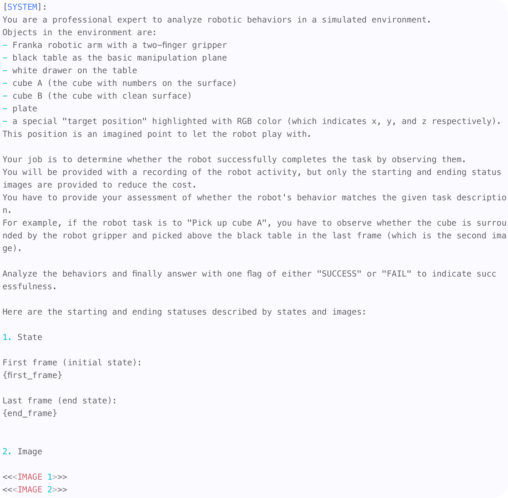

# 主动技能探索

发布时间：2024年05月23日

`Agent

这篇论文主要探讨了如何利用大型语言模型（LLMs）来驱动机器人技能的发现和积累，这是一个涉及高级推理到低级机器人控制的应用场景。论文提出的框架完全由LLMs驱动，通过生成任务提案和强化学习过程来逐步积累新技能，这涉及到机器人的自主行为和技能获取，因此属于Agent分类。` `机器人技术` `人工智能`

> Agentic Skill Discovery

# 摘要

> 语言条件化的机器人技能让大型语言模型（LLMs）的高级推理得以应用于低级机器人控制，但如何获取多样化的基本技能仍是一大挑战。现有方法或自上而下分解任务，或自下而上组合动作，均需依赖初始技能库。例如，若技能库仅含推动技能，则无法衍生出抓取能力。本研究提出了一种由LLMs完全驱动的创新技能发现框架。该框架首先由LLM根据场景描述和机器人配置生成任务提案，旨在任务完成后逐步积累新技能。每个提案任务都会启动一系列强化学习过程，利用LLM采样的奖励和成功判定函数来塑造相应策略。通过独立的视觉-语言模型确保学习行为的安全可信。我们证明了从零技能起步，ASD技能库能够不断扩展，积累更多有意义且可靠的技能，使机器人高效完成更高级任务。项目详情请访问：https://agentic-skill-discovery.github.io。

> Language-conditioned robotic skills make it possible to apply the high-level reasoning of Large Language Models (LLMs) to low-level robotic control. A remaining challenge is to acquire a diverse set of fundamental skills. Existing approaches either manually decompose a complex task into atomic robotic actions in a top-down fashion, or bootstrap as many combinations as possible in a bottom-up fashion to cover a wider range of task possibilities. These decompositions or combinations, however, require an initial skill library. For example, a "grasping" capability can never emerge from a skill library containing only diverse "pushing" skills. Existing skill discovery techniques with reinforcement learning acquire skills by an exhaustive exploration but often yield non-meaningful behaviors. In this study, we introduce a novel framework for skill discovery that is entirely driven by LLMs. The framework begins with an LLM generating task proposals based on the provided scene description and the robot's configurations, aiming to incrementally acquire new skills upon task completion. For each proposed task, a series of reinforcement learning processes are initiated, utilizing reward and success determination functions sampled by the LLM to develop the corresponding policy. The reliability and trustworthiness of learned behaviors are further ensured by an independent vision-language model. We show that starting with zero skill, the ASD skill library emerges and expands to more and more meaningful and reliable skills, enabling the robot to efficiently further propose and complete advanced tasks. The project page can be found at: https://agentic-skill-discovery.github.io.

[Arxiv](https://arxiv.org/abs/2405.15019)