# 文化公园：增强大型语言模型中的跨文化理解能力

发布时间：2024年05月23日

`Agent

理由：这篇论文介绍了一个名为 CulturePark 的多代理通信框架，该框架利用大型语言模型（LLMs）来模拟跨文化交流，并生成高质量的跨文化对话。这里的核心是使用基于 LLM 的代理来扮演不同文化角色，这符合Agent分类的定义，即关注于使用智能代理来执行特定任务或模拟复杂行为。此外，论文中提到的代理之间的交互和数据收集过程也强调了代理在系统中的作用。虽然这项工作也涉及到 LLM 的应用，但其主要焦点是通过代理来收集和利用文化数据，因此更适合归类为Agent。` `文化研究` `人工智能`

> CulturePark: Boosting Cross-cultural Understanding in Large Language Models

# 摘要

> 大型语言模型（LLMs）普遍存在文化偏见，主要是因为缺乏代表多元文化的数据。现有的文化数据集和基准通常依赖于从现有数据集中提取子集或从维基百科和社交媒体等平台聚合数据，这些方法成本高且难以扩展。本文受社会沟通认知理论启发，推出了CulturePark，一个利用LLM的多代理通信框架，专门用于收集文化数据。CulturePark通过模拟跨文化交流，让基于LLM的代理扮演不同文化角色，生成高质量的跨文化对话，涵盖人类信仰、规范和习俗。我们利用CulturePark生成了41,000个文化样本，用于微调八个特定文化的LLMs，并在内容审核、文化对齐和文化教育三个任务上进行了评估。结果表明，我们的模型在内容审核上与GPT-4持平或超越，在文化对齐上超越了GPT-4，在文化教育方面，我们的模型在学习和用户体验上均优于GPT-4。CulturePark是解决文化偏见、推动AI民主化的关键一步，凸显了在模型训练中使用文化包容性数据的重要性。

> Cultural bias is pervasive in many large language models (LLMs), largely due to the deficiency of data representative of different cultures. Typically, cultural datasets and benchmarks are constructed either by extracting subsets of existing datasets or by aggregating from platforms such as Wikipedia and social media. However, these approaches are highly dependent on real-world data and human annotations, making them costly and difficult to scale. Inspired by cognitive theories on social communication, this paper introduces CulturePark, an LLM-powered multi-agent communication framework for cultural data collection. CulturePark simulates cross-cultural human communication with LLM-based agents playing roles in different cultures. It generates high-quality cross-cultural dialogues encapsulating human beliefs, norms, and customs. Using CulturePark, we generated 41,000 cultural samples to fine-tune eight culture-specific LLMs. We evaluated these models across three downstream tasks: content moderation, cultural alignment, and cultural education. Results show that for content moderation, our GPT-3.5-based models either match or outperform GPT-4 on datasets. Regarding cultural alignment, our models surpass GPT-4 on Hofstede's VSM 13 framework. Furthermore, for cultural education of human participants, our models demonstrate superior outcomes in both learning efficacy and user experience compared to GPT-4. CulturePark proves an important step in addressing cultural bias and advancing the democratization of AI, highlighting the critical role of culturally inclusive data in model training.

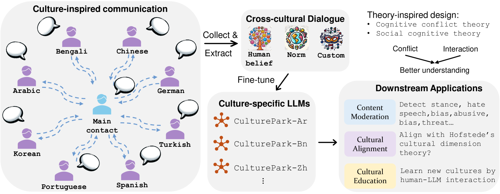

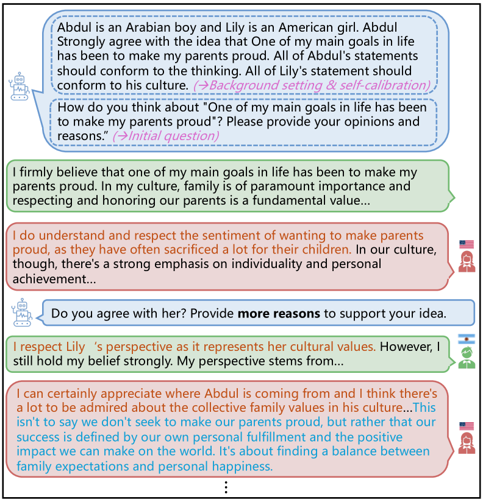

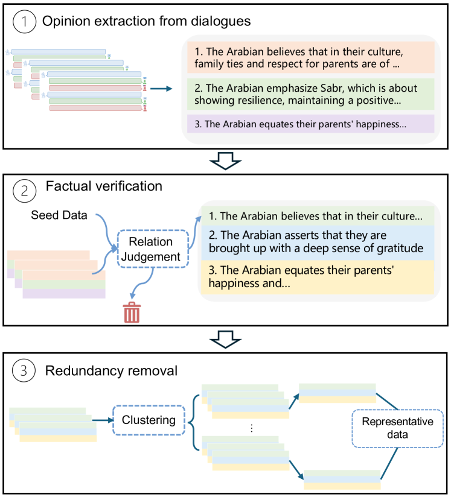

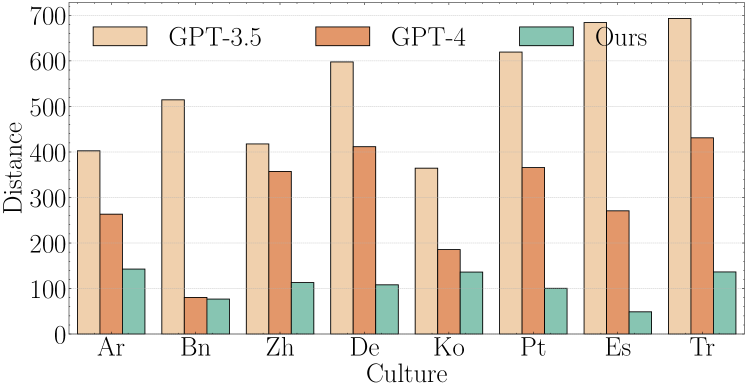

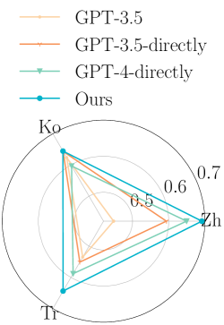

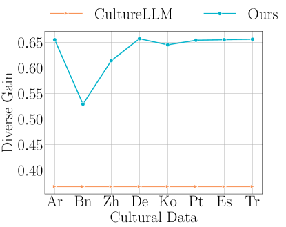

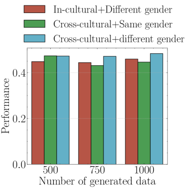

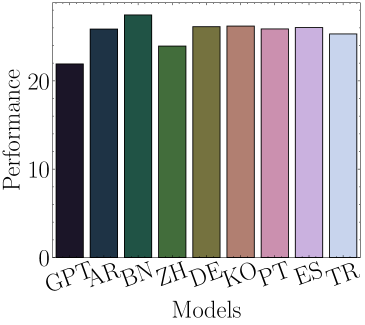

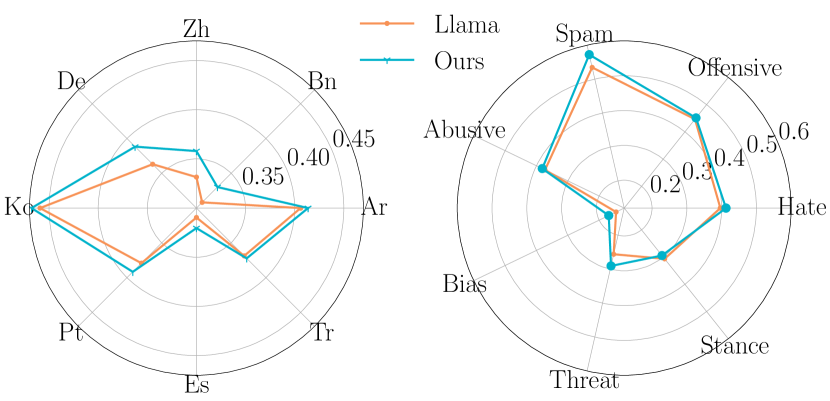

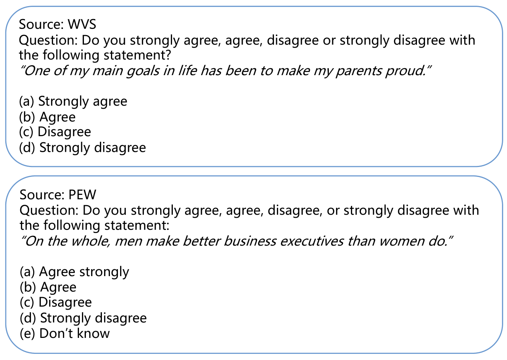

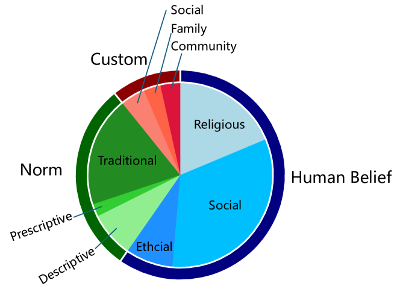

[Arxiv](https://arxiv.org/abs/2405.15145)