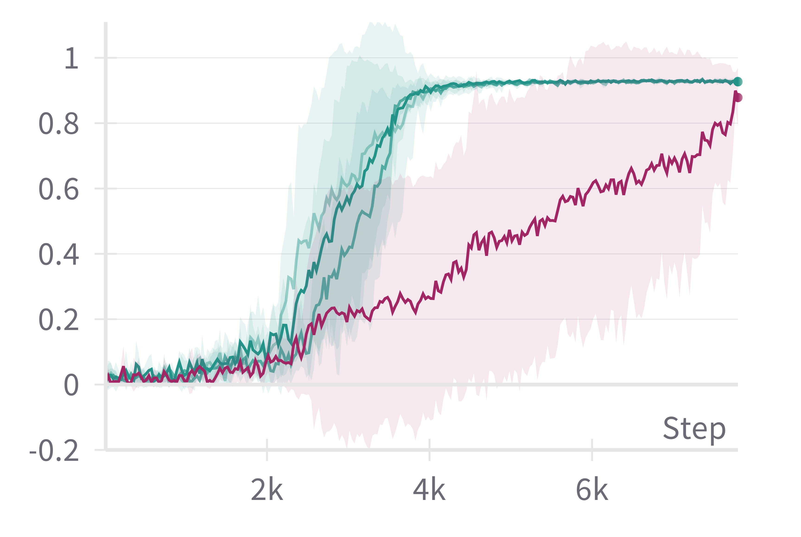
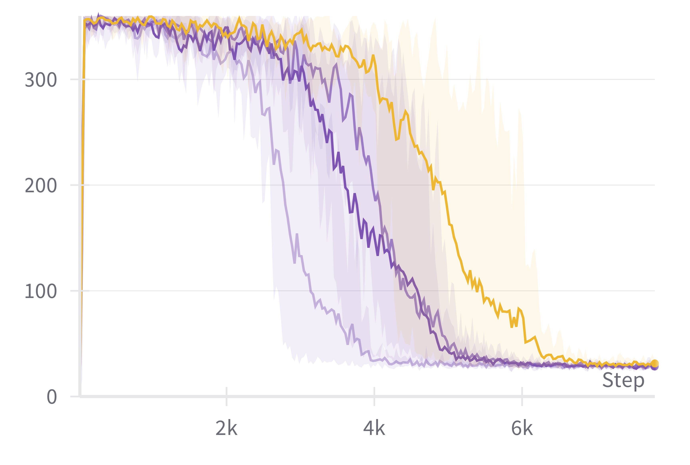
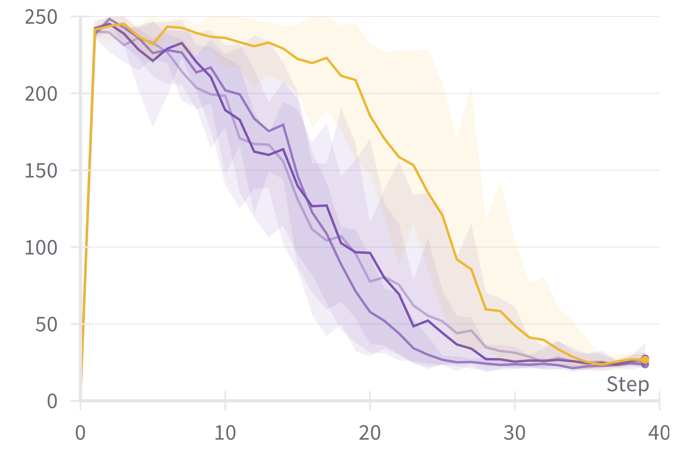

# 利用大型语言模型搜索，实现强化学习的高效性

发布时间：2024年05月23日

`Agent

这篇论文主要探讨了如何利用大型语言模型（LLMs）来设计提升强化学习（RL）代理样本效率的奖励塑造函数。研究中提出了MEDIC框架，该框架通过模型反馈批评验证LLM输出，为抽象问题生成有效的计划，从而降低RL代理的样本复杂性。虽然涉及LLMs的应用，但核心关注点是RL代理的性能提升，因此更符合Agent分类。`

> Efficient Reinforcement Learning via Large Language Model-based Search

# 摘要

> 强化学习（RL）在稀疏奖励环境中样本效率低下，尤其在存在随机转换时问题更为显著。奖励塑造作为一种提升效率的方法，通过引入内在奖励加速RL代理向最优策略的收敛。然而，为每个问题定制有效的奖励塑造函数极具挑战，即便专家也需依赖特定知识或为每项任务提供独立演示。随着大型语言模型（LLMs）在自然语言处理领域的崛起，我们探索能否利用LLMs来设计提升RL样本效率的奖励塑造函数。本研究利用现成的LLMs，通过简化问题的确定性版本生成指导策略，进而构建RL代理的奖励塑造函数。面对直接使用LLMs的局限，我们提出MEDIC框架，它通过模型反馈批评验证LLM输出，为抽象问题生成虽非最优但有效的计划。实验结果显示，MEDIC增强了LLMs的能力，显著降低了基于PPO和A2C的RL代理的样本复杂性，并为未来探索LLMs如何优化RL流程指明了方向。

> Reinforcement Learning (RL) suffers from sample inefficiency in sparse reward domains, and the problem is pronounced if there are stochastic transitions. To improve the sample efficiency, reward shaping is a well-studied approach to introduce intrinsic rewards that can help the RL agent converge to an optimal policy faster. However, designing a useful reward shaping function specific to each problem is challenging, even for domain experts. They would either have to rely on task-specific domain knowledge or provide an expert demonstration independently for each task. Given, that Large Language Models (LLMs) have rapidly gained prominence across a magnitude of natural language tasks, we aim to answer the following question: Can we leverage LLMs to construct a reward shaping function that can boost the sample efficiency of an RL agent? In this work, we aim to leverage off-the-shelf LLMs to generate a guide policy by solving a simpler deterministic abstraction of the original problem that can then be used to construct the reward shaping function for the downstream RL agent. Given the ineffectiveness of directly prompting LLMs, we propose MEDIC: a framework that augments LLMs with a Model-based feEDback critIC, which verifies LLM-generated outputs, to generate a possibly sub-optimal but valid plan for the abstract problem. Our experiments across domains from the BabyAI environment suite show 1) the effectiveness of augmenting LLMs with MEDIC, 2) a significant improvement in the sample complexity of PPO and A2C-based RL agents when guided by our LLM-generated plan, and finally, 3) pave the direction for further explorations of how these models can be used to augment existing RL pipelines.

[Arxiv](https://arxiv.org/abs/2405.15194)