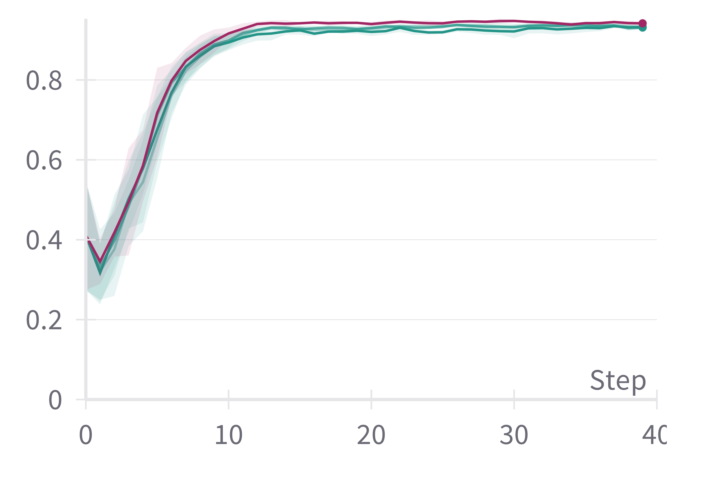
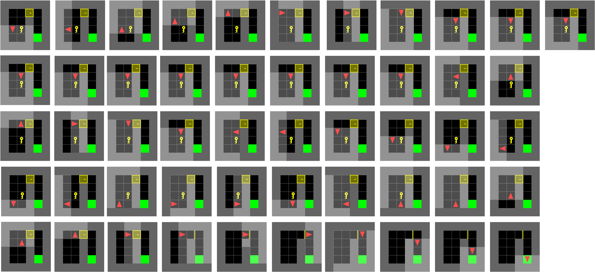
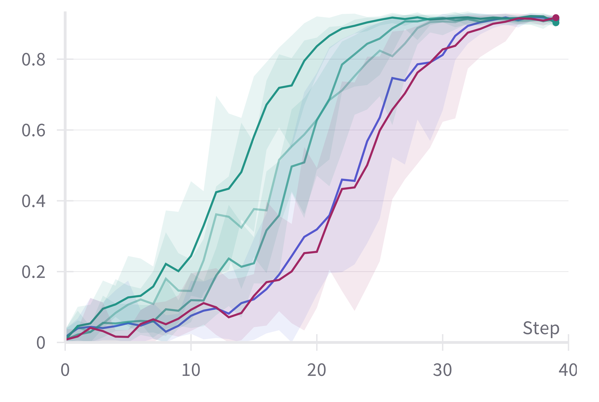

# 借助大型语言模型，探索高效强化学习之路

发布时间：2024年05月23日

`Agent

理由：这篇论文主要探讨了如何利用大型语言模型（LLMs）来设计一个提升强化学习（RL）代理样本效率的奖励塑造函数。它提出了一种名为MEDIC的框架，该框架通过增强LLMs来生成有效的计划，以指导RL代理。因此，这篇论文的核心在于如何改进和应用Agent（即RL代理），而不是专注于LLM的理论研究或应用，也不是关于检索增强生成（RAG）的研究。因此，将其归类为Agent是最合适的。`

> Efficient Reinforcement Learning via Large Language Model-based Search

# 摘要

> 强化学习（RL）在稀疏奖励环境中样本效率低下，尤其当环境转换具有随机性时，问题更为严重。奖励塑造作为一种提升样本效率的方法，通过引入内在奖励加速RL代理向最优策略收敛。然而，为每个问题定制有效的奖励塑造函数极具挑战，即便对于领域专家亦是如此。他们要么依赖特定任务的领域知识，要么为每个任务单独提供专家演示。鉴于大型语言模型（LLMs）在自然语言任务中的迅速崛起，我们探索是否能利用LLMs来设计一个提升RL代理样本效率的奖励塑造函数。本研究中，我们利用现成的LLMs，通过解决问题的简化确定性版本，生成指导策略，进而构建下游RL代理的奖励塑造函数。考虑到直接使用LLMs的局限性，我们提出了MEDIC框架，它通过基于模型的反馈批评增强LLMs，确保生成的计划虽可能非最优但有效。我们的实验在BabyAI环境套件的多个领域中展示了：1) MEDIC增强LLMs的有效性，2) 由LLM生成的计划指导的PPO和A2C RL代理在样本复杂性上显著提升，最终，3) 为这些模型如何进一步增强RL流程开辟了新的研究方向。

> Reinforcement Learning (RL) suffers from sample inefficiency in sparse reward domains, and the problem is pronounced if there are stochastic transitions. To improve the sample efficiency, reward shaping is a well-studied approach to introduce intrinsic rewards that can help the RL agent converge to an optimal policy faster. However, designing a useful reward shaping function specific to each problem is challenging, even for domain experts. They would either have to rely on task-specific domain knowledge or provide an expert demonstration independently for each task. Given, that Large Language Models (LLMs) have rapidly gained prominence across a magnitude of natural language tasks, we aim to answer the following question: Can we leverage LLMs to construct a reward shaping function that can boost the sample efficiency of an RL agent? In this work, we aim to leverage off-the-shelf LLMs to generate a guide policy by solving a simpler deterministic abstraction of the original problem that can then be used to construct the reward shaping function for the downstream RL agent. Given the ineffectiveness of directly prompting LLMs, we propose MEDIC: a framework that augments LLMs with a Model-based feEDback critIC, which verifies LLM-generated outputs, to generate a possibly sub-optimal but valid plan for the abstract problem. Our experiments across domains from the BabyAI environment suite show 1) the effectiveness of augmenting LLMs with MEDIC, 2) a significant improvement in the sample complexity of PPO and A2C-based RL agents when guided by our LLM-generated plan, and finally, 3) pave the direction for further explorations of how these models can be used to augment existing RL pipelines.

[Arxiv](https://arxiv.org/abs/2405.15194)