# 利用大型语言模型进行深入的文本评估，揭示信息丰富的内容。

发布时间：2024年05月23日

`Agent

这篇论文主要探讨了如何利用大型语言模型（LLMs）来扩展同行预测机制，以应用于文本报告领域。论文提出了两种新的机制：生成型同行预测机制（GPPM）和生成型摘要同行预测机制（GSPPM），这些机制利用LLMs来预测一个代理的报告与其同行报告之间的关系。这里的重点在于使用LLMs来增强代理（Agent）的行为预测和反馈机制，而不是直接讨论LLMs的理论或应用，也不是关于检索增强生成（RAG）的内容。因此，这篇论文最适合归类为Agent。` `同行评审`

> Eliciting Informative Text Evaluations with Large Language Models

# 摘要

> 同行预测机制能确保高质量反馈，但目前仅限于简单的报告类型。我们旨在扩展这些技术至文本报告领域，利用大型语言模型的最新进展。这将极大地拓宽同行预测机制的应用范围，因为文本反馈在众多反馈渠道中占据主导地位，如同行评审、电商客户评价和社交媒体评论。我们提出了两种新机制：生成型同行预测机制（GPPM）和生成型摘要同行预测机制（GSPPM），它们利用LLMs预测一个代理的报告与其同行报告之间的关系。理论上，当LLM预测足够精确时，我们的机制能激励真实且努力的行为，形成近似贝叶斯纳什均衡。实验结果显示，我们的机制在Yelp和ICLR OpenReview数据集上均有效。特别是在ICLR数据集上，我们的机制能区分三种评论质量：人工编写、GPT-4生成和GPT-3.5生成，并根据预期分数进行评估。此外，GSPPM在惩罚LLM生成评论方面比GPPM更为有效。

> Peer prediction mechanisms motivate high-quality feedback with provable guarantees. However, current methods only apply to rather simple reports, like multiple-choice or scalar numbers. We aim to broaden these techniques to the larger domain of text-based reports, drawing on the recent developments in large language models. This vastly increases the applicability of peer prediction mechanisms as textual feedback is the norm in a large variety of feedback channels: peer reviews, e-commerce customer reviews, and comments on social media.
  We introduce two mechanisms, the Generative Peer Prediction Mechanism (GPPM) and the Generative Synopsis Peer Prediction Mechanism (GSPPM). These mechanisms utilize LLMs as predictors, mapping from one agent's report to a prediction of her peer's report. Theoretically, we show that when the LLM prediction is sufficiently accurate, our mechanisms can incentivize high effort and truth-telling as an (approximate) Bayesian Nash equilibrium. Empirically, we confirm the efficacy of our mechanisms through experiments conducted on two real datasets: the Yelp review dataset and the ICLR OpenReview dataset. We highlight the results that on the ICLR dataset, our mechanisms can differentiate three quality levels -- human-written reviews, GPT-4-generated reviews, and GPT-3.5-generated reviews in terms of expected scores. Additionally, GSPPM penalizes LLM-generated reviews more effectively than GPPM.

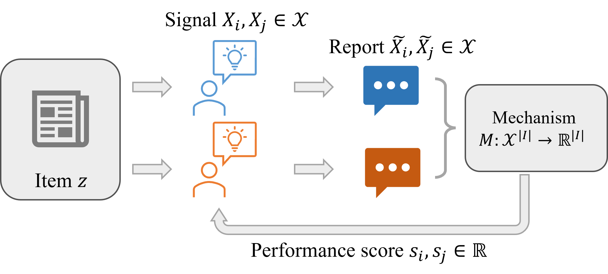

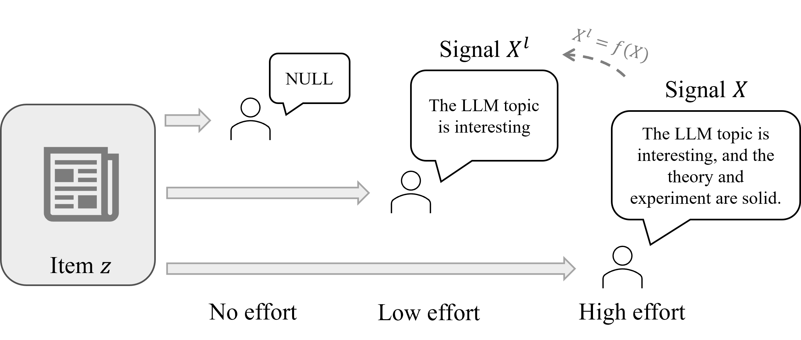

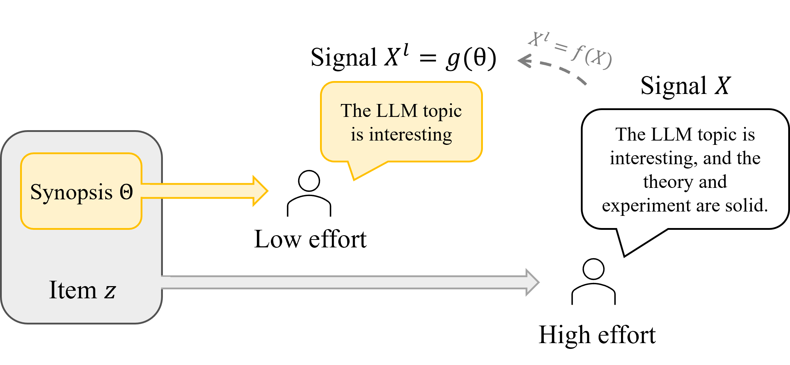

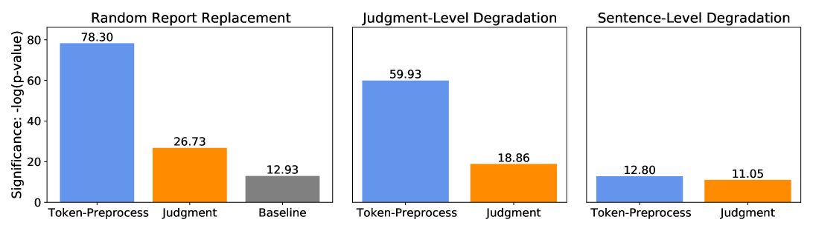

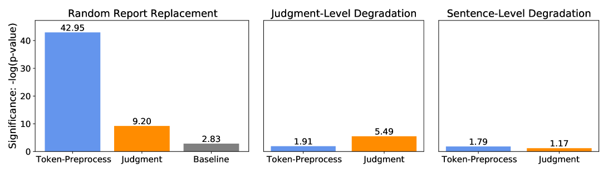

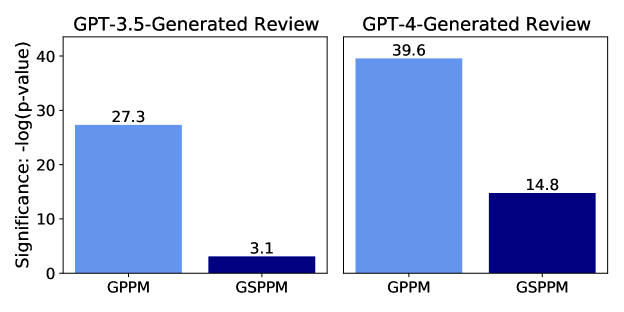

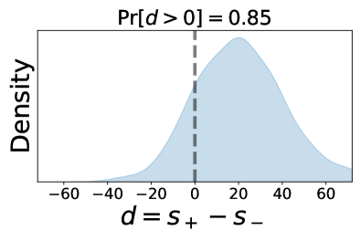

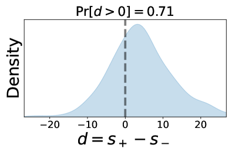

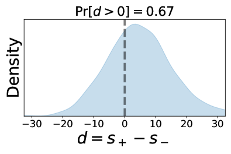

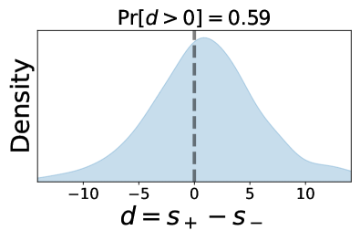

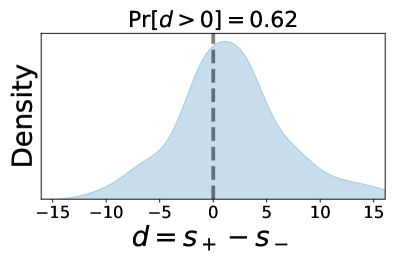

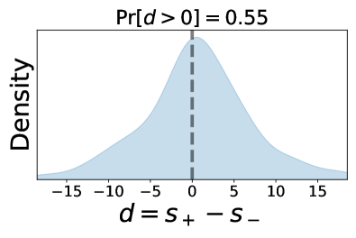

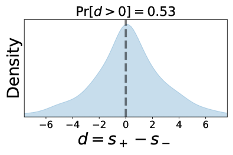

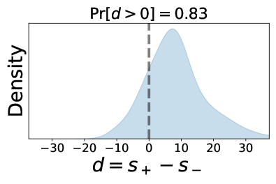

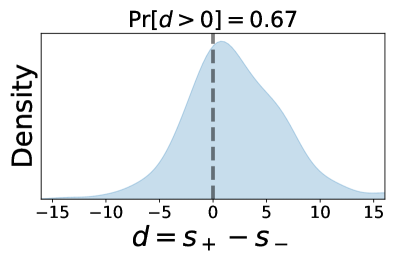

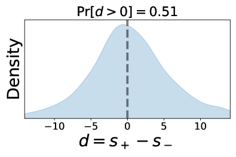

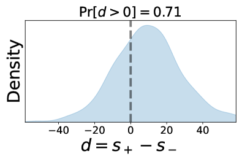

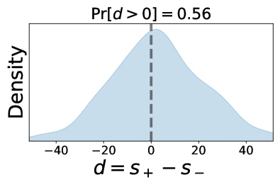

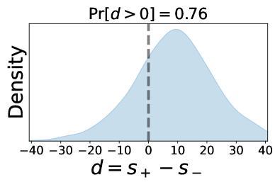

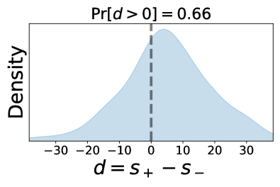

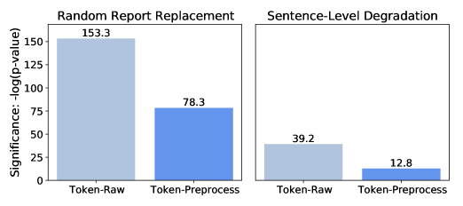

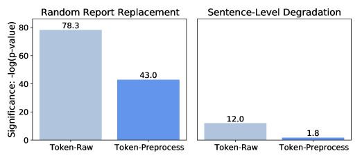

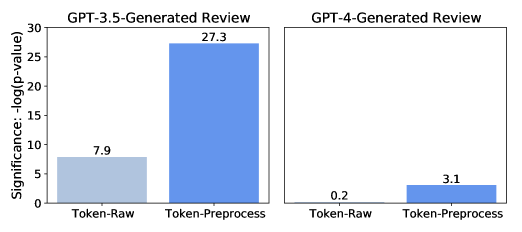

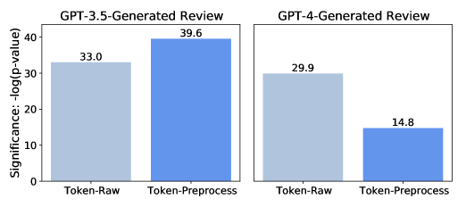

[Arxiv](https://arxiv.org/abs/2405.15077)