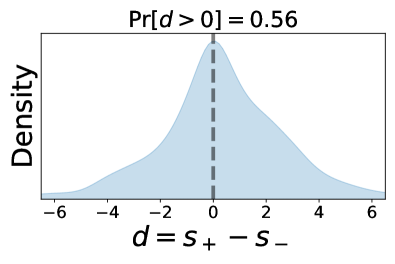

# 借助大型语言模型，我们能够引出富含信息的文本评估，深入探索语言模型的评估潜力。

发布时间：2024年05月23日

`Agent

这篇论文主要探讨了如何利用大型语言模型（LLMs）来改进同行预测机制，使其能够处理更广泛的文本报告类型。论文提出了两种新的机制：生成型同行预测机制（GPPM）和生成型摘要同行预测机制（GSPPM），并展示了这些机制在实际数据集上的应用效果。这些机制的核心在于使用LLMs作为预测工具，将一方的报告转化为对另一方报告的预测，从而在多种反馈场景中提升同行预测机制的应用。因此，这篇论文更符合Agent分类，因为它涉及到了使用LLMs作为智能代理来处理和改进现有的预测机制。` `学术评审` `电商评价`

> Eliciting Informative Text Evaluations with Large Language Models

# 摘要

> 同行预测机制能够确保高质量反馈，但目前仅限于处理简单的报告类型，如选择题或数字。我们旨在将这些技术扩展到更广泛的文本报告领域，利用大型语言模型的最新进展。这将大幅提升同行预测机制在多种反馈场景中的应用，如学术评审、电商评价和社交媒体评论等。我们提出了两种新机制：生成型同行预测机制（GPPM）和生成型摘要同行预测机制（GSPPM），它们利用大型语言模型（LLMs）作为预测工具，将一方的报告转化为对另一方报告的预测。理论上，当LLM的预测足够精确时，我们的机制能够激励参与者付出更多努力并提供真实信息，形成近似的贝叶斯纳什均衡。通过在Yelp评论数据集和ICLR OpenReview数据集上的实验，我们验证了这些机制的实际效果。特别地，在ICLR数据集上，我们的机制能够根据预期分数区分出三种评论质量：人工编写、GPT-4生成和GPT-3.5生成。此外，GSPPM在惩罚LLM生成的评论方面比GPPM更为有效。

> Peer prediction mechanisms motivate high-quality feedback with provable guarantees. However, current methods only apply to rather simple reports, like multiple-choice or scalar numbers. We aim to broaden these techniques to the larger domain of text-based reports, drawing on the recent developments in large language models. This vastly increases the applicability of peer prediction mechanisms as textual feedback is the norm in a large variety of feedback channels: peer reviews, e-commerce customer reviews, and comments on social media.
  We introduce two mechanisms, the Generative Peer Prediction Mechanism (GPPM) and the Generative Synopsis Peer Prediction Mechanism (GSPPM). These mechanisms utilize LLMs as predictors, mapping from one agent's report to a prediction of her peer's report. Theoretically, we show that when the LLM prediction is sufficiently accurate, our mechanisms can incentivize high effort and truth-telling as an (approximate) Bayesian Nash equilibrium. Empirically, we confirm the efficacy of our mechanisms through experiments conducted on two real datasets: the Yelp review dataset and the ICLR OpenReview dataset. We highlight the results that on the ICLR dataset, our mechanisms can differentiate three quality levels -- human-written reviews, GPT-4-generated reviews, and GPT-3.5-generated reviews in terms of expected scores. Additionally, GSPPM penalizes LLM-generated reviews more effectively than GPPM.

[Arxiv](https://arxiv.org/abs/2405.15077)