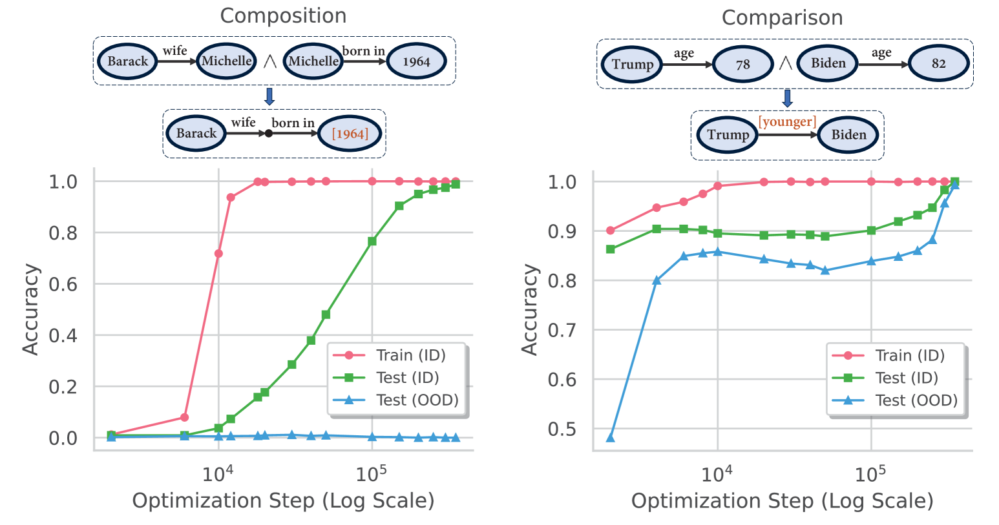
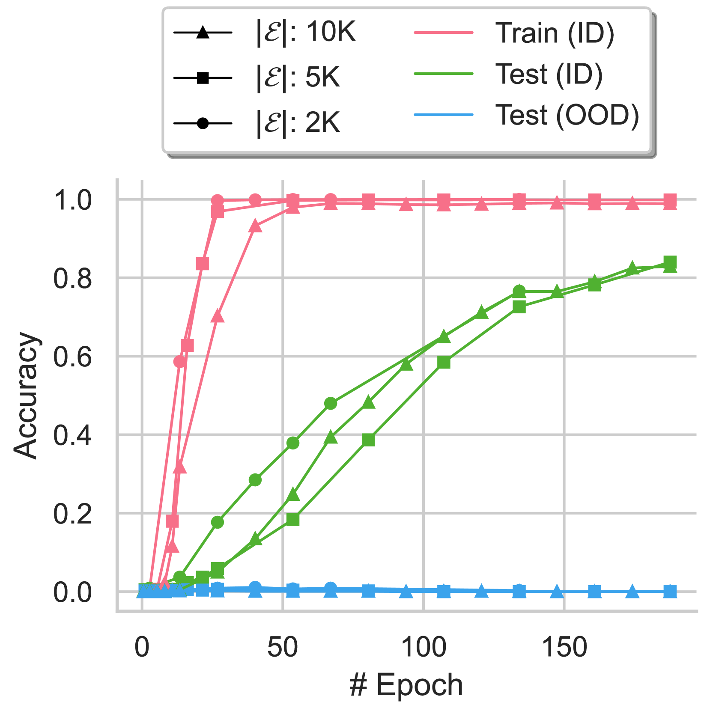
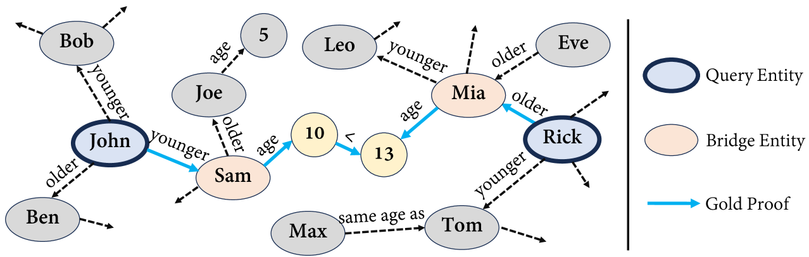
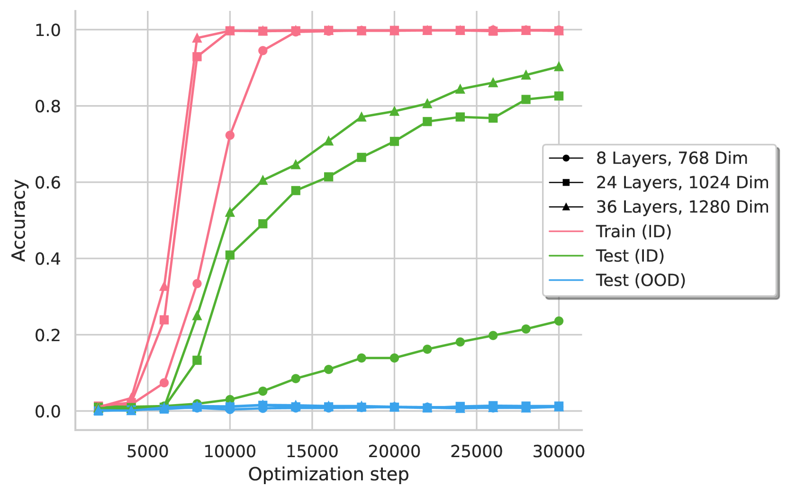
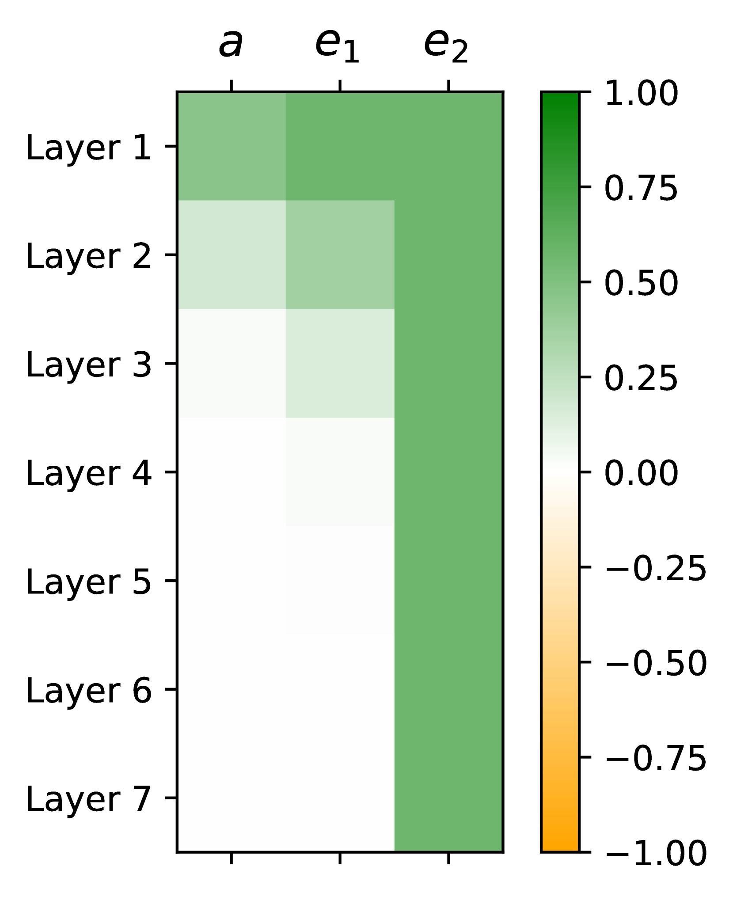
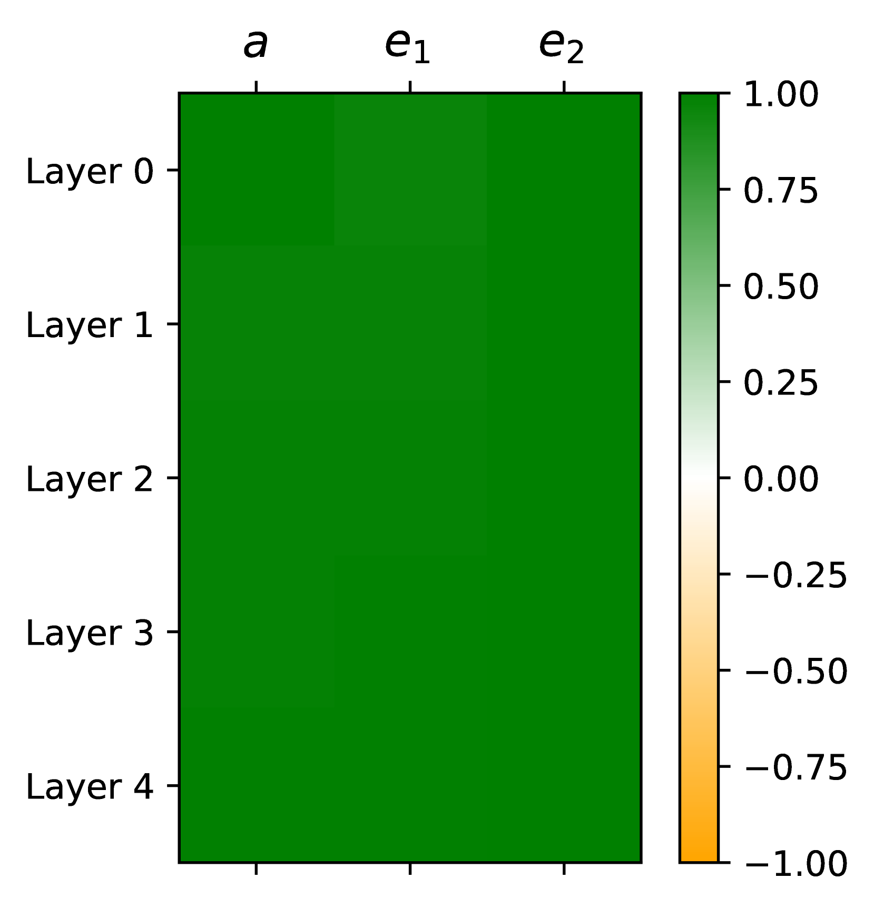
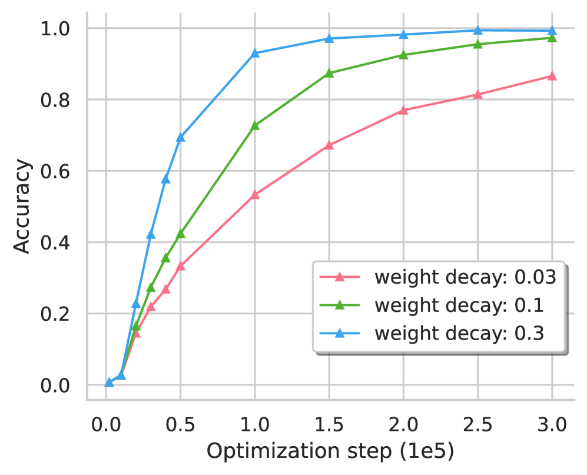

# Transformer的隐式推理之旅：探索泛化极限的机制探秘

发布时间：2024年05月23日

`LLM理论

这篇论文主要探讨了大型语言模型（LLM）中的transformer架构在处理隐式推理参数化知识方面的能力，特别是在组合与比较推理类型中的表现。研究通过分析训练过程中的模型内部机制，揭示了grokking现象的形成及其与泛化和记忆电路效率的关系。此外，论文还讨论了系统性与泛化电路配置的关联，并提出了对transformer架构改进的建议。这些内容属于对LLM理论层面的深入研究，因此应归类为LLM理论。` `人工智能` `推理能力`

> Grokked Transformers are Implicit Reasoners: A Mechanistic Journey to the Edge of Generalization

# 摘要

> 我们探讨了transformer是否能掌握隐式推理参数化知识的技能，这一挑战连顶尖语言模型也难以克服。通过聚焦组合与比较这两种关键推理类型，我们发现transformer确实能通过长期训练（即grokking）学会隐式推理，但泛化能力因推理类型而异：面对新样本，组合推理的系统泛化失败，而比较推理则成功。我们深入分析了训练过程中模型的内部机制，揭示了grokking的形成机制及其与泛化和记忆电路效率的关系，以及系统性与泛化电路配置的关联。这些发现不仅优化了数据和训练策略，以促进隐式推理，还为transformer架构的改进提供了思路，如增强跨层知识交流。在一个搜索空间巨大的复杂推理任务中，我们进一步证明，尽管采用了各种提示和检索增强，基于非参数记忆的模型如GPT-4-Turbo和Gemini-1.5-Pro表现不佳，而完全grokked的transformer则接近完美，凸显了参数化记忆在复杂推理中的关键作用。

> We study whether transformers can learn to implicitly reason over parametric knowledge, a skill that even the most capable language models struggle with. Focusing on two representative reasoning types, composition and comparison, we consistently find that transformers can learn implicit reasoning, but only through grokking, i.e., extended training far beyond overfitting. The levels of generalization also vary across reasoning types: when faced with out-of-distribution examples, transformers fail to systematically generalize for composition but succeed for comparison. We delve into the model's internals throughout training, conducting analytical experiments that reveal: 1) the mechanism behind grokking, such as the formation of the generalizing circuit and its relation to the relative efficiency of generalizing and memorizing circuits, and 2) the connection between systematicity and the configuration of the generalizing circuit. Our findings guide data and training setup to better induce implicit reasoning and suggest potential improvements to the transformer architecture, such as encouraging cross-layer knowledge sharing. Furthermore, we demonstrate that for a challenging reasoning task with a large search space, GPT-4-Turbo and Gemini-1.5-Pro based on non-parametric memory fail badly regardless of prompting styles or retrieval augmentation, while a fully grokked transformer can achieve near-perfect accuracy, showcasing the power of parametric memory for complex reasoning.

[Arxiv](https://arxiv.org/abs/2405.15071)