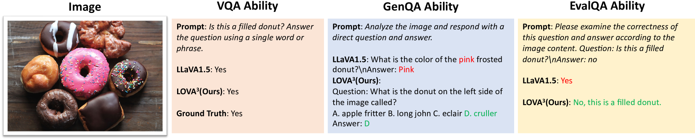
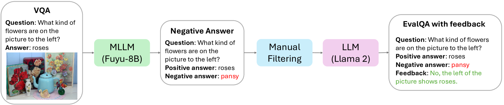
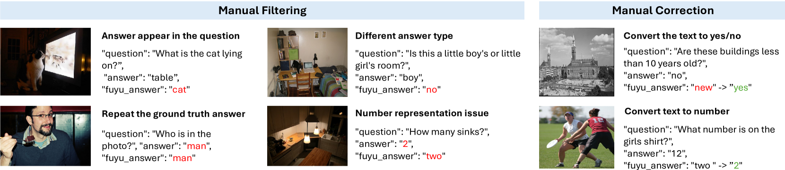
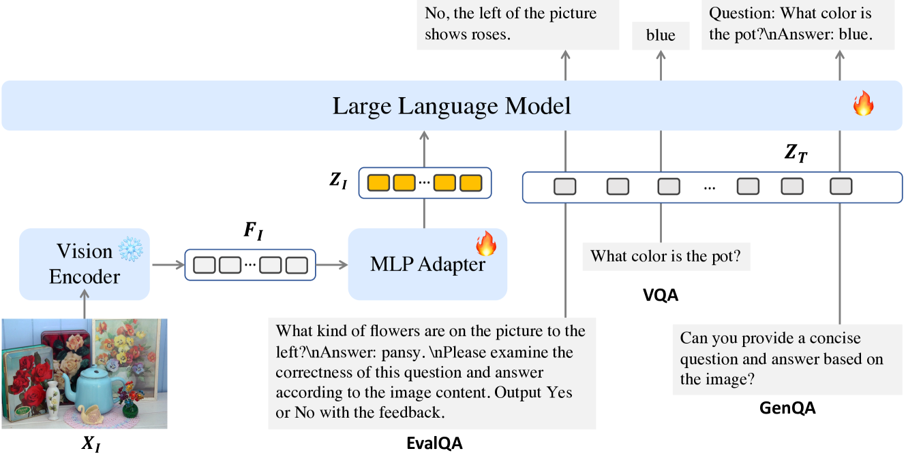
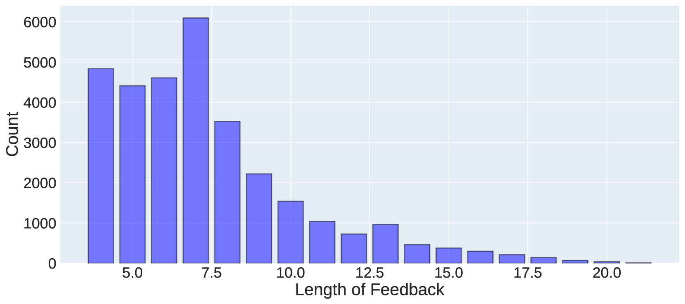
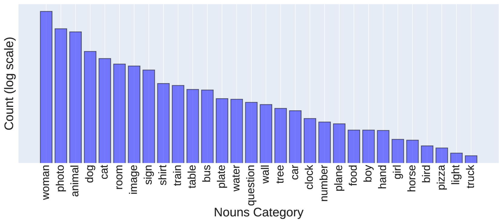
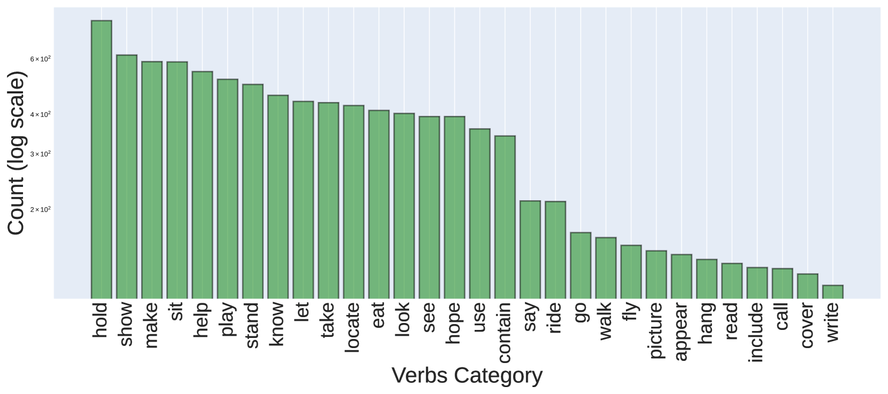

# LOVA3：掌握视觉问答、提问与评估的艺术

发布时间：2024年05月23日

`LLM应用

这篇论文介绍了LOVA3框架，旨在增强多模态大型语言模型（MLLMs）的问答、提问与评估能力。通过设计特定的训练任务和评估基准，研究者们试图提升MLLMs在图像背景下的这些能力。这种研究方向直接应用于提升MLLMs的实际功能和性能，因此属于LLM应用类别。` `人工智能`

> LOVA3: Learning to Visual Question Answering, Asking and Assessment

# 摘要

> 问答、提问与评估是人类理解世界、获取知识的关键本能。通过强化这些本能，人类能更高效地利用数据，增进理解和学习成效。然而，现今的多模态大型语言模型（MLLMs）多专注于问答，却未充分挖掘提问与评估的潜能。本研究推出LOVA3框架，旨在赋予MLLMs这些额外技能，名为“学习视觉问答、提问与评估”。我们设计了GenQA与EvalQA两项补充训练任务，旨在提升图像背景下的提问与评估能力。为培养提问技能，我们整合了一系列多模态基础任务。评估方面，我们新设EvalQABench基准，包含64,000个训练样本（正负各半）及5,000个测试样本。我们坚信，提升MLLMs的问答、提问与评估能力将增强其多模态理解，进而提升性能。通过LOVA3框架训练MLLM并在10个多模态基准上测试，我们验证了这一假设，结果显示性能持续提升，证实了我们方法的有效性。

> Question answering, asking, and assessment are three innate human traits crucial for understanding the world and acquiring knowledge. By enhancing these capabilities, humans can more effectively utilize data, leading to better comprehension and learning outcomes. However, current Multimodal Large Language Models (MLLMs) primarily focus on question answering, often neglecting the full potential of questioning and assessment skills. In this study, we introduce LOVA3, an innovative framework named ``Learning tO Visual Question Answering, Asking and Assessment,'' designed to equip MLLMs with these additional capabilities. Our approach involves the creation of two supplementary training tasks GenQA and EvalQA, aiming at fostering the skills of asking and assessing questions in the context of images. To develop the questioning ability, we compile a comprehensive set of multimodal foundational tasks. For assessment, we introduce a new benchmark called EvalQABench, comprising 64,000 training samples (split evenly between positive and negative samples) and 5,000 testing samples. We posit that enhancing MLLMs with the capabilities to answer, ask, and assess questions will improve their multimodal comprehension and lead to better performance. We validate our hypothesis by training an MLLM using the LOVA3 framework and testing it on 10 multimodal benchmarks. The results demonstrate consistent performance improvements, thereby confirming the efficacy of our approach.

[Arxiv](https://arxiv.org/abs/2405.14974)