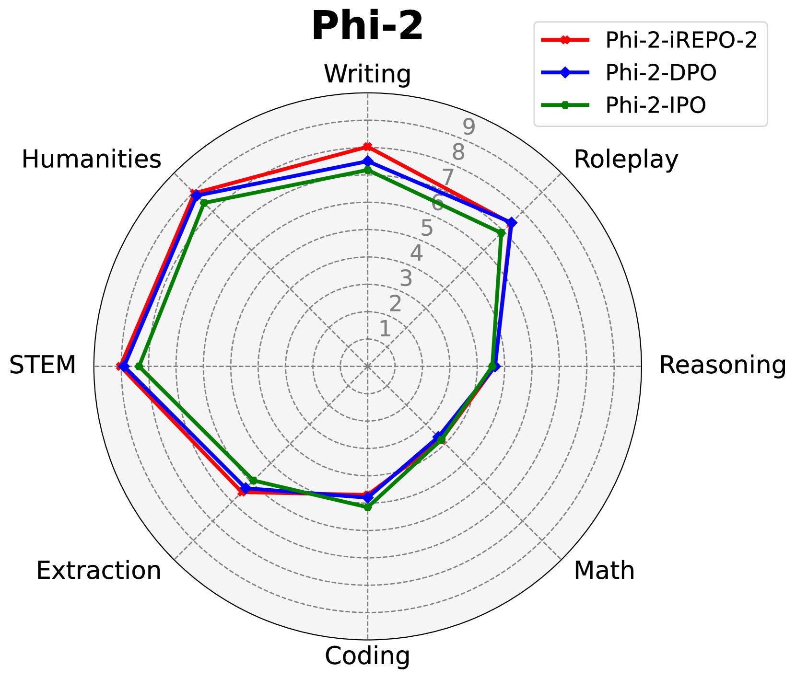
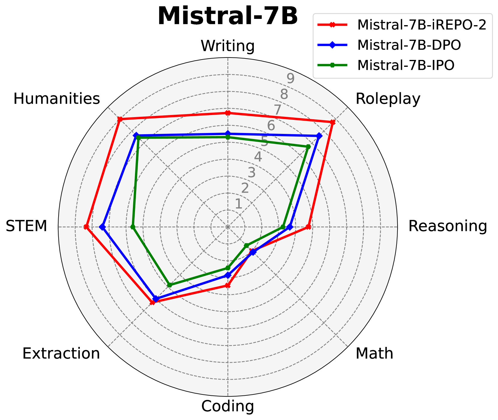
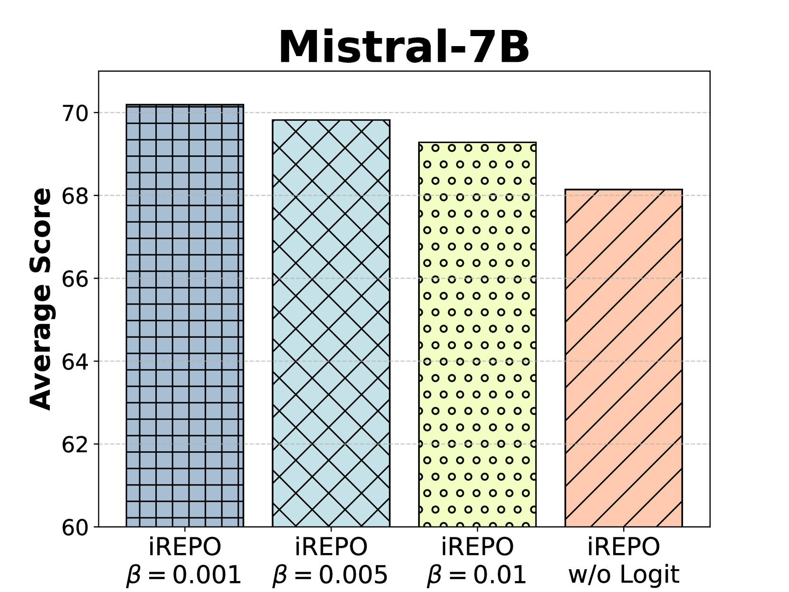
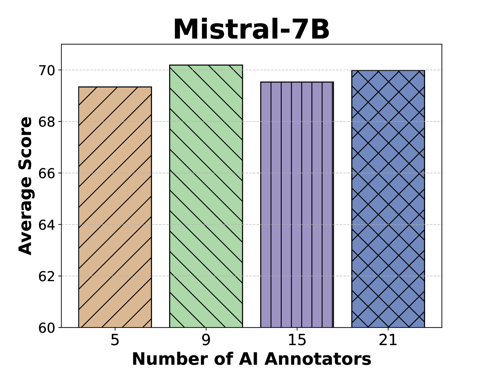

# $i$REPO：利用隐式奖励的成对差异进行经验偏好优化

发布时间：2024年05月24日

`LLM理论

这篇论文主要探讨了大型语言模型（LLM）的对齐问题，并提出了一种新的框架$i$REPO来优化这一过程。该框架通过隐式奖励差异回归优化经验偏好，并利用AI注释者偏好标记的自生成数据进行迭代优化。这种方法涉及理论支持的新算法，旨在在理想和非理想条件下提供最佳效果。因此，这篇论文的内容更偏向于LLM的理论研究，特别是关于模型对齐和优化的理论探讨。` `人工智能`

> $i$REPO: $i$mplicit Reward Pairwise Difference based Empirical Preference Optimization

# 摘要

> 大型语言模型（LLM）虽功能强大，但有时输出与人类预期不符，需要对齐以避免传播错误或偏见信息。传统基于强化学习的对齐方法面临稳定性挑战，而偏好优化则易过度依赖预设数据集。本文提出的$i$REPO框架，通过隐式奖励差异回归优化经验偏好，利用AI注释者偏好标记的自生成数据，通过创新回归损失函数迭代优化策略。理论支持的新算法在理想条件下确保最佳效果，并在非理想条件下提供性能差距。实验证明，$i$REPO在Phi-2和Mistral-7B模型上有效自对齐，且在语言模型评估和多轮测试中优于现有方法。

> While astonishingly capable, large Language Models (LLM) can sometimes produce outputs that deviate from human expectations. Such deviations necessitate an alignment phase to prevent disseminating untruthful, toxic, or biased information. Traditional alignment methods based on reinforcement learning often struggle with the identified instability, whereas preference optimization methods are limited by their overfitting to pre-collected hard-label datasets. In this paper, we propose a novel LLM alignment framework named $i$REPO, which utilizes implicit Reward pairwise difference regression for Empirical Preference Optimization. Particularly, $i$REPO employs self-generated datasets labelled by empirical human (or AI annotator) preference to iteratively refine the aligned policy through a novel regression-based loss function. Furthermore, we introduce an innovative algorithm backed by theoretical guarantees for achieving optimal results under ideal assumptions and providing a practical performance-gap result without such assumptions. Experimental results with Phi-2 and Mistral-7B demonstrate that $i$REPO effectively achieves self-alignment using soft-label, self-generated responses and the logit of empirical AI annotators. Furthermore, our approach surpasses preference optimization baselines in evaluations using the Language Model Evaluation Harness and Multi-turn benchmarks.

[Arxiv](https://arxiv.org/abs/2405.15230)