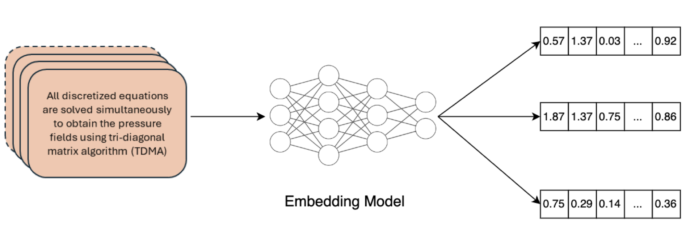

# AMGPT：专为增材制造中的上下文查询而设计的大型语言模型

发布时间：2024年05月24日

`RAG

理由：这篇论文主要描述了一个特定领域的LLM应用，即金属增材制造（AM）领域的文本生成器“AMGPT”。该应用利用了检索增强生成（RAG）框架，通过整合专业文献来增强模型的性能。虽然涉及到了LLM（大型语言模型），但重点在于RAG框架的应用，而不是LLM的理论研究或Agent的设计。因此，最合适的分类是RAG。` `材料科学` `增材制造`

> AMGPT: a Large Language Model for Contextual Querying in Additive Manufacturing

# 摘要

> 通用大型语言模型（如GPT-4）在回答材料科学研究者的具体查询时可能显得力不从心，仅能提供一个大致框架，而无法深入到新型合金的制造细节和材料特性。相比之下，通过将专业知识注入小型模型，我们能更快地适应金属增材制造（AM）领域的研究步伐，这是大型模型难以做到的。为此，我们开发了“AMGPT”，一个专为金属AM领域定制的LLM文本生成器，旨在帮助研究者和用户深入探索AM的丰富文献。我们利用Hugging Face的预训练Llama2-7B模型，在检索增强生成（RAG）框架下，动态整合了约50篇AM论文和教科书的信息。通过Mathpix将这些PDF文档转换为TeX格式，以便于整合进LlamaIndex管理的RAG流程。专家评估显示，RAG设置中的特定嵌入不仅加快了响应速度，还确保了生成文本的连贯性。

> Generalized large language models (LLMs) such as GPT-4 may not provide specific answers to queries formulated by materials science researchers. These models may produce a high-level outline but lack the capacity to return detailed instructions on manufacturing and material properties of novel alloys. Enhancing a smaller model with specialized domain knowledge may provide an advantage over large language models which cannot be retrained quickly enough to keep up with the rapid pace of research in metal additive manufacturing (AM). We introduce "AMGPT," a specialized LLM text generator designed for metal AM queries. The goal of AMGPT is to assist researchers and users in navigating the extensive corpus of literature in AM. Instead of training from scratch, we employ a pre-trained Llama2-7B model from Hugging Face in a Retrieval-Augmented Generation (RAG) setup, utilizing it to dynamically incorporate information from $\sim$50 AM papers and textbooks in PDF format. Mathpix is used to convert these PDF documents into TeX format, facilitating their integration into the RAG pipeline managed by LlamaIndex. Expert evaluations of this project highlight that specific embeddings from the RAG setup accelerate response times and maintain coherence in the generated text.

[Arxiv](https://arxiv.org/abs/2406.00031)