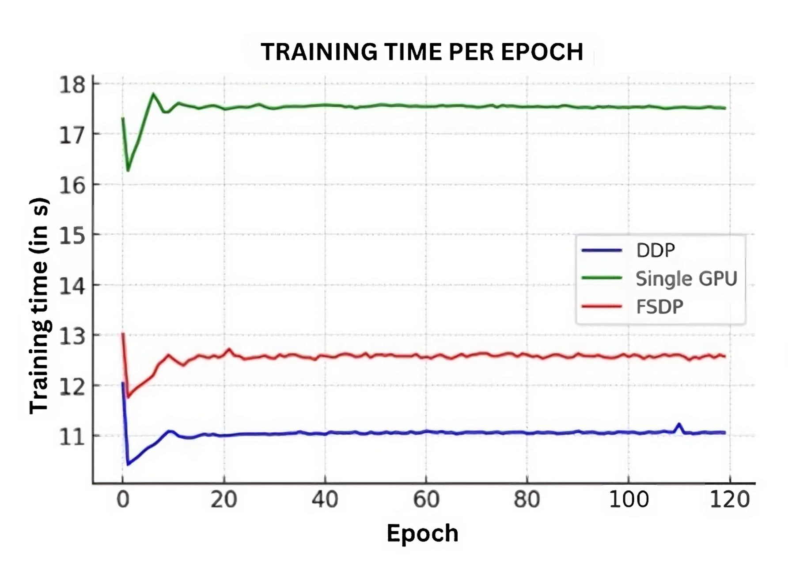

# GPT-2分布式训练策略比较研究

发布时间：2024年05月24日

`LLM理论

理由：这篇论文主要探讨了大型语言模型（LLM）训练过程中的技术挑战，特别是计算和内存需求，并深入分析了并行化技术如何解决这些问题。内容涉及数据并行和模型并行策略，以及它们在提高训练效率和可扩展性方面的作用。这些讨论直接关联到LLM的理论和训练方法，而非具体的应用、Agent行为或RAG（Retrieval-Augmented Generation）技术。因此，将其归类为LLM理论是合适的。` `人工智能` `高性能计算`

> A Comparative Analysis of Distributed Training Strategies for GPT-2

# 摘要

> 大型语言模型的迅猛发展伴随着训练过程中的重大挑战，主要源于其庞大的计算和内存需求。本研究深入探讨了为应对这些挑战而开发的并行化技术，这些技术使得大型语言模型的训练既高效又可扩展。研究全面分析了数据并行和模型并行策略，包括全分片数据并行和分布式数据并行框架，以评估促进高效模型训练的方法。此外，还深入探讨了生成预训练变换器-2模型的架构复杂性和训练方法。这些策略的应用研究对于管理训练复杂模型所需的巨大计算和内存需求至关重要。本研究不仅突出了这些并行训练策略在提高训练效率方面的有效性，还强调了它们在实现大型语言模型可扩展训练中的关键作用。通过综合文献回顾，本研究基于最新的研究成果，强调了并行化技术在解决训练最先进大型语言模型的计算挑战中的关键作用，为推动训练更复杂、更有能力的人工智能系统的发展做出了贡献。

> The rapid advancement in Large Language Models has been met with significant challenges in their training processes, primarily due to their considerable computational and memory demands. This research examines parallelization techniques developed to address these challenges, enabling the efficient and scalable training of Large Language Models. A comprehensive analysis of both data and model parallelism strategies, including Fully Sharded Data Parallelism and Distributed Data-Parallel frameworks, is provided to assess methods that facilitate efficient model training. Furthermore, the architectural complexities and training methodologies of the Generative Pre-Trained Transformer-2 model are explored. The application of these strategies is further investigated, which is crucial in managing the substantial computational and memory demands of training sophisticated models. This analysis not only highlights the effectiveness of these parallel training strategies in enhancing training efficiency but also their role in enabling the scalable training of large language models. Drawing on recent research findings, through a comprehensive literature review, this research underscores the critical role of parallelization techniques in addressing the computational challenges of training state-of-the-art Large Language Models, thereby contributing to the advancement of training more sophisticated and capable artificial intelligence systems.

[Arxiv](https://arxiv.org/abs/2405.15628)