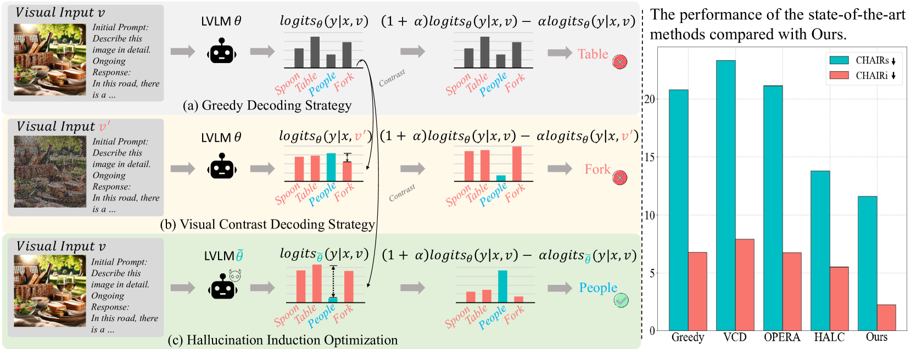

# 借助幻觉诱导优化，缓解大型视觉-语言模型中的幻觉问题

发布时间：2024年05月24日

`LLM理论

这篇论文主要探讨了大型视觉语言模型（LVLMs）中的幻觉问题，并提出了一种新的理论分析和优化策略（幻觉诱导优化，HIO）来改善这一问题。论文的核心贡献在于理论模型的精细调整和优化策略的提出，这些内容更偏向于对LLM理论的深入研究和改进，因此适合归类为LLM理论。` `计算机视觉`

> Alleviating Hallucinations in Large Vision-Language Models through Hallucination-Induced Optimization

# 摘要

> 大型视觉语言模型（LVLMs）虽在多模态理解上表现出色，却常因幻觉问题导致文本与图像脱节。现有的视觉对比解码方法尝试通过引入视觉不确定性来缩小幻觉与目标间的差距，但全局视觉不确定性的不可控性使得精确引导幻觉标记变得困难，限制了其缓解幻觉的效果，有时甚至适得其反。为此，我们进行了理论分析，并基于此提出了幻觉诱导优化（HIO）策略，通过精细调整的理论模型增强幻觉与目标标记的对比，有效提升了对比解码在LVLMs中缓解幻觉的能力。实验结果显示，HIO策略在多个测试中均优于现有技术，显著减少了幻觉现象。

> Although Large Visual Language Models (LVLMs) have demonstrated exceptional abilities in understanding multimodal data, they invariably suffer from hallucinations, leading to a disconnect between the generated text and the corresponding images. Almost all current visual contrastive decoding methods attempt to mitigate these hallucinations by introducing visual uncertainty information that appropriately widens the contrastive logits gap between hallucinatory and targeted ones. However, due to uncontrollable nature of the global visual uncertainty, they struggle to precisely induce the hallucinatory tokens, which severely limits their effectiveness in mitigating hallucinations and may even lead to the generation of undesired hallucinations. To tackle this issue, we conducted the theoretical analysis to promote the effectiveness of contrast decoding. Building on this insight, we introduce a novel optimization strategy named Hallucination-Induced Optimization (HIO). This strategy seeks to amplify the contrast between hallucinatory and targeted tokens relying on a fine-tuned theoretical preference model (i.e., Contrary Bradley-Terry Model), thereby facilitating efficient contrast decoding to alleviate hallucinations in LVLMs. Extensive experimental research demonstrates that our HIO strategy can effectively reduce hallucinations in LVLMs, outperforming state-of-the-art methods across various benchmarks.

[Arxiv](https://arxiv.org/abs/2405.15356)