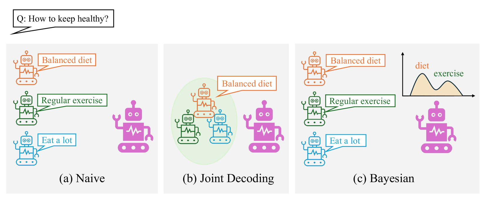
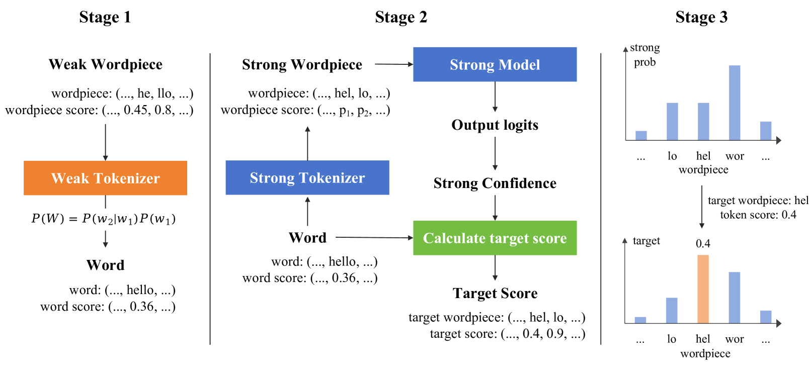

# 从文本分类到生成：贝叶斯弱至强的跃迁

发布时间：2024年05月24日

`Agent

这篇论文探讨了如何通过弱到强的框架来模拟弱模型如何驾驭更强大模型的潜能，并提出了集成多个弱模型来模拟人类意见多样性的方法。此外，论文还探讨了将这一策略应用于文本生成领域，并引入了直接偏好优化来深化学生模型的偏好学习。这些内容涉及到模型的自主学习和决策过程，因此更符合Agent分类的定义，即关注于模型的自主行为和决策能力。` `人工智能` `机器学习`

> Bayesian WeakS-to-Strong from Text Classification to Generation

# 摘要

> 随着大型语言模型的复杂性增加，人类监督变得越发薄弱，我们不禁思考：对齐技术将如何适应这一变化？本研究通过Weak-to-Strong框架，模拟了弱模型如何尝试驾驭更强大模型的潜能。我们进一步扩展了这一概念，通过集成多个弱模型来模拟人类意见的多样性，并采用贝叶斯方法评估置信度，以指导从弱到强的泛化过程。此外，我们将这一策略从文本分类扩展至文本生成领域，探索了更高级的监督方法。同时，引入了直接偏好优化，以超越传统的教师强制框架，深化学生模型的偏好学习。实验结果证实了这一方法在提升强学生模型可靠性方面的有效性，预示着超对齐技术的广阔前景。

> Advances in large language models raise the question of how alignment techniques will adapt as models become increasingly complex and humans will only be able to supervise them weakly. Weak-to-Strong mimics such a scenario where weak model supervision attempts to harness the full capabilities of a much stronger model. This work extends Weak-to-Strong to WeakS-to-Strong by exploring an ensemble of weak models which simulate the variability in human opinions. Confidence scores are estimated using a Bayesian approach to guide the WeakS-to-Strong generalization. Furthermore, we extend the application of WeakS-to-Strong from text classification tasks to text generation tasks where more advanced strategies are investigated for supervision. Moreover, direct preference optimization is applied to advance the student model's preference learning, beyond the basic learning framework of teacher forcing. Results demonstrate the effectiveness of the proposed approach for the reliability of a strong student model, showing potential for superalignment.

[Arxiv](https://arxiv.org/abs/2406.03199)