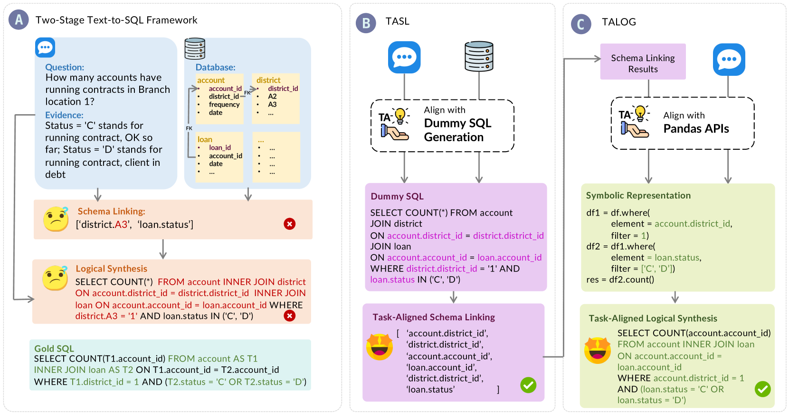
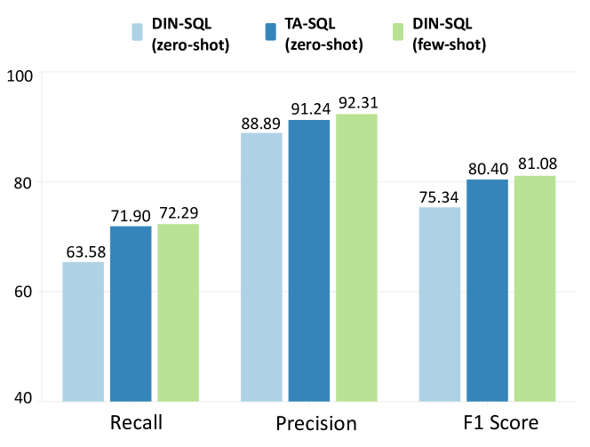
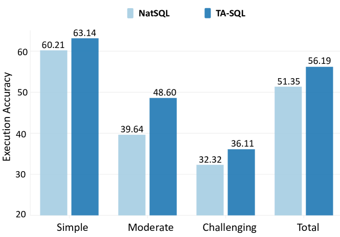
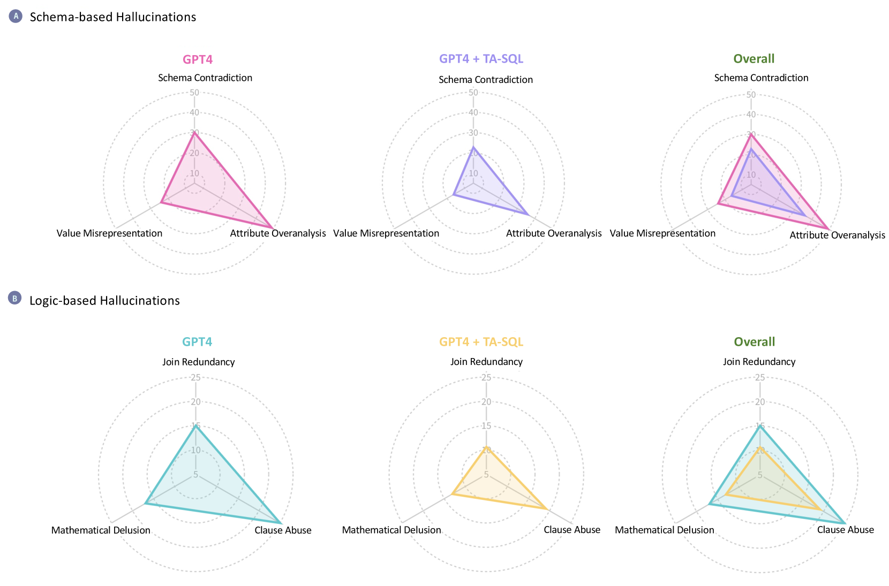
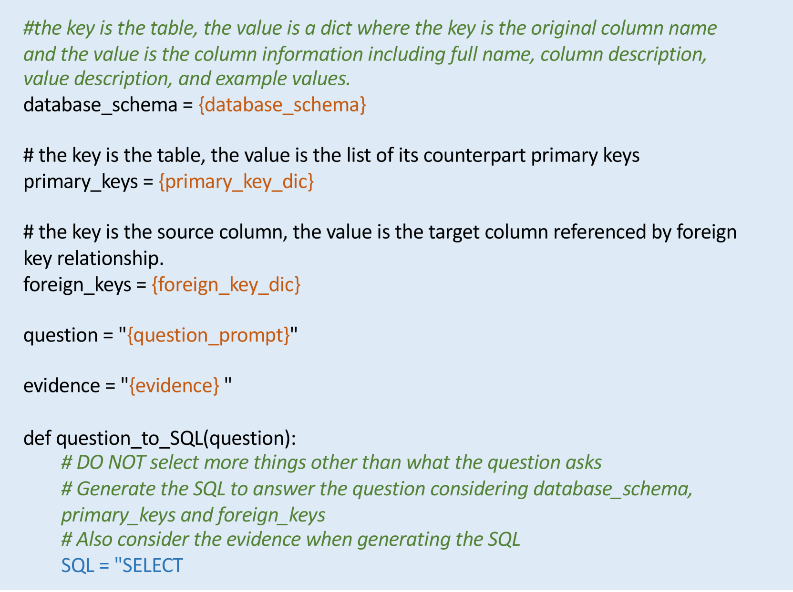
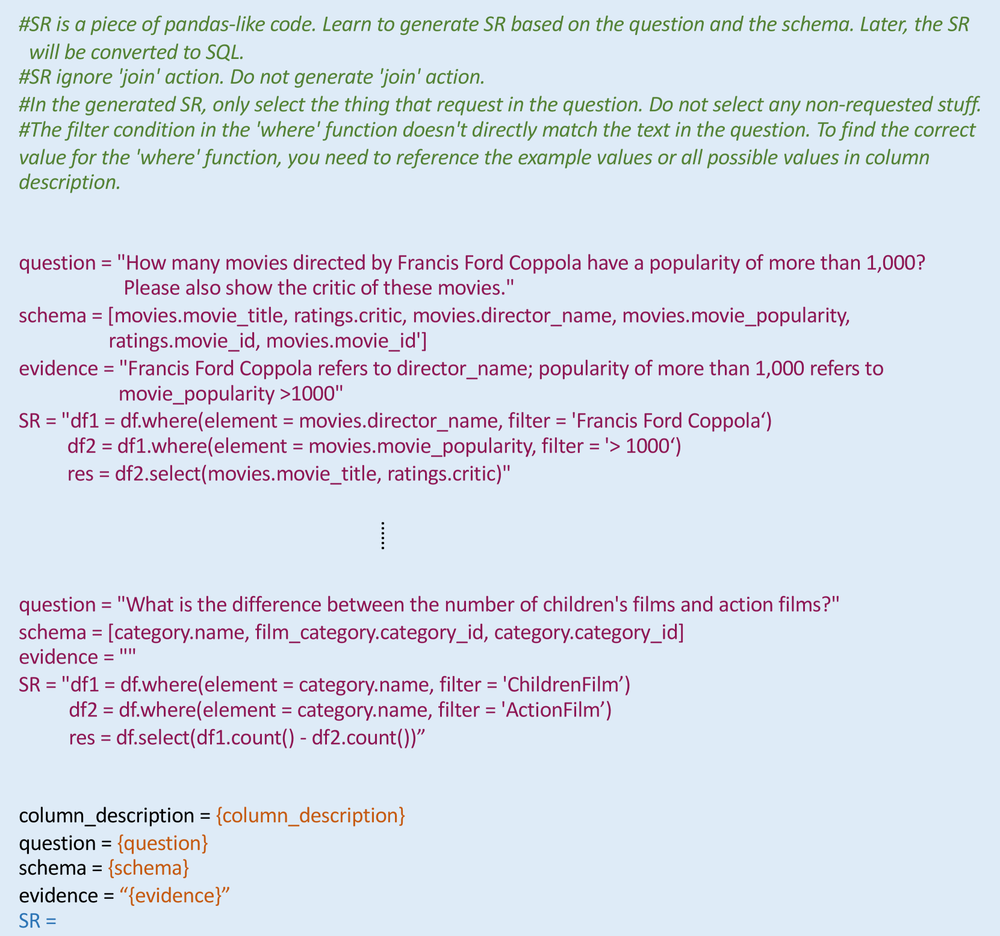

# 生成前先对齐！这一新颖策略有效缓解了文本到SQL生成中的幻觉问题。

发布时间：2024年05月24日

`LLM应用

理由：这篇论文主要关注的是大型语言模型（LLMs）在text-to-SQL任务中的应用，特别是在通过In-Context Learning (ICL) 驱动的模型中减少幻觉的问题。论文提出了一种任务对齐（TA）策略和TA-SQL框架，旨在提高模型在特定任务上的性能。这些内容主要涉及LLM的具体应用，而不是理论研究或Agent的设计，也不是关于检索增强生成（RAG）的讨论。因此，最合适的分类是LLM应用。` `数据库`

> Before Generation, Align it! A Novel and Effective Strategy for Mitigating Hallucinations in Text-to-SQL Generation

# 摘要

> 通过In-Context Learning (ICL) 驱动的大型语言模型 (LLMs) 在text-to-SQL任务上取得了显著进步，但LLMs的泛化缺陷常导致幻觉，限制了其潜力。我们首先识别并分类了text-to-SQL各阶段中的常见幻觉类型，并提出了任务对齐 (TA) 策略，旨在利用类似任务经验，减少从零开始的需要，有效减轻幻觉。基于此，我们开发了TA-SQL框架，实验证明其显著提升了GPT-4在BIRD dev上的性能，并在多个模型和复杂基准上实现了显著改进。

> Large Language Models (LLMs) driven by In-Context Learning (ICL) have significantly improved the performance of text-to-SQL. Previous methods generally employ a two-stage reasoning framework, namely 1) schema linking and 2) logical synthesis, making the framework not only effective but also interpretable. Despite these advancements, the inherent bad nature of the generalization of LLMs often results in hallucinations, which limits the full potential of LLMs. In this work, we first identify and categorize the common types of hallucinations at each stage in text-to-SQL. We then introduce a novel strategy, Task Alignment (TA), designed to mitigate hallucinations at each stage. TA encourages LLMs to take advantage of experiences from similar tasks rather than starting the tasks from scratch. This can help LLMs reduce the burden of generalization, thereby mitigating hallucinations effectively. We further propose TA-SQL, a text-to-SQL framework based on this strategy. The experimental results and comprehensive analysis demonstrate the effectiveness and robustness of our framework. Specifically, it enhances the performance of the GPT-4 baseline by 21.23% relatively on BIRD dev and it yields significant improvements across six models and four mainstream, complex text-to-SQL benchmarks.

[Arxiv](https://arxiv.org/abs/2405.15307)