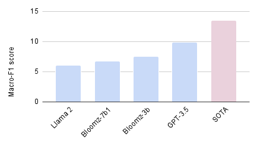

# 探究预训练大型语言模型在乌尔都语 NLP 任务中的潜能

发布时间：2024年05月24日

`LLM应用

这篇论文主要探讨了大型语言模型（LLMs）如GPT-3.5-turbo和Llama2-7B-Chat在乌尔都语数据集上的表现，并与当前最先进的（SOTA）模型进行了比较。研究关注的是LLMs在特定语言（乌尔都语）上的应用性能，这属于LLM在实际应用中的表现和优化问题，因此应归类为LLM应用。` `语言学研究`

> Benchmarking Pre-trained Large Language Models' Potential Across Urdu NLP tasks

# 摘要

> 大型语言模型（LLMs）通过在多语言数据上预训练，已经从特定语言和任务的模型管道转变为适应多种任务的单一模型，从而革新了自然语言处理研究。然而，大多数现有的多语言NLP基准测试仅涵盖少数语言，且缺乏与最先进模型的质量对比。本研究深入探讨了GPT-3.5-turbo、Llama2-7B-Chat等LLMs在15个乌尔都语数据集上的14项任务中的表现，并与SOTA模型进行了对比分析。实验结果显示，SOTA模型在乌尔都语NLP任务中全面领先。此外，我们发现，尽管参数较少，但基础模型中包含更多特定语言数据的LLMs在性能上优于计算量更大的模型。

> Large Language Models (LLMs) pre-trained on multilingual data have revolutionized natural language processing research, by transitioning from languages and task specific model pipelines to a single model adapted on a variety of tasks. However majority of existing multilingual NLP benchmarks for LLMs provide evaluation data in only few languages with little linguistic diversity. In addition these benchmarks lack quality assessment against the respective state-of the art models. This study presents an in-depth examination of prominent LLMs; GPT-3.5-turbo, Llama2-7B-Chat, Bloomz 7B1 and Bloomz 3B, across 14 tasks using 15 Urdu datasets, in a zero-shot setting, and their performance against state-of-the-art (SOTA) models, has been compared and analysed. Our experiments show that SOTA models surpass all the encoder-decoder pre-trained language models in all Urdu NLP tasks with zero-shot learning. Our results further show that LLMs with fewer parameters, but more language specific data in the base model perform better than larger computational models, but low language data.

[Arxiv](https://arxiv.org/abs/2405.15453)