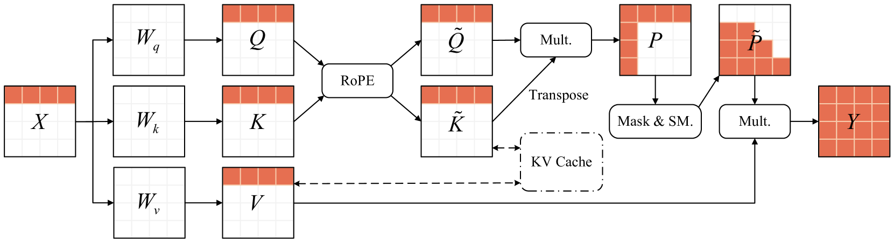
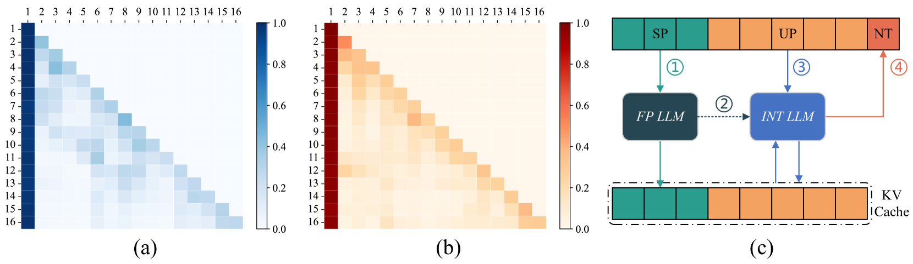
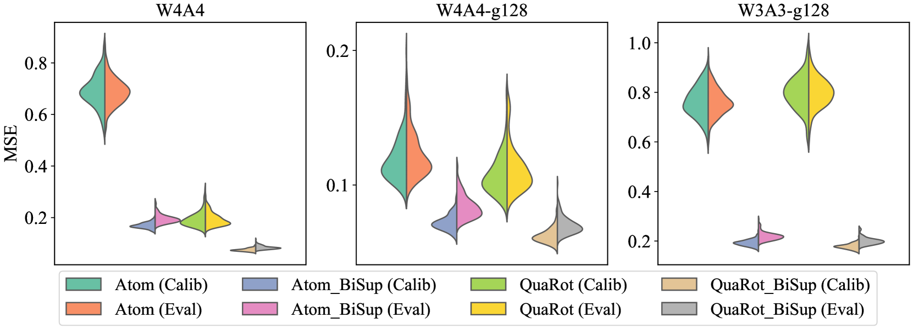
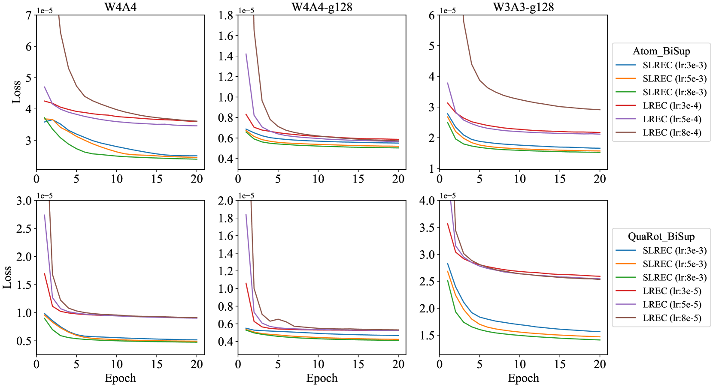
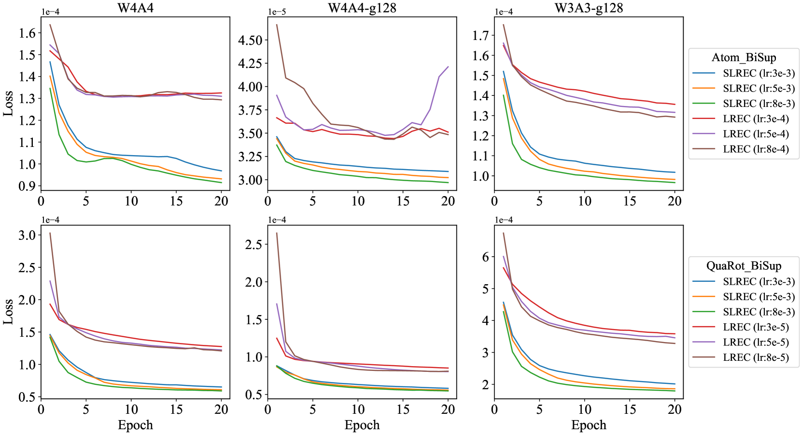

# BiSup：大型语言模型中的双向量化误差抑制技术

发布时间：2024年05月24日

`LLM理论

理由：这篇论文主要关注大型语言模型（LLMs）中的权重-激活量化技术，并提出了一种新的方法（BiSup）来抑制量化误差的双向传播。这种研究属于对LLMs内部机制的理论探讨和优化，特别是关于量化技术的改进，这是LLM理论研究的一个重要方面。因此，将其归类为LLM理论是合适的。` `模型优化`

> BiSup: Bidirectional Quantization Error Suppression for Large Language Models

# 摘要

> 随着大型语言模型（LLMs）的规模和上下文长度的增加，权重-激活量化技术变得至关重要，以实现高效部署。与仅权重量化相比，权重-激活量化因激活中的异常值而更具挑战性。现有研究通过混合精度量化和异常值抑制取得了进展，但主要关注单个矩阵乘法的优化，忽略了LLMs中量化误差的双向传播问题。具体而言，误差在同一令牌内层间垂直累积，并在不同令牌间因自注意力机制而水平扩散。为此，我们提出了BiSup，一种双向量化误差抑制方法。BiSup通过构建合适的参数空间，并利用少量数据进行量化感知微调，有效抑制了误差的垂直累积。同时，采用提示混合精度量化策略，确保系统提示关键值缓存的高精度，从而减轻了误差的水平扩散。实验结果显示，BiSup在Llama和Qwen系列模型上显著提升了性能，超越了两种现有最先进方法，进一步推动了低比特权重-激活量化的实际应用。

> As the size and context length of Large Language Models (LLMs) grow, weight-activation quantization has emerged as a crucial technique for efficient deployment of LLMs. Compared to weight-only quantization, weight-activation quantization presents greater challenges due to the presence of outliers in activations. Existing methods have made significant progress by exploring mixed-precision quantization and outlier suppression. However, these methods primarily focus on optimizing the results of single matrix multiplication, neglecting the bidirectional propagation of quantization errors in LLMs. Specifically, errors accumulate vertically within the same token through layers, and diffuse horizontally across different tokens due to self-attention mechanisms. To address this issue, we introduce BiSup, a Bidirectional quantization error Suppression method. By constructing appropriate optimizable parameter spaces, BiSup utilizes a small amount of data for quantization-aware parameter-efficient fine-tuning to suppress the error vertical accumulation. Besides, BiSup employs prompt mixed-precision quantization strategy, which preserves high precision for the key-value cache of system prompts, to mitigate the error horizontal diffusion. Extensive experiments on Llama and Qwen families demonstrate that BiSup can improve performance over two state-of-the-art methods (the average WikiText2 perplexity decreases from 13.26 to 9.41 for Atom and from 14.33 to 7.85 for QuaRot under the W3A3-g128 configuration), further facilitating the practical applications of low-bit weight-activation quantization.

[Arxiv](https://arxiv.org/abs/2405.15346)