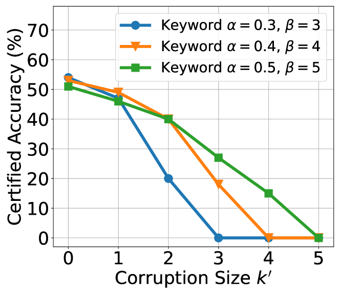
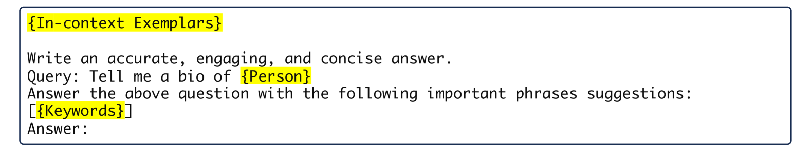

# RAG模型在面对检索污染时的可验证鲁棒性

发布时间：2024年05月24日

`RAG

理由：这篇论文主要讨论了检索增强生成（RAG）系统面临的检索污染攻击问题，并提出了一个名为RobustRAG的防御框架。这个框架专门设计来应对这种攻击，通过先隔离后聚合的策略来确保系统的安全性。因此，这篇论文的主题与RAG系统的安全性和防御机制紧密相关，属于RAG分类。` `网络安全` `问答系统`

> Certifiably Robust RAG against Retrieval Corruption

# 摘要

> 检索增强生成（RAG）面临检索污染攻击的威胁，攻击者通过注入恶意内容误导系统响应。为此，我们提出了RobustRAG，首个针对此类攻击的防御框架。其核心策略是先隔离后聚合：独立处理每个段落的LLM响应，再安全地整合这些响应。我们设计了基于关键词和解码的算法，确保非结构化文本响应的安全聚合。RobustRAG的可证明鲁棒性意味着，即便攻击者完全了解防御机制并注入恶意内容，对于特定查询，系统仍能提供准确答案。我们在多个数据集上验证了RobustRAG在开放域问答和长文本生成等任务中的有效性和广泛适用性。

> Retrieval-augmented generation (RAG) has been shown vulnerable to retrieval corruption attacks: an attacker can inject malicious passages into retrieval results to induce inaccurate responses. In this paper, we propose RobustRAG as the first defense framework against retrieval corruption attacks. The key insight of RobustRAG is an isolate-then-aggregate strategy: we get LLM responses from each passage in isolation and then securely aggregate these isolated responses. To instantiate RobustRAG, we design keyword-based and decoding-based algorithms for securely aggregating unstructured text responses. Notably, RobustRAG can achieve certifiable robustness: we can formally prove and certify that, for certain queries, RobustRAG can always return accurate responses, even when the attacker has full knowledge of our defense and can arbitrarily inject a small number of malicious passages. We evaluate RobustRAG on open-domain QA and long-form text generation datasets and demonstrate its effectiveness and generalizability across various tasks and datasets.

[Arxiv](https://arxiv.org/abs/2405.15556)