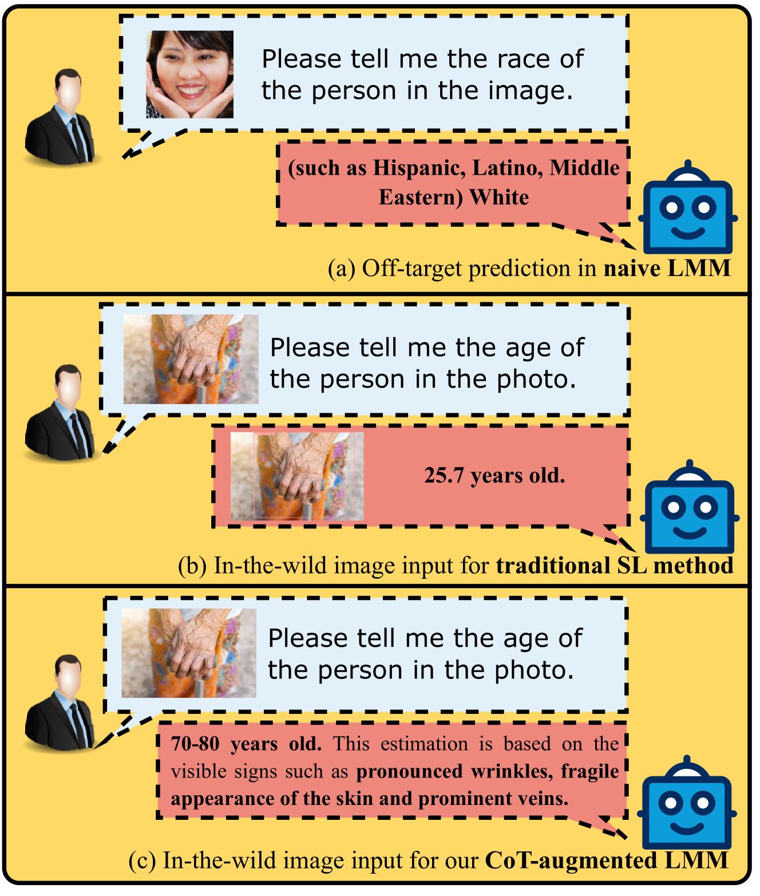
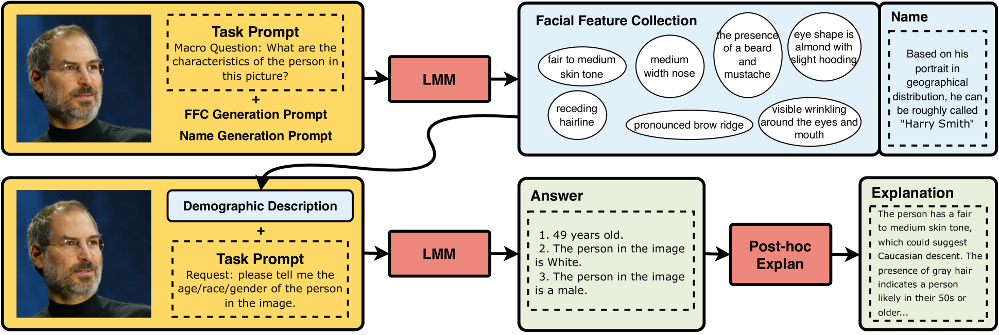
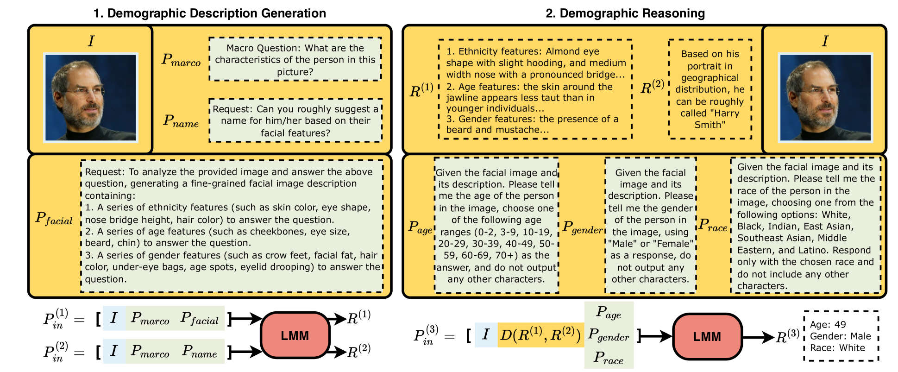
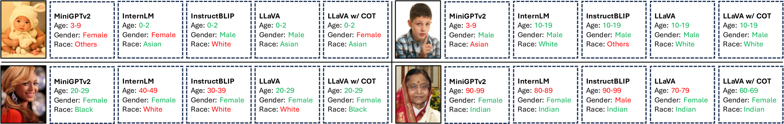

# 借助思维链提示，大型多模态模型在人口统计推断上展现新潜力

发布时间：2024年05月24日

`LLM应用

理由：这篇论文探讨了大型多模态模型（LMMs）在人口统计推断中的应用，并提出了一种增强的“思维链”提示策略以改善模型性能。这表明论文关注的是LLM（或在此情况下为LMM）的具体应用，即在人口统计推断领域的应用，而不是理论研究或Agent的设计与实现。因此，它属于LLM应用分类。` `人口统计学` `机器学习`

> Chain-of-Thought Prompting for Demographic Inference with Large Multimodal Models

# 摘要

> 传统的人口统计推断方法依赖于准确标记的数据，但在适应多变的社会和文化环境时显得力不从心，导致应用范围狭窄且准确性有限。大型多模态模型（LMMs）的兴起为视觉理解等任务带来了革命性的进步。本研究探索了LMMs在人口统计推断中的应用，并设立了评估基准。我们发现，LMMs在零-shot学习、可解释性及处理原始数据方面表现出色，但有时预测会偏离目标。为此，我们提出了一种增强的“思维链”提示策略，有效减少了预测偏差，提升了LMMs的性能，使其能与监督学习方法相媲美。

> Conventional demographic inference methods have predominantly operated under the supervision of accurately labeled data, yet struggle to adapt to shifting social landscapes and diverse cultural contexts, leading to narrow specialization and limited accuracy in applications. Recently, the emergence of large multimodal models (LMMs) has shown transformative potential across various research tasks, such as visual comprehension and description. In this study, we explore the application of LMMs to demographic inference and introduce a benchmark for both quantitative and qualitative evaluation. Our findings indicate that LMMs possess advantages in zero-shot learning, interpretability, and handling uncurated 'in-the-wild' inputs, albeit with a propensity for off-target predictions. To enhance LMM performance and achieve comparability with supervised learning baselines, we propose a Chain-of-Thought augmented prompting approach, which effectively mitigates the off-target prediction issue.

[Arxiv](https://arxiv.org/abs/2405.15687)