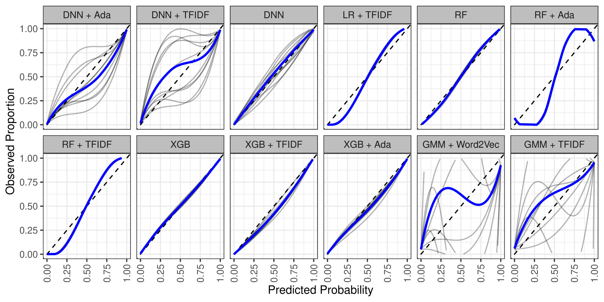

# ChatGPT源码追踪：探秘代码起源的技术手段

发布时间：2024年05月24日

`LLM应用

这篇论文探讨了大型语言模型（LLMs）在生成计算机代码方面的应用，特别是在区分人类编写的代码与AI生成的代码方面的应用。通过引入一种结合嵌入特征与监督学习算法的新方法，该研究实现了高准确率的代码来源识别。此外，研究还通过白盒特征和可解释的贝叶斯分类器揭示了代码来源间的关键差异，增强了方法的透明度和解释性。这项研究对于理解和减轻AI在代码生成中的潜在风险具有重要意义，特别是在高等教育、软件开发和竞争编程领域。因此，这篇论文应归类为LLM应用。` `高等教育` `软件开发`

> ChatGPT Code Detection: Techniques for Uncovering the Source of Code

# 摘要

> 大型语言模型（LLMs）在生成计算机代码方面取得了显著进展，使得人类编写的代码与AI生成的代码之间的界限变得模糊。随着技术的快速发展，探索这些模型如何影响代码生成变得尤为重要，尤其是在高等教育等领域存在误用风险的情况下。本文采用先进的分类技术，通过区分人类编写的代码与ChatGPT（一种LLM）生成的代码来探讨这一问题。我们引入了一种结合强大嵌入特征与监督学习算法的新方法，实现了高达98%的准确率。我们还对成功组合的模型进行了校准分析，发现部分模型校准得非常好。此外，我们通过白盒特征和可解释的贝叶斯分类器揭示了代码来源间的关键差异，增强了方法的透明度和解释性。尽管两种方法的准确率最高可达85-88%，但未经训练的人类在解决相同任务时的表现并不优于随机猜测。这项研究对于理解和减轻AI在代码生成中的潜在风险，尤其是在高等教育、软件开发和竞争编程领域，具有重要意义。

> In recent times, large language models (LLMs) have made significant strides in generating computer code, blurring the lines between code created by humans and code produced by artificial intelligence (AI). As these technologies evolve rapidly, it is crucial to explore how they influence code generation, especially given the risk of misuse in areas like higher education. This paper explores this issue by using advanced classification techniques to differentiate between code written by humans and that generated by ChatGPT, a type of LLM. We employ a new approach that combines powerful embedding features (black-box) with supervised learning algorithms - including Deep Neural Networks, Random Forests, and Extreme Gradient Boosting - to achieve this differentiation with an impressive accuracy of 98%. For the successful combinations, we also examine their model calibration, showing that some of the models are extremely well calibrated. Additionally, we present white-box features and an interpretable Bayes classifier to elucidate critical differences between the code sources, enhancing the explainability and transparency of our approach. Both approaches work well but provide at most 85-88% accuracy. We also show that untrained humans solve the same task not better than random guessing. This study is crucial in understanding and mitigating the potential risks associated with using AI in code generation, particularly in the context of higher education, software development, and competitive programming.

[Arxiv](https://arxiv.org/abs/2405.15512)