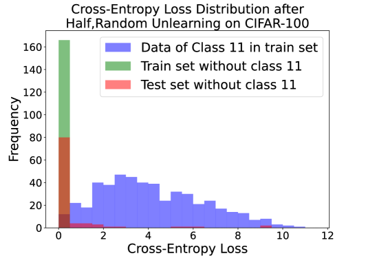

# 利用概念推理与数据污染技术实现复杂数据中的类别机器遗忘

发布时间：2024年05月24日

`Agent

这篇论文主要讨论了机器遗忘技术，这是一种允许模型所有者在不显著影响模型性能的情况下删除特定数据或类别的方法。论文中提到的技术涉及使用“概念”来定义复杂数据中的遗忘类别，并运用事后概念瓶颈模型和集成梯度技术来精确识别不同类别间的关键概念。此外，还提出了随机与定向标签的数据中毒策略作为有效的遗忘方法。这些技术在图像分类模型和大型语言模型上的应用表明，它们能够精准移除目标信息，同时保持模型性能。这种技术可以被视为一种智能代理（Agent）的行为，因为它涉及对模型进行操作以实现特定的目标（即删除特定数据或类别），并且这种操作是在模型所有者的控制下进行的。因此，这篇论文更适合归类到Agent分类中。` `机器学习` `隐私保护`

> Class Machine Unlearning for Complex Data via Concepts Inference and Data Poisoning

# 摘要

> 在AI时代，用户出于隐私考虑可能要求AI公司从训练数据集中删除其数据。作为模型所有者，重新训练模型成本高昂。因此，机器遗忘技术应运而生，它允许模型所有者在不显著影响模型性能的情况下删除特定数据或类别。然而，对于图像或文本等复杂数据，遗忘一个类别往往导致性能下降，因为难以准确识别类别与模型间的关联。不恰当的类别删除可能导致遗忘过度或不足。本文中，我们采用“概念”而非单一特征或标记来定义复杂数据中的遗忘类别，以此切断模型与类别间的联系，实现对特定类别影响的彻底消除。我们运用事后概念瓶颈模型和集成梯度技术精确识别不同类别间的关键概念，并借助随机与定向标签的数据中毒策略提出有效的遗忘方法。实验在图像分类模型和大型语言模型上进行，结果显示我们的方法能精准移除目标信息，同时保持模型性能。

> In current AI era, users may request AI companies to delete their data from the training dataset due to the privacy concerns. As a model owner, retraining a model will consume significant computational resources. Therefore, machine unlearning is a new emerged technology to allow model owner to delete requested training data or a class with little affecting on the model performance. However, for large-scaling complex data, such as image or text data, unlearning a class from a model leads to a inferior performance due to the difficulty to identify the link between classes and model. An inaccurate class deleting may lead to over or under unlearning. In this paper, to accurately defining the unlearning class of complex data, we apply the definition of Concept, rather than an image feature or a token of text data, to represent the semantic information of unlearning class. This new representation can cut the link between the model and the class, leading to a complete erasing of the impact of a class. To analyze the impact of the concept of complex data, we adopt a Post-hoc Concept Bottleneck Model, and Integrated Gradients to precisely identify concepts across different classes. Next, we take advantage of data poisoning with random and targeted labels to propose unlearning methods. We test our methods on both image classification models and large language models (LLMs). The results consistently show that the proposed methods can accurately erase targeted information from models and can largely maintain the performance of the models.

[Arxiv](https://arxiv.org/abs/2405.15662)