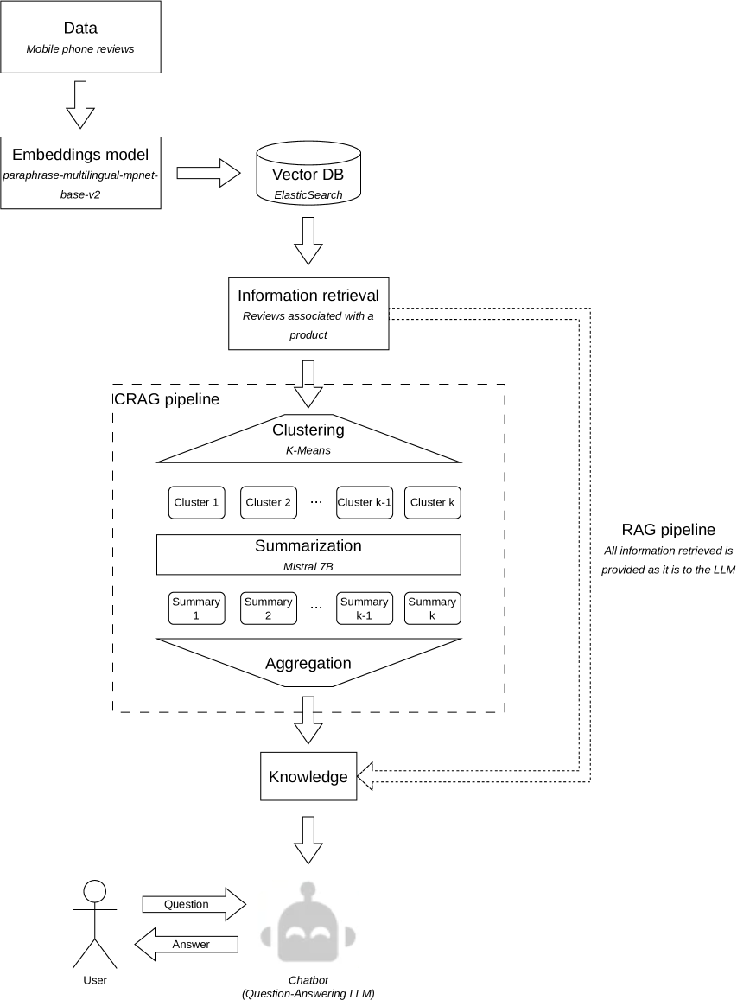

# 集群检索增强生成（CRAG）技术

发布时间：2024年05月24日

`RAG

理由：这篇论文主要讨论了一种名为CRAG的创新策略，该策略旨在通过减少令牌数量来优化基于向量数据库的检索增强生成（RAG）方法。论文的核心贡献在于提出了一种改进的RAG方法，即CRAG，以解决原RAG方法在处理大量上下文时可能遇到的令牌数量过多和成本增加的问题。因此，这篇论文属于RAG分类，因为它专注于改进和优化现有的RAG技术。` `信息检索`

> Clustered Retrieved Augmented Generation (CRAG)

# 摘要

> 在实际应用中，为大型语言模型（LLMs）注入外部知识至关重要，这包括实时更新内容、获取专业知识以及避免信息失真。基于向量数据库的检索增强生成（RAG）方法虽广受欢迎，但在某些场景下可能因上下文窗口需求过大而显得力不从心。即便上下文适配窗口，庞大的令牌数量也会导致成本和时间上的负担。为此，我们推出了CRAG，一种创新策略，它能在保持响应质量的同时，显著削减令牌数量，实验表明，CRAG能减少至少46%的令牌，某些情况下甚至高达90%以上。与RAG不同，随着分析评论的增多，CRAG的令牌数量增长微乎其微，而RAG在处理75条评论时，令牌数量是处理4条评论时的近9倍。

> Providing external knowledge to Large Language Models (LLMs) is a key point for using these models in real-world applications for several reasons, such as incorporating up-to-date content in a real-time manner, providing access to domain-specific knowledge, and contributing to hallucination prevention. The vector database-based Retrieval Augmented Generation (RAG) approach has been widely adopted to this end. Thus, any part of external knowledge can be retrieved and provided to some LLM as the input context. Despite RAG approach's success, it still might be unfeasible for some applications, because the context retrieved can demand a longer context window than the size supported by LLM. Even when the context retrieved fits into the context window size, the number of tokens might be expressive and, consequently, impact costs and processing time, becoming impractical for most applications. To address these, we propose CRAG, a novel approach able to effectively reduce the number of prompting tokens without degrading the quality of the response generated compared to a solution using RAG. Through our experiments, we show that CRAG can reduce the number of tokens by at least 46\%, achieving more than 90\% in some cases, compared to RAG. Moreover, the number of tokens with CRAG does not increase considerably when the number of reviews analyzed is higher, unlike RAG, where the number of tokens is almost 9x higher when there are 75 reviews compared to 4 reviews.

[Arxiv](https://arxiv.org/abs/2406.00029)