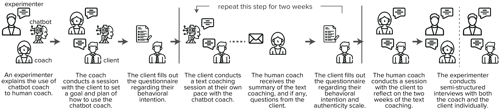
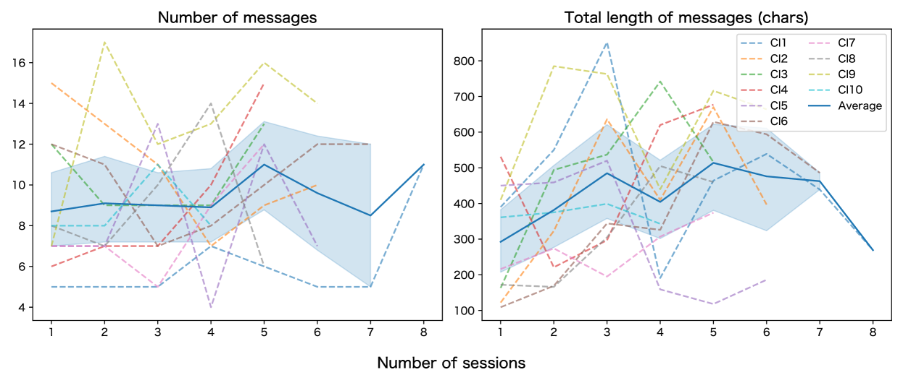
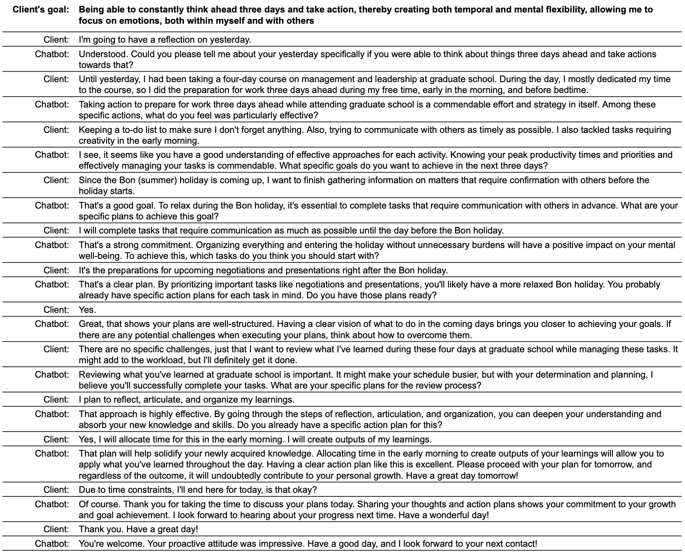
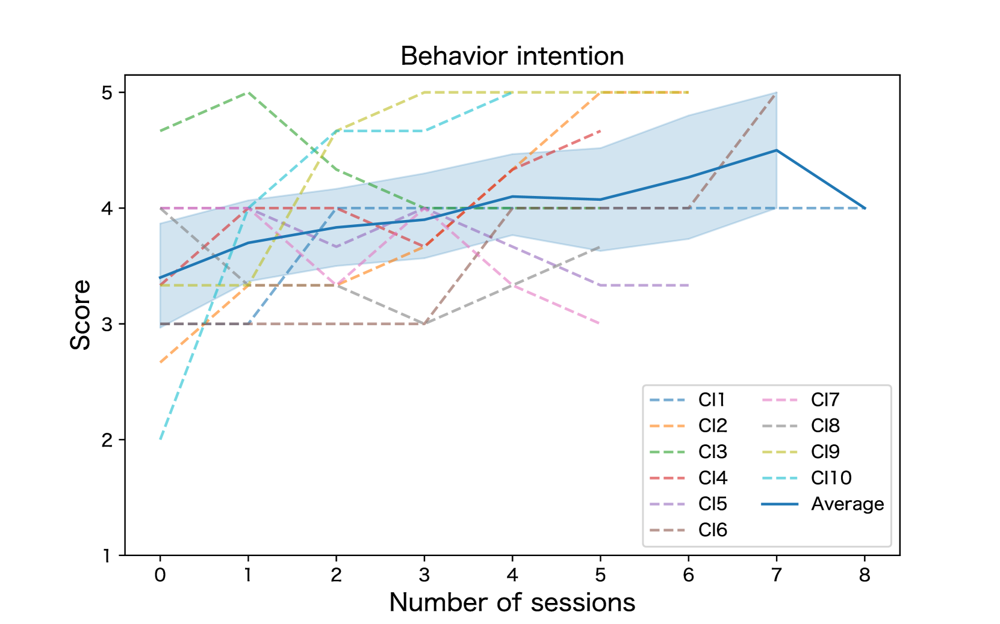
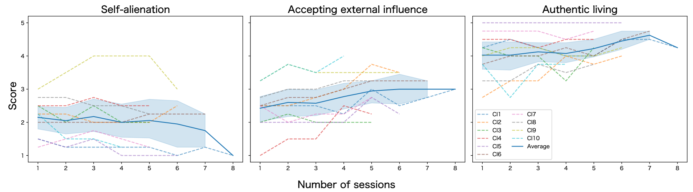

# 领导力成长助手：结合 LLM 聊天机器人与人类教练，共同助力自我反思，促进领导力发展。

发布时间：2024年05月24日

`Agent

这篇论文探讨了结合大型语言模型（LLMs）的聊天机器人在高管教练领域的应用，特别是在促进自我反思和领导力发展方面的作用。它通过设计研讨会和用户研究来探索聊天机器人辅助人类教练的可行性和细节，强调了LLMs赋予聊天机器人的普遍性和推理能力，以及在人机协作中需要解决的局限性和设计需求。因此，这篇论文更符合Agent分类，因为它关注的是如何利用智能代理（聊天机器人）来辅助人类在特定领域（如高管教练）的工作。` `高管教练`

> Coaching Copilot: Blended Form of an LLM-Powered Chatbot and a Human Coach to Effectively Support Self-Reflection for Leadership Growth

# 摘要

> 聊天机器人在促进自我反思，尤其是引导行为改变方面的作用已得到广泛认可。尽管它们的全天候服务、可扩展性和一致性在医疗和教育领域帮助人们养成新习惯方面已显示出优势，但在需要深入内省对话以促进领导力发展的教练领域，聊天机器人的潜力尚未被充分挖掘。本文探讨了结合最新大型语言模型（LLMs）的聊天机器人在高管教练领域与专业教练合作的潜力。通过与教练们的设计研讨会和为期两周的用户研究，我们探索了聊天机器人辅助人类教练的可行性和细节。研究发现，LLMs赋予聊天机器人的普遍性和推理能力带来了显著优势，同时也揭示了在人机协作中需要解决的局限性和设计需求。这项研究为通过人机交互方法增强自我反思过程奠定了基础。

> Chatbots' role in fostering self-reflection is now widely recognized, especially in inducing users' behavior change. While the benefits of 24/7 availability, scalability, and consistent responses have been demonstrated in contexts such as healthcare and tutoring to help one form a new habit, their utilization in coaching necessitating deeper introspective dialogue to induce leadership growth remains unexplored. This paper explores the potential of such a chatbot powered by recent Large Language Models (LLMs) in collaboration with professional coaches in the field of executive coaching. Through a design workshop with them and two weeks of user study involving ten coach-client pairs, we explored the feasibility and nuances of integrating chatbots to complement human coaches. Our findings highlight the benefits of chatbots' ubiquity and reasoning capabilities enabled by LLMs while identifying their limitations and design necessities for effective collaboration between human coaches and chatbots. By doing so, this work contributes to the foundation for augmenting one's self-reflective process with prevalent conversational agents through the human-in-the-loop approach.

[Arxiv](https://arxiv.org/abs/2405.15250)