# 遥感图像的组合检索技术

发布时间：2024年05月24日

`RAG

理由：这篇论文主要探讨了将组合图像检索技术应用于遥感领域，并提出了结合图像与文本相似度的新方法。这种方法利用了视觉语言模型来增强图像检索的能力，特别是在处理文本描述与图像示例结合的查询时。这与RAG（Retrieval-Augmented Generation）的概念相符，其中检索（Retrieval）和生成（Generation）是核心组成部分，用于增强模型的信息检索和处理能力。虽然论文中提到了视觉语言模型，但其重点在于应用这些模型于特定的图像检索任务，而不是深入探讨模型的理论或作为Agent的应用。因此，将其归类为RAG更为合适。` `图像检索`

> Composed Image Retrieval for Remote Sensing

# 摘要

> 本研究创新性地将组合图像检索技术应用于遥感领域，通过图像示例与文本描述的结合，提升了单模态查询的描述能力。文本描述可调整图像的形状、颜色及上下文等属性。我们提出了一种结合图像与文本相似度的新方法，并证实视觉语言模型已具备强大描述力，无需额外学习或训练数据。此外，我们还设立了新的评估基准，专注于颜色、上下文、密度、存在性、数量和形状的变异。此项研究不仅刷新了该领域的技术标准，也为遥感图像检索的进一步发展奠定了基础。相关代码已公开于 GitHub：https://github.com/billpsomas/rscir。

> This work introduces composed image retrieval to remote sensing. It allows to query a large image archive by image examples alternated by a textual description, enriching the descriptive power over unimodal queries, either visual or textual. Various attributes can be modified by the textual part, such as shape, color, or context. A novel method fusing image-to-image and text-to-image similarity is introduced. We demonstrate that a vision-language model possesses sufficient descriptive power and no further learning step or training data are necessary. We present a new evaluation benchmark focused on color, context, density, existence, quantity, and shape modifications. Our work not only sets the state-of-the-art for this task, but also serves as a foundational step in addressing a gap in the field of remote sensing image retrieval. Code at: https://github.com/billpsomas/rscir

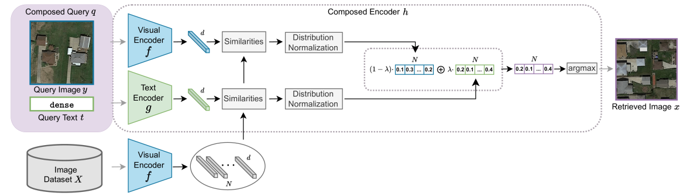

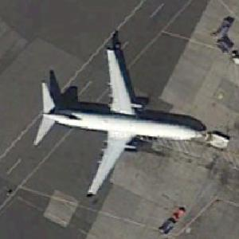

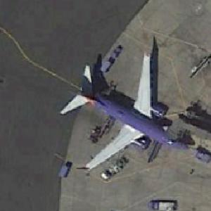

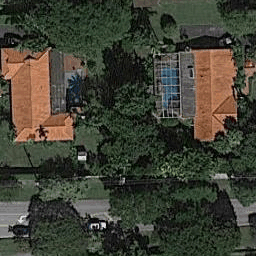

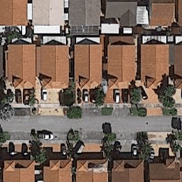

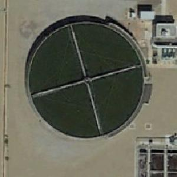

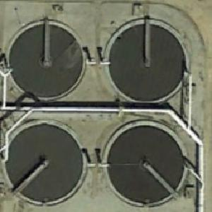

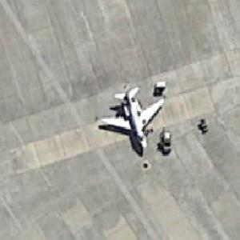

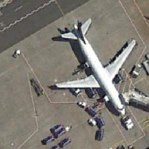

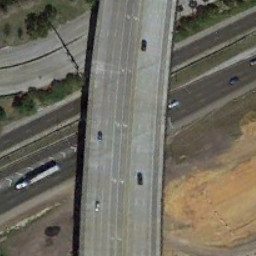

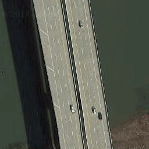

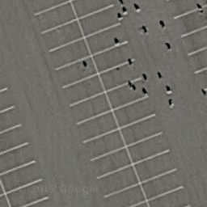

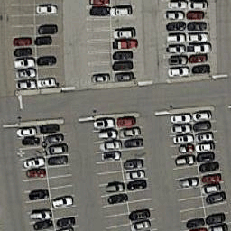

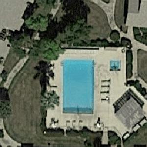

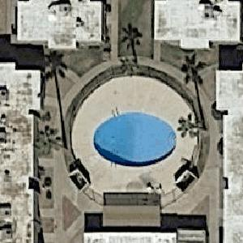

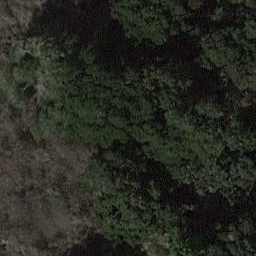

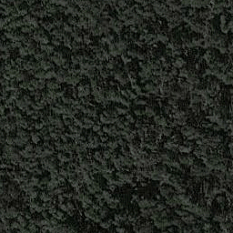

[Arxiv](https://arxiv.org/abs/2405.15587)