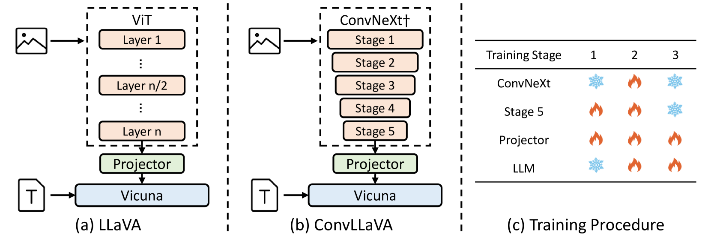
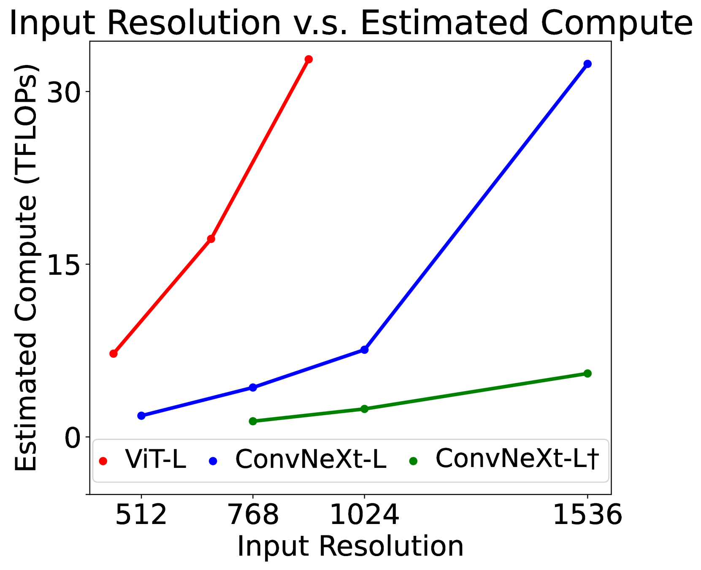

# ConvLLaVA：大型多模态模型的视觉编码器——层次化骨干网络

发布时间：2024年05月24日

`LLM应用

理由：这篇论文主要讨论了如何通过开发ConvLLaVA模型来解决高分辨率大型多模态模型（LMMs）中视觉令牌过多和视觉复杂度的问题。它通过采用ConvNeXt作为视觉编码器，并实施特定的优化策略来压缩视觉特征，减少视觉令牌的冗余，从而提高模型的效率和性能。这些内容主要关注于大型语言模型（LLM）的应用层面，即如何优化和应用这些模型以解决实际问题，而不是深入探讨LLM的理论基础或Agent的设计与实现。因此，将其归类为LLM应用是合适的。` `计算机视觉` `人工智能`

> ConvLLaVA: Hierarchical Backbones as Visual Encoder for Large Multimodal Models

# 摘要

> 高分辨率大型多模态模型（LMMs）面临视觉令牌过多和视觉复杂度二次方的挑战。尽管现有模型解决了二次方复杂度问题，但视觉令牌的冗余仍是一个关键问题，增加了计算负担。为此，我们开发了ConvLLaVA，采用ConvNeXt作为视觉编码器，替代ViT，有效压缩高分辨率图像为信息密集的视觉特征，避免了视觉令牌的过度生成。为了提升ConvLLaVA的性能，我们实施了两项关键优化：一是更新低分辨率预训练的ConvNeXt，以适应高分辨率；二是增加连续训练阶段，进一步压缩视觉令牌，减少冗余。这些改进使ConvLLaVA能处理1536x1536分辨率的输入，仅产生576个视觉令牌，适应各种宽高比的图像。实验证明，我们的方法在主流基准上与顶尖模型表现相当。ConvLLaVA模型系列已公开于https://github.com/alibaba/conv-llava。

> High-resolution Large Multimodal Models (LMMs) encounter the challenges of excessive visual tokens and quadratic visual complexity. Current high-resolution LMMs address the quadratic complexity while still generating excessive visual tokens. However, the redundancy in visual tokens is the key problem as it leads to more substantial compute. To mitigate this issue, we propose ConvLLaVA, which employs ConvNeXt, a hierarchical backbone, as the visual encoder of LMM to replace Vision Transformer (ViT). ConvLLaVA compresses high-resolution images into information-rich visual features, effectively preventing the generation of excessive visual tokens. To enhance the capabilities of ConvLLaVA, we propose two critical optimizations. Since the low-resolution pretrained ConvNeXt underperforms when directly applied on high resolution, we update it to bridge the gap. Moreover, since ConvNeXt's original compression ratio is inadequate for much higher resolution inputs, we train a successive stage to further compress the visual tokens, thereby reducing redundancy. These optimizations enable ConvLLaVA to support inputs of 1536x1536 resolution generating only 576 visual tokens, capable of handling images of arbitrary aspect ratios. Experimental results demonstrate that our method achieves competitive performance with state-of-the-art models on mainstream benchmarks. The ConvLLaVA model series are publicly available at https://github.com/alibaba/conv-llava.

[Arxiv](https://arxiv.org/abs/2405.15738)