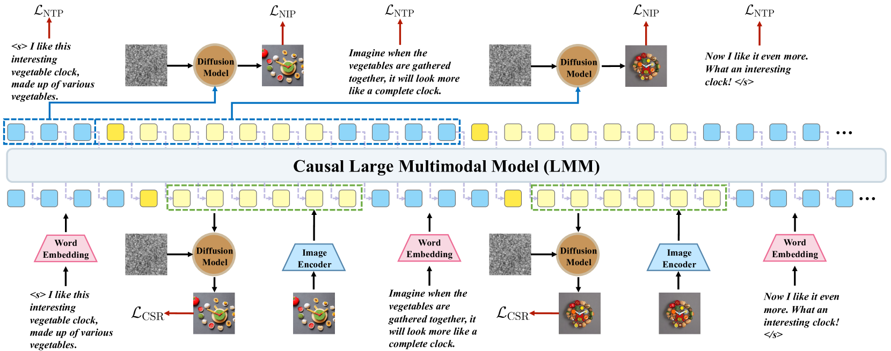
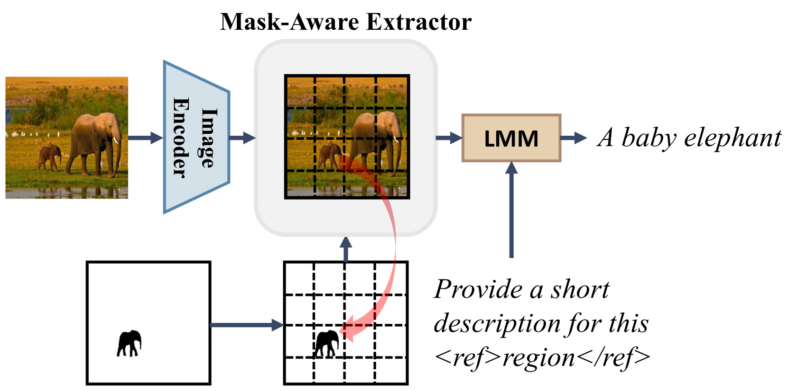
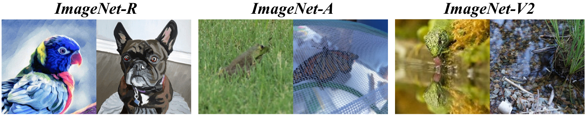
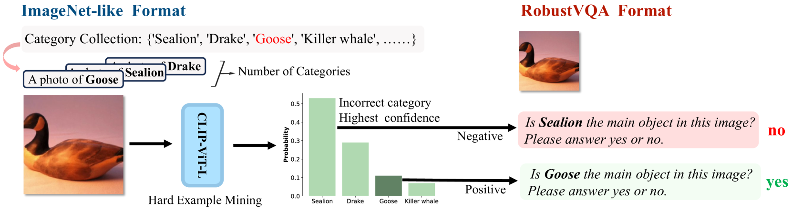
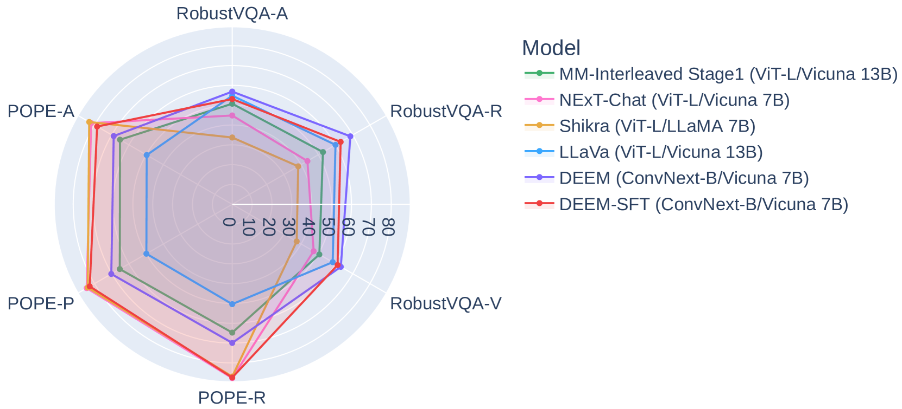
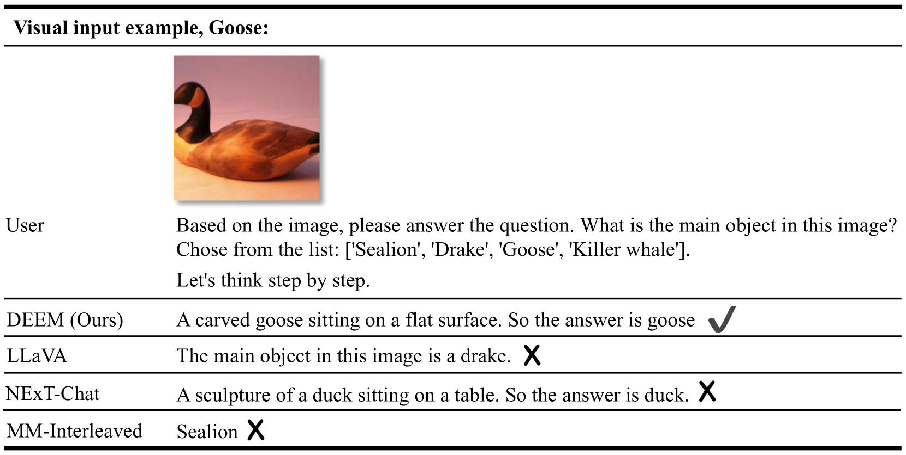
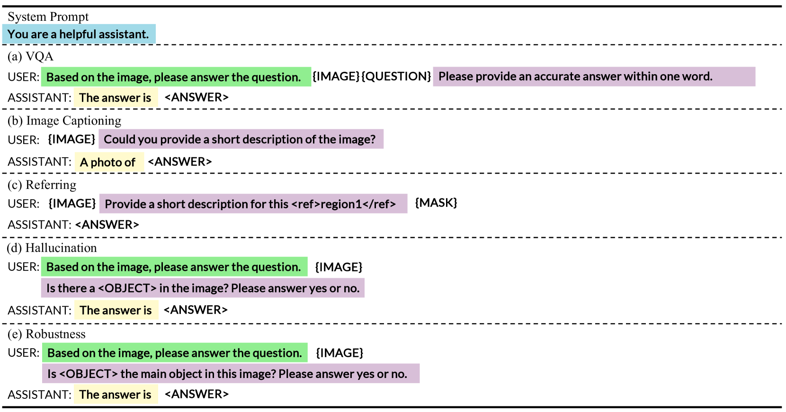
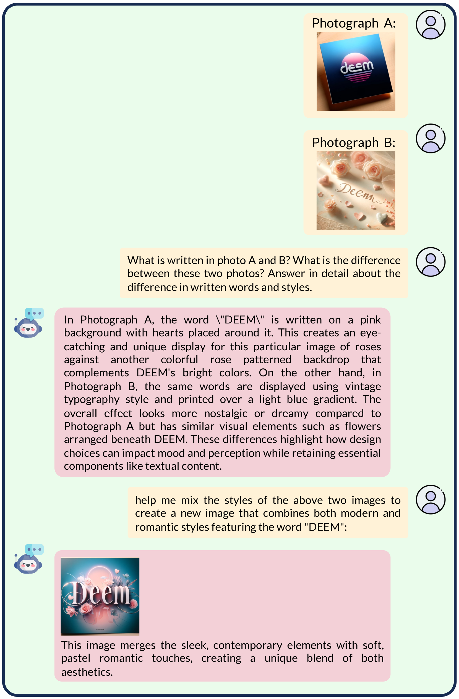
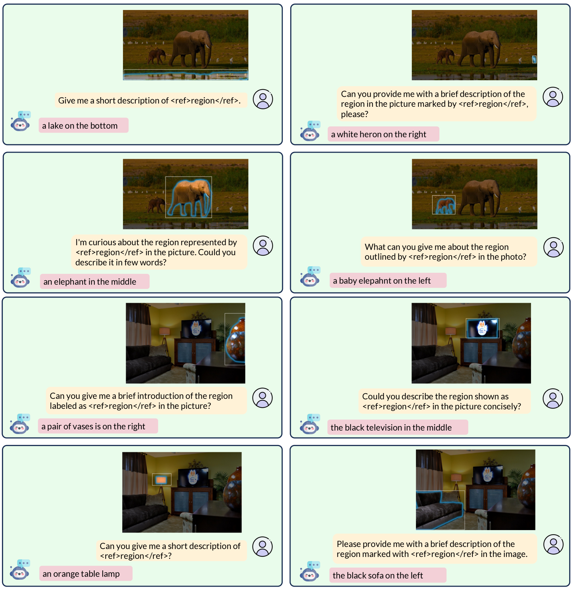

# DEEM：扩散模型——大型语言模型感知图像的慧眼

发布时间：2024年05月24日

`LLM应用

这篇论文探讨了大型多模态模型在处理分布外数据时的脆弱性，并提出了一种名为DEEM的方法来优化图像编码器的语义分布，以提高模型的鲁棒性和减少视觉幻觉。这种方法直接应用于现有的多模态模型中，以改善其性能，因此属于LLM应用类别。` `多模态学习` `视觉问答`

> DEEM: Diffusion Models Serve as the Eyes of Large Language Models for Image Perception

# 摘要

> 大型语言模型的发展催生了大型多模态模型的兴起。虽然多模态模型在促进理解和创造的协同作用方面取得了显著成就，但面对分布外数据时仍显脆弱。这主要源于它们依赖于将图像编码为任务相关特征的图像编码器，可能忽视了细节。本文提出的DEEM方法，巧妙地利用扩散模型的生成反馈来优化图像编码器的语义分布，有效克服了仅依赖图像编码器的局限，提升了模型对异常数据的抵抗力并减少了视觉幻觉，且无需额外训练模块和少量参数。在RobustVQA和POPE基准测试中，DEEM展现出更强的鲁棒性和减少幻觉的能力，同时使用更少的训练参数和预训练数据，以及更小的模型基础。

> The development of large language models (LLMs) has significantly advanced the emergence of large multimodal models (LMMs). While LMMs have achieved tremendous success by promoting the synergy between multimodal comprehension and creation, they often face challenges when confronted with out-of-distribution data. This is primarily due to their reliance on image encoders trained to encode images into task-relevant features, which may lead them to disregard irrelevant details. Delving into the modeling capabilities of diffusion models for images naturally prompts the question: Can diffusion models serve as the eyes of large language models for image perception? In this paper, we propose DEEM, a simple and effective approach that utilizes the generative feedback of diffusion models to align the semantic distributions of the image encoder. This addresses the drawbacks of previous methods that solely relied on image encoders like ViT, thereby enhancing the model's resilience against out-of-distribution samples and reducing visual hallucinations. Importantly, this is achieved without requiring additional training modules and with fewer training parameters. We extensively evaluated DEEM on both our newly constructed RobustVQA benchmark and another well-known benchmark, POPE, for object hallucination. Compared to the state-of-the-art interleaved content generation models, DEEM exhibits enhanced robustness and a superior capacity to alleviate model hallucinations while utilizing fewer trainable parameters, less pre-training data (10%), and a smaller base model size.

[Arxiv](https://arxiv.org/abs/2405.15232)