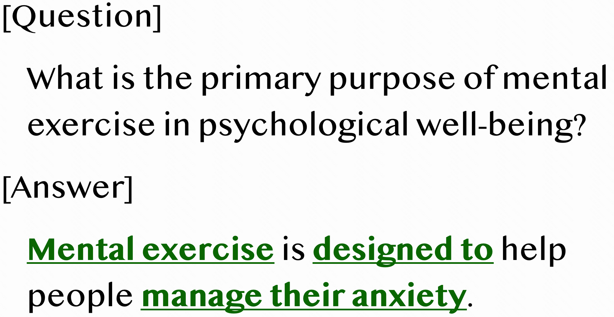
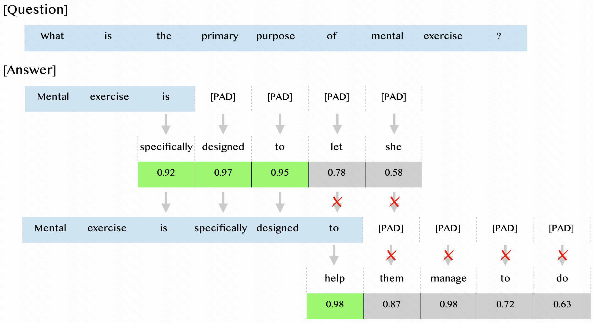
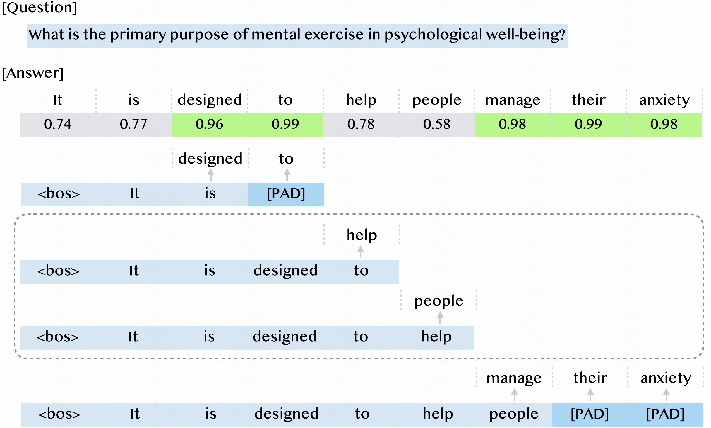
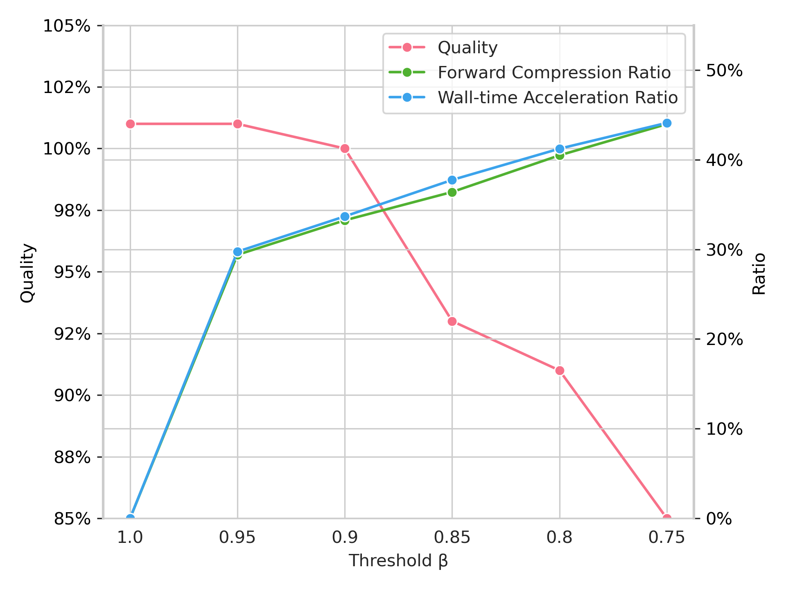
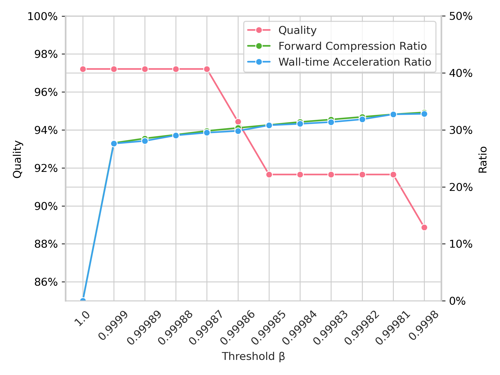
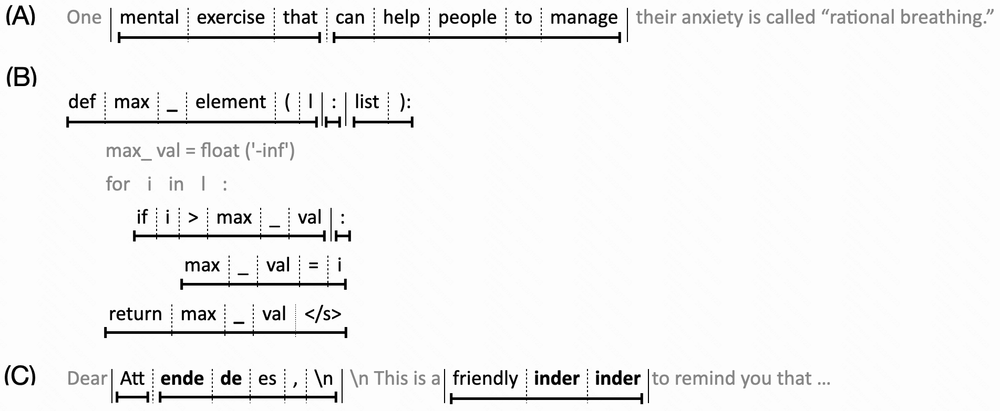
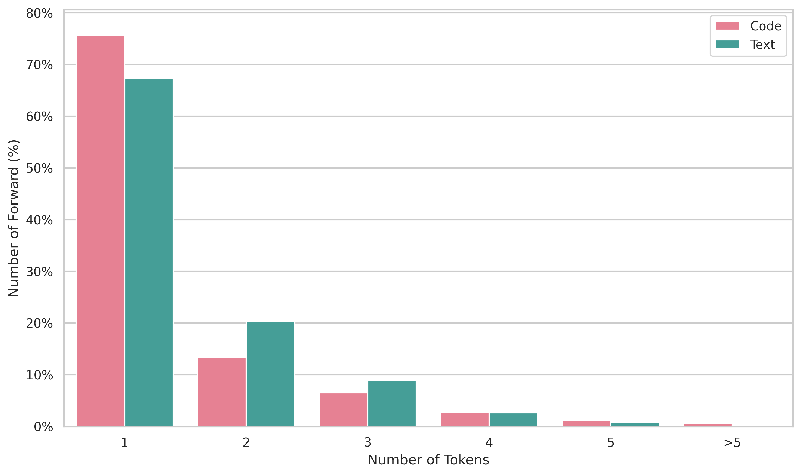

# 思维速度解码：借助词汇单元的并行解码，大型语言模型（LLMs）性能得以飞跃提升。

发布时间：2024年05月24日

`LLM应用

理由：这篇论文介绍了一种名为“词汇单元解码（LUD）”的方法，旨在加速大型语言模型的解码过程，以提高实时应用的效率。这种方法通过并行解码“词汇单元”来实现加速，同时保持输出质量。论文中的实验结果显示了LUD在自然语言生成和代码生成中的效率提升，并且这种方法不需要额外的模型或改变现有架构。因此，这项工作属于大型语言模型的应用范畴，专注于优化模型的实际使用效率。` `代码生成`

> Decoding at the Speed of Thought: Harnessing Parallel Decoding of Lexical Units for LLMs

# 摘要

> 大型语言模型在自然语言理解和生成上表现卓越，但其生成速度因解码过程的顺序性而受限，对实时应用构成挑战。本文提出的词汇单元解码（LUD）方法，通过数据驱动的方式加速解码，同时保持输出质量。LUD的核心在于利用预训练模型预测连续词元的能力，形成可并行解码的“词汇单元”。实验表明，LUD在自然语言生成中提速33%且无质量损失，在代码生成中提速30%，质量损失仅3%。LUD无需额外模型，不改现有架构，并可与其他加速方法结合，进一步提升推理效率。我们相信，LUD的原则将为未来语言模型开辟新的解码范式，拓展其应用范围。相关代码已公开于https://github.com/tjunlp-lab/Lexical-Unit-Decoding-LUD-。关键词：并行解码，词汇单元解码，大型语言模型

> Large language models have demonstrated exceptional capability in natural language understanding and generation. However, their generation speed is limited by the inherently sequential nature of their decoding process, posing challenges for real-time applications. This paper introduces Lexical Unit Decoding (LUD), a novel decoding methodology implemented in a data-driven manner, accelerating the decoding process without sacrificing output quality. The core of our approach is the observation that a pre-trained language model can confidently predict multiple contiguous tokens, forming the basis for a \textit{lexical unit}, in which these contiguous tokens could be decoded in parallel. Extensive experiments validate that our method substantially reduces decoding time while maintaining generation quality, i.e., 33\% speed up on natural language generation with no quality loss, and 30\% speed up on code generation with a negligible quality loss of 3\%. Distinctively, LUD requires no auxiliary models and does not require changes to existing architectures. It can also be integrated with other decoding acceleration methods, thus achieving an even more pronounced inference efficiency boost. We posit that the foundational principles of LUD could define a new decoding paradigm for future language models, enhancing their applicability for a broader spectrum of applications. All codes are be publicly available at https://github.com/tjunlp-lab/Lexical-Unit-Decoding-LUD-.
Keywords: Parallel Decoding, Lexical Unit Decoding, Large Language Model

[Arxiv](https://arxiv.org/abs/2405.15208)