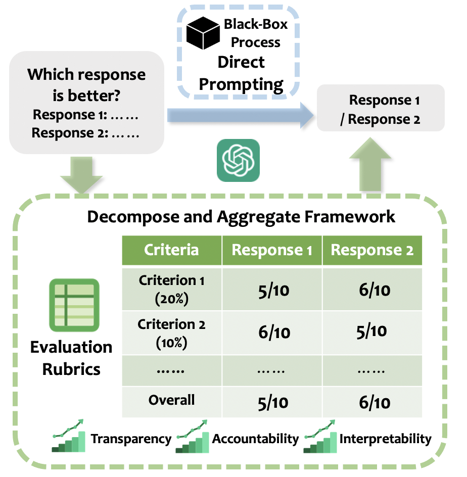

# 分解聚合：构建一个逐步透明的评估体系

发布时间：2024年05月24日

`RAG

理由：这篇论文主要探讨了如何改进大型语言模型（LLMs）在文本评估中的应用，通过提出“分解与聚合”策略来增强评估过程的透明度和提升LLMs的表现。这种方法涉及将评估过程细化为多个阶段，类似于检索增强生成（RAG）框架中的方法，即通过分解问题和任务来增强模型的理解和生成能力。因此，这篇论文更符合RAG分类，因为它关注的是通过改进评估策略来增强LLMs的性能。` `教育评估` `语言模型评估`

> Decompose and Aggregate: A Step-by-Step Interpretable Evaluation Framework

# 摘要

> 随着大型语言模型研究的加速，我们有了新的方法来评估生成的文本。这些模型作为高效且经济的评估工具，但其可靠性成为了研究焦点。以往的研究中，LLMs作为评判者时，仅允许一次提示以做出最终评价，并比较其结果与人类评价的一致性，这限制了对LLMs评估能力的深入理解。为此，我们提出了“分解与聚合”策略，借鉴教学实践，将评估过程细化为多个阶段。实验结果显示，这种方法不仅增强了LLMs评估过程的透明度，还在多个元评估基准上提升了LLMs的表现，最高可达39.6%。

> The acceleration of Large Language Models (LLMs) research has opened up new possibilities for evaluating generated texts. They serve as scalable and economical evaluators, but the question of how reliable these evaluators are has emerged as a crucial research question. Prior research efforts in the meta-evaluation of LLMs as judges limit the prompting of an LLM to a single use to obtain a final evaluation decision. They then compute the agreement between LLMs' outputs and human labels. This lacks interpretability in understanding the evaluation capability of LLMs. In light of this challenge, we propose Decompose and Aggregate, which breaks down the evaluation process into different stages based on pedagogical practices. Our experiments illustrate that it not only provides a more interpretable window for how well LLMs evaluate, but also leads to improvements up to 39.6% for different LLMs on a variety of meta-evaluation benchmarks.

[Arxiv](https://arxiv.org/abs/2405.15329)