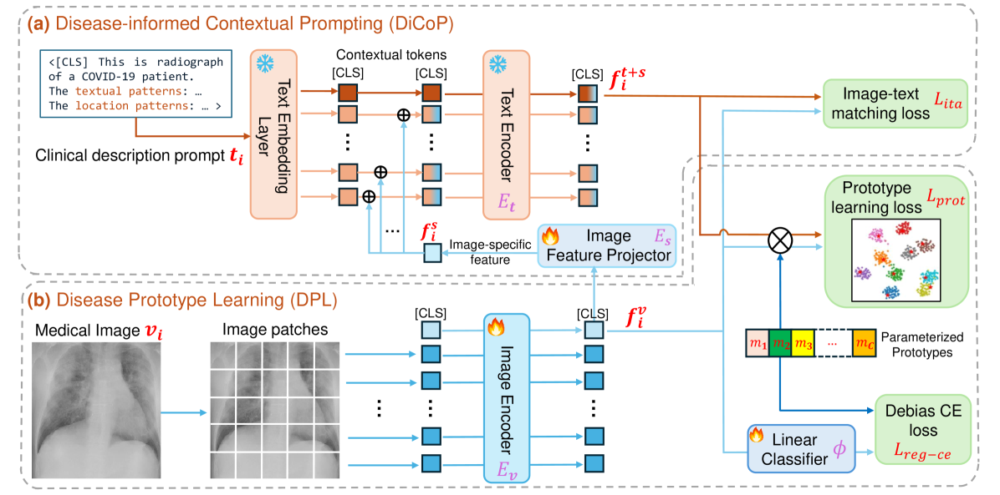
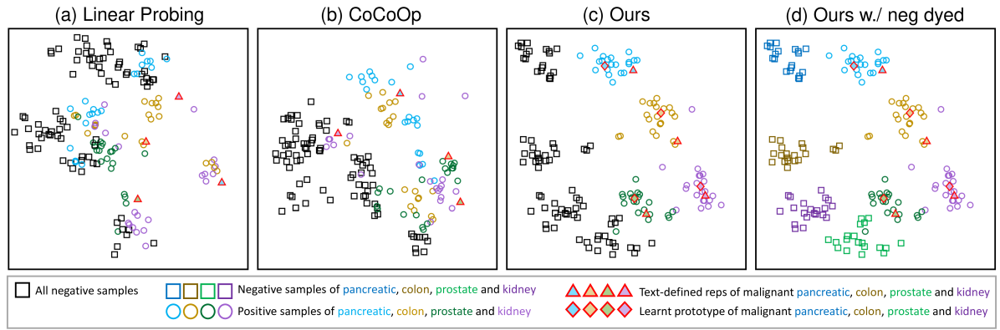
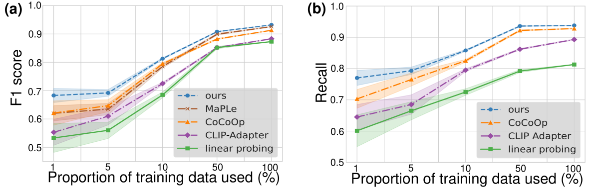
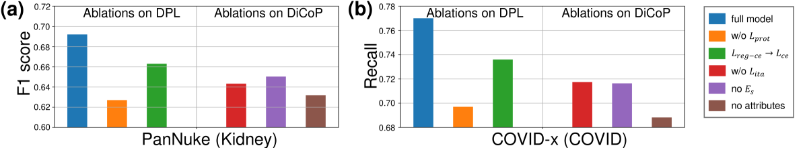

# 疾病引导的视觉-语言模型适应策略

发布时间：2024年05月24日

`LLM应用

理由：这篇论文探讨了如何利用预训练的视觉-语言模型（VLMs）进行迁移学习，特别是在医学图像分析领域。它提出了一种新的方法，通过疾病信息驱动的上下文提示机制来增强VLMs在处理新疾病或罕见疾病时的适应性。这种方法的应用性质明显，因为它关注的是如何改进模型在特定领域的应用性能，而不是模型的理论基础或Agent的设计。因此，它属于LLM应用类别。` `医学图像分析` `迁移学习`

> Disease-informed Adaptation of Vision-Language Models

# 摘要

> 在医学图像分析领域，专家资源的稀缺和数据标注的高昂成本制约了大型AI模型的发展。本文深入探讨了利用预训练的视觉-语言模型（VLMs）进行迁移学习的可能性。尽管VLMs在处理预训练数据集中未涉及的新疾病或极少见的疾病时仍显吃力，但我们认为，通过精细化的疾病概念表示学习，VLMs的适应性可以得到有效提升。我们借助VLMs在视觉与语言上的双重优势，创新性地引入了疾病信息驱动的上下文提示机制，构建了一个疾病原型学习框架。这一策略使得VLMs即使在数据稀缺的情况下，也能迅速且有效地理解新疾病的概念。通过跨多种图像模态的广泛实验，我们证明了这一方法相较于现有技术，在性能上实现了显著的飞跃。

> In medical image analysis, the expertise scarcity and the high cost of data annotation limits the development of large artificial intelligence models. This paper investigates the potential of transfer learning with pre-trained vision-language models (VLMs) in this domain. Currently, VLMs still struggle to transfer to the underrepresented diseases with minimal presence and new diseases entirely absent from the pretraining dataset. We argue that effective adaptation of VLMs hinges on the nuanced representation learning of disease concepts. By capitalizing on the joint visual-linguistic capabilities of VLMs, we introduce disease-informed contextual prompting in a novel disease prototype learning framework. This approach enables VLMs to grasp the concepts of new disease effectively and efficiently, even with limited data. Extensive experiments across multiple image modalities showcase notable enhancements in performance compared to existing techniques.

[Arxiv](https://arxiv.org/abs/2405.15728)