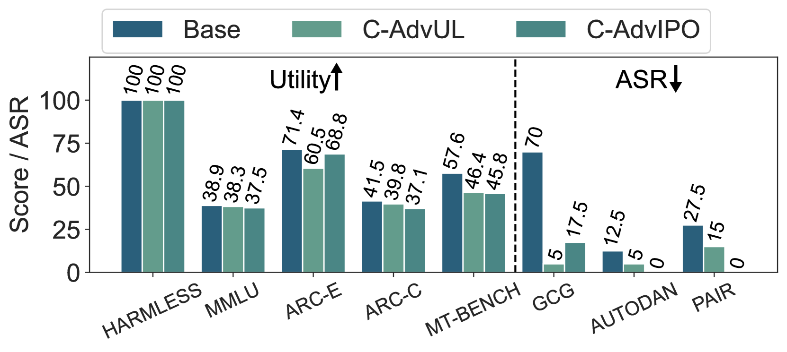

# 利用连续攻击优化大型语言模型（LLMs）的对抗训练效率

发布时间：2024年05月24日

`LLM理论

理由：这篇论文主要探讨了大型语言模型（LLMs）在对抗性攻击下的鲁棒性问题，并提出了一种在连续嵌入空间中进行对抗攻击计算的新方法。论文的核心贡献在于开发了新的对抗训练算法（C-AdvUL和C-AdvIPO），并通过实验验证了这些算法在提升模型鲁棒性方面的有效性。这些内容更偏向于LLMs的理论研究和方法论创新，而不是具体的应用案例或Agent的设计，因此归类为LLM理论。` `人工智能安全` `机器学习`

> Efficient Adversarial Training in LLMs with Continuous Attacks

# 摘要

> 大型语言模型（LLMs）面临对抗性攻击的威胁，这些攻击能绕过其安全机制。尽管对抗性训练在多个领域被证实是提升模型鲁棒性的有效手段，但在LLMs中，由于每次训练迭代中执行离散对抗攻击的高计算成本，这一方法受到限制。为此，我们提出在LLM的连续嵌入空间中进行对抗攻击计算，大幅提高了效率。我们开发的快速对抗训练算法（C-AdvUL）包含两个损失函数：一是使模型对基于对抗行为数据集的连续攻击具有鲁棒性；二是通过实用数据微调确保模型的实用性。此外，我们还推出了C-AdvIPO，一种无需实用数据即可实现对抗性鲁棒对齐的IPO变体。通过对四个不同规模和家族的模型（Gemma, Phi3, Mistral, Zephyr）进行测试，我们发现这两种算法显著提升了LLMs对离散攻击（GCG, AutoDAN, PAIR）的抵抗力，同时保持了模型的实用性。这表明，对连续扰动的鲁棒性可以扩展到离散威胁模型，为开发可扩展的对抗性训练算法铺平了道路，以实现LLMs的鲁棒对齐。

> Large language models (LLMs) are vulnerable to adversarial attacks that can bypass their safety guardrails. In many domains, adversarial training has proven to be one of the most promising methods to reliably improve robustness against such attacks. Yet, in the context of LLMs, current methods for adversarial training are hindered by the high computational costs required to perform discrete adversarial attacks at each training iteration. We address this problem by instead calculating adversarial attacks in the continuous embedding space of the LLM, which is orders of magnitudes more efficient. We propose a fast adversarial training algorithm (C-AdvUL) composed of two losses: the first makes the model robust on continuous embedding attacks computed on an adversarial behaviour dataset; the second ensures the usefulness of the final model by fine-tuning on utility data. Moreover, we introduce C-AdvIPO, an adversarial variant of IPO that does not require utility data for adversarially robust alignment. Our empirical evaluation on four models from different families (Gemma, Phi3, Mistral, Zephyr) and at different scales (2B, 3.8B, 7B) shows that both algorithms substantially enhance LLM robustness against discrete attacks (GCG, AutoDAN, PAIR), while maintaining utility. Our results demonstrate that robustness to continuous perturbations can extrapolate to discrete threat models. Thereby, we present a path toward scalable adversarial training algorithms for robustly aligning LLMs.

[Arxiv](https://arxiv.org/abs/2405.15589)