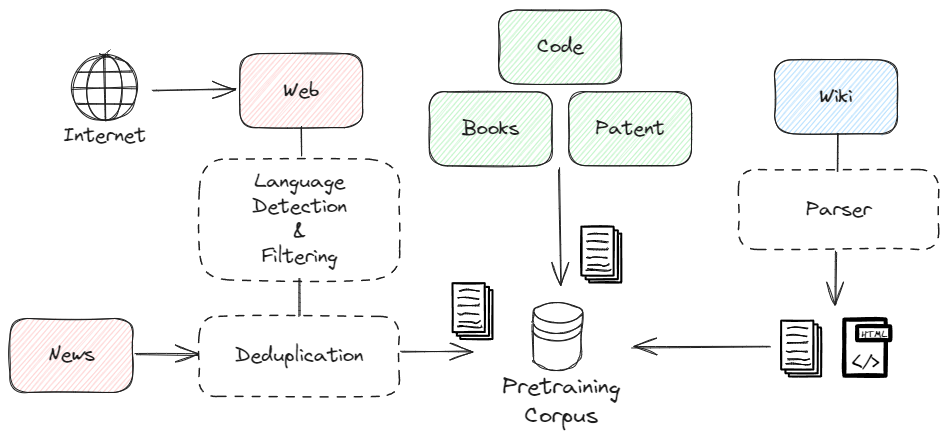
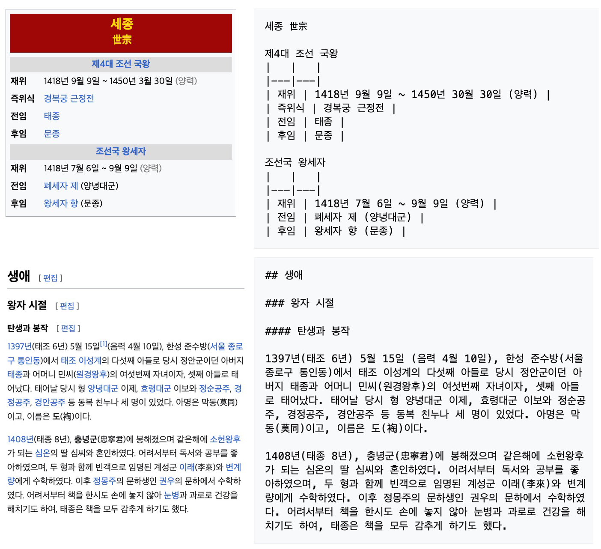

# GECKO：专为英语、代码及韩文打造的生成式语言模型

发布时间：2024年05月24日

`LLM应用

理由：这篇论文介绍了GECKO模型，这是一个专为韩语、英语及编程语言优化的双语大型语言模型。论文详细描述了模型的架构、预训练过程以及在特定基准测试中的表现。虽然提到了模型的架构和训练细节，但主要焦点在于模型的应用和性能，特别是在韩语和英语环境中的应用。因此，这篇论文更适合归类为LLM应用，因为它展示了如何将大型语言模型应用于特定的语言和编程环境中，并讨论了模型的实际效果和开源贡献。` `语言模型` `编程语言`

> GECKO: Generative Language Model for English, Code and Korean

# 摘要

> 我们推出了GECKO，一款专为韩语、英语及编程语言优化的双语大型语言模型。该模型采用LLaMA架构，在精心平衡的韩英高质量语料库上进行了预训练。本报告详述了我们为优化数据处理流程和模型训练所做的努力。尽管词汇量有限，GECKO在韩英令牌生成上展现出卓越效率。在韩语、英语及代码的代表性基准测试中，GECKO在KMMLU上大放异彩，在英语和代码方面亦有不俗表现，即便其训练令牌数少于专攻英语的LLM。GECKO已向开源社区开放，我们期待它能为韩语LLM研究提供坚实基础和实用洞见。模型详情请访问：https://huggingface.co/kifai/GECKO-7B。

> We introduce GECKO, a bilingual large language model (LLM) optimized for Korean and English, along with programming languages. GECKO is pretrained on the balanced, high-quality corpus of Korean and English employing LLaMA architecture. In this report, we share the experiences of several efforts to build a better data pipeline for the corpus and to train our model. GECKO shows great efficiency in token generations for both Korean and English, despite its small size of vocabulary. We measure the performance on the representative benchmarks in terms of Korean, English and Code, and it exhibits great performance on KMMLU (Korean MMLU) and modest performance in English and Code, even with its smaller number of trained tokens compared to English-focused LLMs. GECKO is available to the open-source community under a permissive license. We hope our work offers a research baseline and practical insights for Korean LLM research. The model can be found at: https://huggingface.co/kifai/GECKO-7B

[Arxiv](https://arxiv.org/abs/2405.15640)