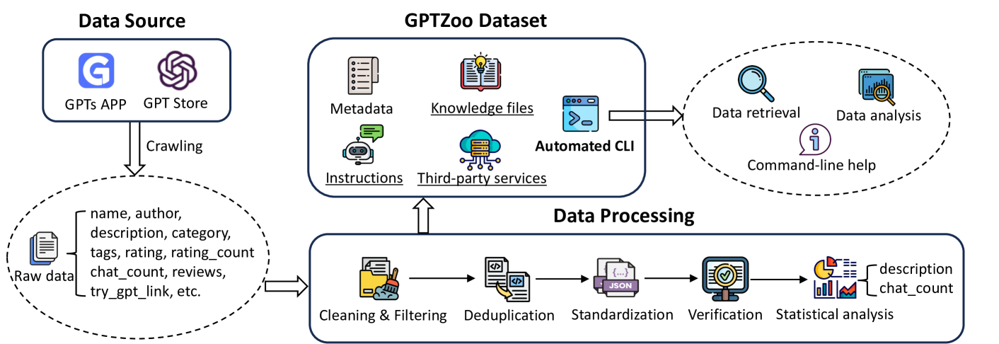
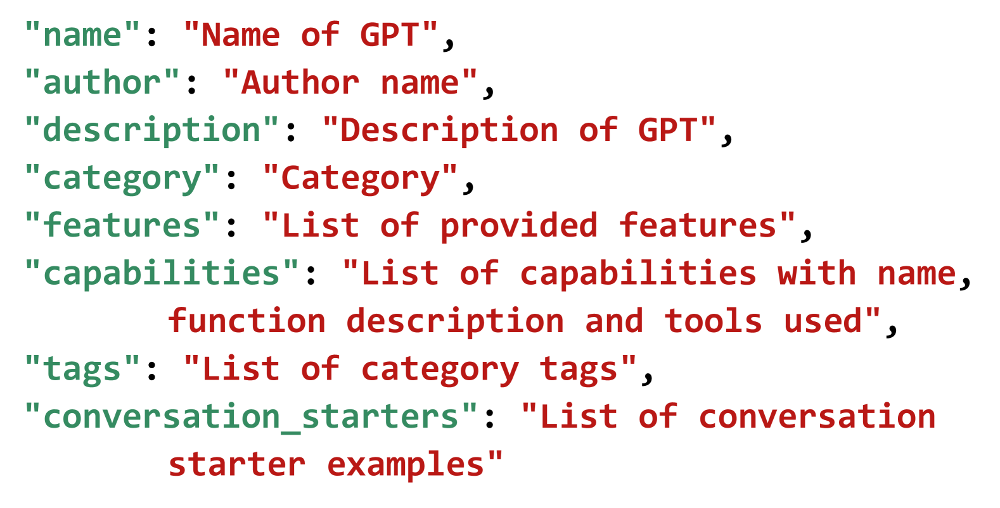
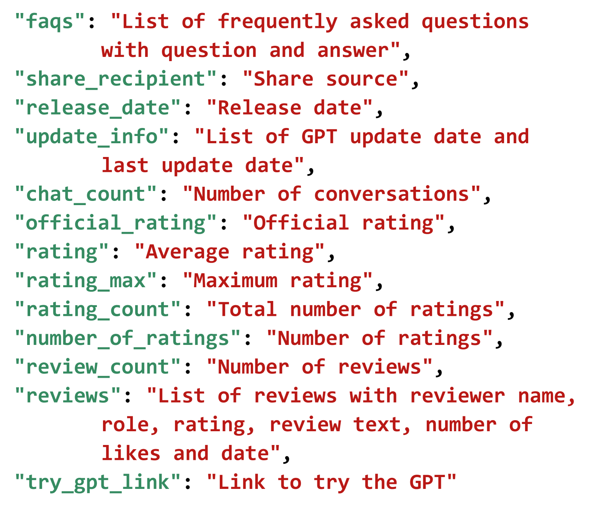
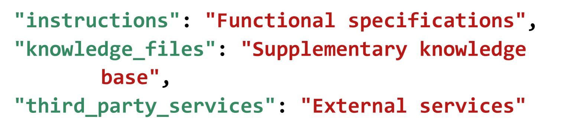
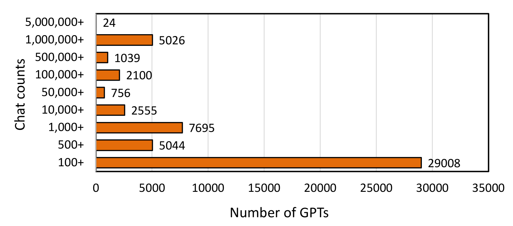

# GPTZoo：研究社区的大型GPT数据集宝库

发布时间：2024年05月24日

`LLM应用

这篇论文摘要描述了一个名为GPTZoo的数据集，该数据集包含了大量的GPT实例，并提供了丰富的元数据和相关信息，旨在支持对GPTs的深入研究和应用探索。这个数据集的创建和提供的工具（如自动化命令行界面）都是为了促进对大型语言模型（LLMs）在实际应用中的性能和潜力的研究。因此，这篇论文属于LLM应用分类。` `数据集`

> GPTZoo: A Large-scale Dataset of GPTs for the Research Community

# 摘要

> 随着大型语言模型（LLMs）技术的飞速进步，自然语言处理领域迎来了革命性的变革。GPTs，作为GPT商店中ChatGPT的定制版本，已成为特定领域和任务的关键技术。为了深化对GPTs的学术研究，我们精心打造了GPTZoo——一个包含730,420个GPT实例的庞大数据集。每个实例不仅拥有详尽的21项元数据，还附带了开发过程中的指令、知识文件及第三方服务信息。GPTZoo致力于成为研究者探索GPTs实际应用、性能及潜力的宝贵资源。此外，我们还开发了支持关键词搜索的自动化命令行界面（CLI），以提升数据集的检索与分析效率。为促进开放研究与创新，GPTZoo将持续更新，并向全球研究者开放使用及其配套工具。

> The rapid advancements in Large Language Models (LLMs) have revolutionized natural language processing, with GPTs, customized versions of ChatGPT available on the GPT Store, emerging as a prominent technology for specific domains and tasks. To support academic research on GPTs, we introduce GPTZoo, a large-scale dataset comprising 730,420 GPT instances. Each instance includes rich metadata with 21 attributes describing its characteristics, as well as instructions, knowledge files, and third-party services utilized during its development. GPTZoo aims to provide researchers with a comprehensive and readily available resource to study the real-world applications, performance, and potential of GPTs. To facilitate efficient retrieval and analysis of GPTs, we also developed an automated command-line interface (CLI) that supports keyword-based searching of the dataset. To promote open research and innovation, the GPTZoo dataset will undergo continuous updates, and we are granting researchers public access to GPTZoo and its associated tools.

[Arxiv](https://arxiv.org/abs/2405.15630)