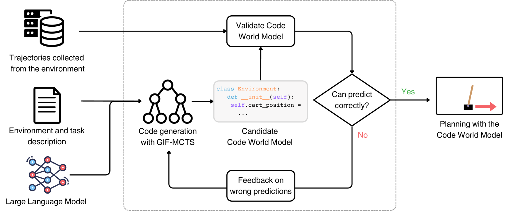
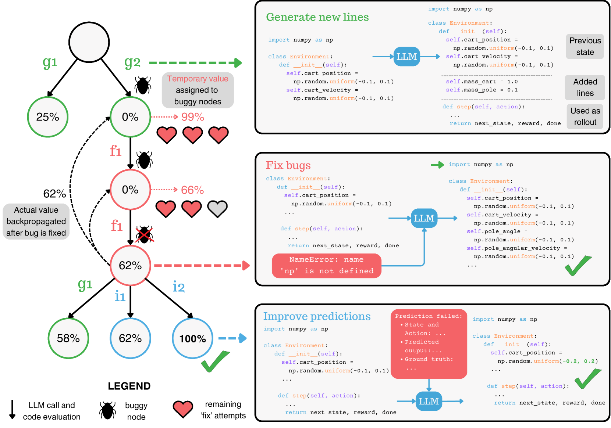

# 借助蒙特卡洛树搜索引导，大型语言模型助力构建代码世界模型

发布时间：2024年05月24日

`Agent

这篇论文主要探讨了如何利用大型语言模型（LLM）生成Python代码来构建用于基于模型的强化学习（RL）的模型。论文中提出的生成、改进与修复策略（GIF-MCTS）结合蒙特卡洛树搜索，旨在提高RL代理的样本效率和推理速度。这种方法直接关联到强化学习中的代理（Agent）设计和优化，因此将其分类为Agent。` `软件开发`

> Generating Code World Models with Large Language Models Guided by Monte Carlo Tree Search

# 摘要

> 本研究聚焦于由大型语言模型（LLM）生成的Python代码世界模型，这些模型专为基于模型的强化学习（RL）设计。相较于直接使用LLM，代码规划更为精确、可靠、易于解释且效率极高。但编写此类模型需具备理解复杂指令、精确编码及自我调试长程序的能力。为此，我们创新性地提出了结合蒙特卡洛树搜索的生成、改进与修复策略（GIF-MCTS）。为验证此策略，我们推出了包含18个多样化RL环境的代码世界模型基准（CWMB）。实验证明，GIF-MCTS在多个基准测试中表现卓越，其合成的代码世界模型有效提升了RL代理的样本效率和推理速度。

> In this work we consider Code World Models, world models generated by a Large Language Model (LLM) in the form of Python code for model-based Reinforcement Learning (RL). Calling code instead of LLMs for planning has the advantages of being precise, reliable, interpretable, and extremely efficient. However, writing appropriate Code World Models requires the ability to understand complex instructions, to generate exact code with non-trivial logic and to self-debug a long program with feedback from unit tests and environment trajectories. To address these challenges, we propose Generate, Improve and Fix with Monte Carlo Tree Search (GIF-MCTS), a new code generation strategy for LLMs. To test our approach, we introduce the Code World Models Benchmark (CWMB), a suite of program synthesis and planning tasks comprised of 18 diverse RL environments paired with corresponding textual descriptions and curated trajectories. GIF-MCTS surpasses all baselines on the CWMB and two other benchmarks, and we show that the Code World Models synthesized with it can be successfully used for planning, resulting in model-based RL agents with greatly improved sample efficiency and inference speed.

[Arxiv](https://arxiv.org/abs/2405.15383)